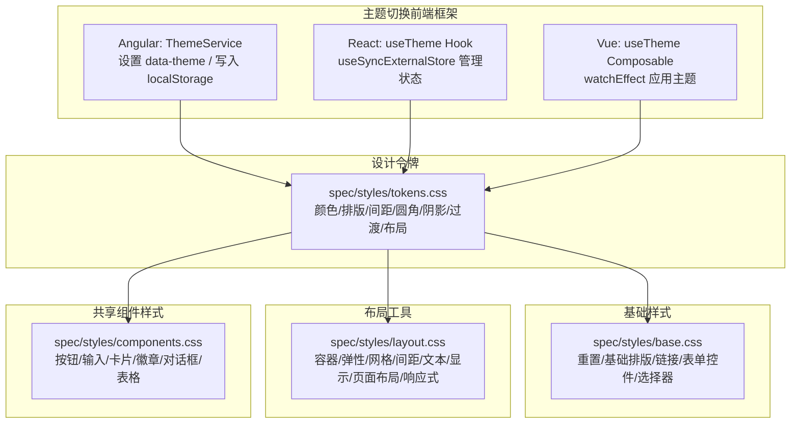
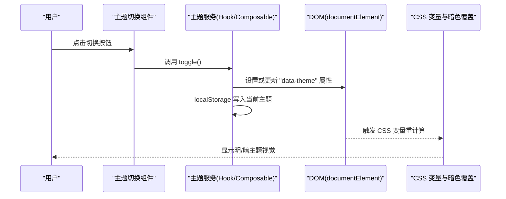
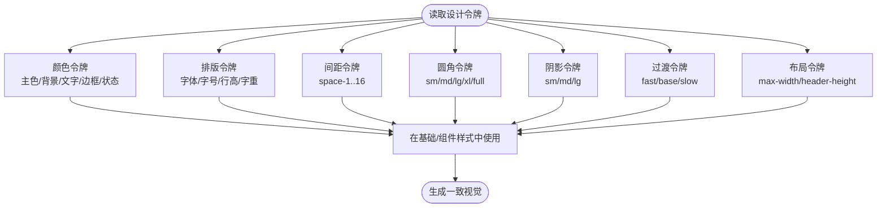
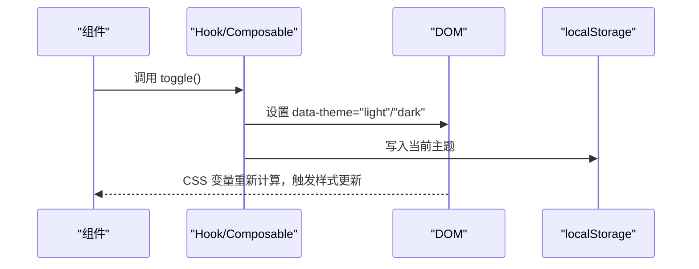
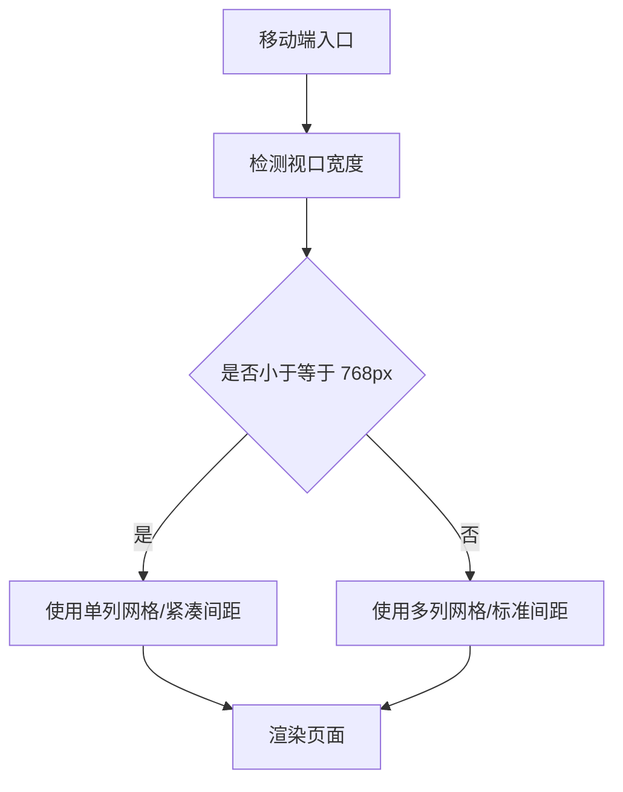
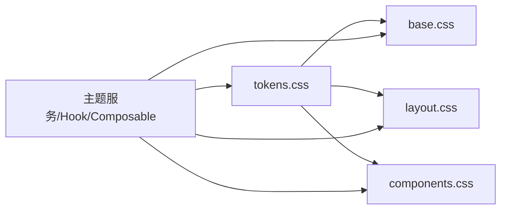

# 设计系统

<cite>
**本文引用的文件**
- [design-tokens.md](file://docs/design-tokens.md)
- [tokens.css](file://spec/styles/tokens.css)
- [base.css](file://spec/styles/base.css)
- [layout.css](file://spec/styles/layout.css)
- [components.css](file://spec/styles/components.css)
- [theme.service.ts](file://frontends/angular-ts/src/app/services/theme.service.ts)
- [useTheme.ts (React)](file://frontends/react-ts/src/hooks/useTheme.ts)
- [useTheme.ts (Vue)](file://frontends/vue3-ts/src/composables/useTheme.ts)
- [ThemeToggle (Angular)](file://frontends/angular-ts/src/app/components/theme-toggle/theme-toggle.component.ts)
- [ThemeToggle (React)](file://frontends/react-ts/src/components/ThemeToggle.tsx)
- [ThemeToggle (Vue)](file://frontends/vue3-ts/src/components/ThemeToggle.vue)
- [CapsuleCard (Angular)](file://frontends/angular-ts/src/app/components/capsule-card/capsule-card.component.css)
- [CapsuleCard (React)](file://frontends/react-ts/src/components/CapsuleCard.module.css)
- [CapsuleCard (Vue)](file://frontends/vue3-ts/src/components/CapsuleCard.vue)
</cite>

## 目录
1. [简介](#简介)
2. [项目结构](#项目结构)
3. [核心组件](#核心组件)
4. [架构总览](#架构总览)
5. [详细组件分析](#详细组件分析)
6. [依赖关系分析](#依赖关系分析)
7. [性能考量](#性能考量)
8. [故障排查指南](#故障排查指南)
9. [结论](#结论)
10. [附录](#附录)

## 简介
本设计系统围绕“设计令牌”展开，采用 CSS 自定义属性作为统一的视觉语言，确保多前端框架（Angular、React、Vue、Svelte、VitePress 等）在颜色、排版、间距、圆角、阴影、过渡与布局工具类上保持一致。同时提供明/暗两套主题，通过在根元素设置 data-theme 属性并持久化到 localStorage，实现跨框架的主题切换与一致性。

## 项目结构
设计系统由“设计令牌 + 基础样式 + 布局工具 + 共享组件样式”四大部分组成，并配合前端框架的主题服务实现主题切换。



图表来源
- [tokens.css:1-104](file://spec/styles/tokens.css#L1-L104)
- [base.css:1-67](file://spec/styles/base.css#L1-L67)
- [layout.css:1-103](file://spec/styles/layout.css#L1-L103)
- [components.css:1-207](file://spec/styles/components.css#L1-L207)
- [theme.service.ts:1-28](file://frontends/angular-ts/src/app/services/theme.service.ts#L1-L28)
- [useTheme.ts (React):1-48](file://frontends/react-ts/src/hooks/useTheme.ts#L1-L48)
- [useTheme.ts (Vue):1-57](file://frontends/vue3-ts/src/composables/useTheme.ts#L1-L57)

章节来源
- [design-tokens.md:1-91](file://docs/design-tokens.md#L1-L91)
- [tokens.css:1-104](file://spec/styles/tokens.css#L1-L104)
- [base.css:1-67](file://spec/styles/base.css#L1-L67)
- [layout.css:1-103](file://spec/styles/layout.css#L1-L103)
- [components.css:1-207](file://spec/styles/components.css#L1-L207)

## 核心组件
- 设计令牌（Design Tokens）
  - 颜色系统：主色、背景、文字、边框、状态色；支持明/暗两套映射。
  - 排版系统：字体族、等宽字体、字号、行高、字重。
  - 间距系统：基于 4px 基准的 space-1 到 space-16。
  - 圆角系统：sm/md/lg/xl/full。
  - 阴影与过渡：sm/md/lg 与快/中/慢三档过渡。
  - 布局常量：最大宽度、头部高度等。
- 基础样式（Base）
  - 统一重置、字体继承、链接、图片、表单控件、标题层级与选区配色。
- 布局工具（Layout Utilities）
  - 容器、弹性、网格、间距、文本、显示控制、页面布局与响应式断点。
- 共享组件样式（Components）
  - 按钮（主/次/危险）、输入框、卡片、徽章、对话框遮罩、表格等。

章节来源
- [design-tokens.md:9-44](file://docs/design-tokens.md#L9-L44)
- [tokens.css:25-80](file://spec/styles/tokens.css#L25-L80)
- [base.css:15-66](file://spec/styles/base.css#L15-L66)
- [layout.css:3-102](file://spec/styles/layout.css#L3-L102)
- [components.css:3-206](file://spec/styles/components.css#L3-L206)

## 架构总览
设计系统通过 CSS 自定义属性将视觉变量集中管理，前端框架通过主题服务在根元素上写入 data-theme，从而驱动 CSS 变量切换，实现明/暗主题的一致性。



图表来源
- [theme.service.ts:16-26](file://frontends/angular-ts/src/app/services/theme.service.ts#L16-L26)
- [useTheme.ts (React):33-47](file://frontends/react-ts/src/hooks/useTheme.ts#L33-L47)
- [useTheme.ts (Vue):46-56](file://frontends/vue3-ts/src/composables/useTheme.ts#L46-L56)
- [tokens.css:82-103](file://spec/styles/tokens.css#L82-L103)

## 详细组件分析

### 设计令牌系统
- 颜色系统
  - 主色与悬停/浅色变体；背景/二级/三级；文字/次要/三级/反色；边框与悬停；状态色（成功/警告/错误/信息）。
  - 暗色模式通过 [data-theme="dark"] 覆盖主色、背景、文字、边框与阴影，保证对比度与可读性。
- 排版系统
  - 字体族与等宽字体；字号体系（xs/sm/base/lg/xl/2xl/3xl）；行高与字重。
- 间距系统
  - 以 4px 为基准，space-1 至 space-16，便于网格与对齐。
- 圆角、阴影、过渡与布局
  - 圆角 sm/md/lg/xl/full；阴影 sm/md/lg；过渡 fast/base/slow；布局最大宽度与头部高度。



图表来源
- [tokens.css:2-80](file://spec/styles/tokens.css#L2-L80)

章节来源
- [design-tokens.md:9-75](file://docs/design-tokens.md#L9-L75)
- [tokens.css:25-80](file://spec/styles/tokens.css#L25-L80)

### 基础样式与组件样式
- 基础样式
  - 统一盒模型、字体与行高、链接颜色与过渡、图片自适应、表单控件继承、标题层级与选区配色。
- 共享组件样式
  - 按钮：主/次/危险态、尺寸、禁用态；输入：边框、聚焦、占位符、错误态；卡片：边框、圆角、阴影、悬停；徽章：状态色；对话框遮罩与弹层；表格：表头、悬停态、分隔线。

```mermaid
classDiagram
class Tokens {
"+颜色/排版/间距/圆角/阴影/过渡/布局"
}
class Base {
"+重置/基础排版/链接/表单控件/标题/选区"
}
class Layout {
"+容器/弹性/网格/间距/文本/显示/页面布局/响应式"
}
class Components {
"+按钮/输入/卡片/徽章/对话框/表格"
}
Tokens --> Base : "提供变量"
Tokens --> Layout : "提供变量"
Tokens --> Components : "提供变量"
```

图表来源
- [base.css:1-67](file://spec/styles/base.css#L1-L67)
- [layout.css:1-103](file://spec/styles/layout.css#L1-L103)
- [components.css:1-207](file://spec/styles/components.css#L1-L207)
- [tokens.css:1-104](file://spec/styles/tokens.css#L1-L104)

章节来源
- [base.css:15-66](file://spec/styles/base.css#L15-L66)
- [components.css:3-206](file://spec/styles/components.css#L3-L206)

### 主题切换机制（Angular/React/Vue）
- Angular
  - ThemeService 使用 signal 管理主题，effect 监听变更，设置 documentElement 的 data-theme 并写入 localStorage。
- React
  - useTheme Hook 使用 useSyncExternalStore 管理模块级主题状态，applyTheme 更新 data-theme 与 localStorage，订阅者同步渲染。
- Vue
  - useTheme Composable 使用 ref 与 watchEffect，初始化与变更均调用 applyTheme，将主题写入 DOM 与 localStorage。



图表来源
- [theme.service.ts:16-26](file://frontends/angular-ts/src/app/services/theme.service.ts#L16-L26)
- [useTheme.ts (React):14-47](file://frontends/react-ts/src/hooks/useTheme.ts#L14-L47)
- [useTheme.ts (Vue):20-56](file://frontends/vue3-ts/src/composables/useTheme.ts#L20-L56)

章节来源
- [ThemeToggle (Angular):1-14](file://frontends/angular-ts/src/app/components/theme-toggle/theme-toggle.component.ts#L1-L14)
- [ThemeToggle (React):1-17](file://frontends/react-ts/src/components/ThemeToggle.tsx#L1-L17)
- [ThemeToggle (Vue):1-34](file://frontends/vue3-ts/src/components/ThemeToggle.vue#L1-L34)
- [theme.service.ts:1-28](file://frontends/angular-ts/src/app/services/theme.service.ts#L1-L28)
- [useTheme.ts (React):1-48](file://frontends/react-ts/src/hooks/useTheme.ts#L1-L48)
- [useTheme.ts (Vue):1-57](file://frontends/vue3-ts/src/composables/useTheme.ts#L1-L57)

### 响应式设计与移动端适配
- 断点与布局
  - tokens 中定义 max-width 与容器最大宽度；layout 提供容器与响应式网格（在 768px 以下将多列网格收为单列）。
- 移动端最佳实践
  - 使用容器限制内容宽度，避免过宽导致阅读困难；在窄屏下优先单列布局；利用 gap 与 padding 的 space- 系列变量保证一致间距；使用 text-sm/text-base 等字号适配小屏阅读。



图表来源
- [layout.css:96-102](file://spec/styles/layout.css#L96-L102)
- [tokens.css:75-80](file://spec/styles/tokens.css#L75-L80)

章节来源
- [layout.css:3-102](file://spec/styles/layout.css#L3-L102)
- [tokens.css:75-80](file://spec/styles/tokens.css#L75-L80)

### 组件样式的复用与扩展
- 复用策略
  - 基于共享组件样式（buttons、inputs、cards、badges、tables、dialogs）与布局工具类（flex/grid/gap/padding/margin），在各框架组件中直接复用类名。
  - 使用 tokens 中的变量统一颜色、字号、间距、圆角与阴影，确保跨组件一致性。
- 扩展方法
  - 新增组件时，优先使用现有类名组合；如需差异化，可在组件局部样式中引入 tokens 变量，避免硬编码颜色与尺寸。
  - 对于徽章等状态样式，遵循明/暗主题下的对比度要求，在暗色覆盖中单独定义状态色。

章节来源
- [components.css:3-206](file://spec/styles/components.css#L3-L206)
- [layout.css:18-102](file://spec/styles/layout.css#L18-L102)
- [tokens.css:25-80](file://spec/styles/tokens.css#L25-L80)

## 依赖关系分析
- 设计令牌是所有样式的基础，基础样式与组件样式均依赖其提供的变量。
- 布局工具类与组件样式同样依赖 tokens，形成“变量 -> 工具/组件 -> 视觉”的链路。
- 主题切换通过在根元素设置 data-theme，间接驱动 tokens 的明/暗覆盖，从而影响所有依赖变量的组件。



图表来源
- [tokens.css:1-104](file://spec/styles/tokens.css#L1-L104)
- [base.css:1-67](file://spec/styles/base.css#L1-L67)
- [layout.css:1-103](file://spec/styles/layout.css#L1-L103)
- [components.css:1-207](file://spec/styles/components.css#L1-L207)
- [useTheme.ts (React):1-48](file://frontends/react-ts/src/hooks/useTheme.ts#L1-L48)
- [useTheme.ts (Vue):1-57](file://frontends/vue3-ts/src/composables/useTheme.ts#L1-L57)
- [theme.service.ts:1-28](file://frontends/angular-ts/src/app/services/theme.service.ts#L1-L28)

章节来源
- [tokens.css:1-104](file://spec/styles/tokens.css#L1-L104)
- [base.css:1-67](file://spec/styles/base.css#L1-L67)
- [layout.css:1-103](file://spec/styles/layout.css#L1-L103)
- [components.css:1-207](file://spec/styles/components.css#L1-L207)
- [useTheme.ts (React):1-48](file://frontends/react-ts/src/hooks/useTheme.ts#L1-L48)
- [useTheme.ts (Vue):1-57](file://frontends/vue3-ts/src/composables/useTheme.ts#L1-L57)
- [theme.service.ts:1-28](file://frontends/angular-ts/src/app/services/theme.service.ts#L1-L28)

## 性能考量
- CSS 变量切换开销极低，仅触发样式重计算，不涉及 JS 复杂逻辑。
- 主题偏好持久化到 localStorage，避免每次刷新重新计算。
- 布局工具类与组件样式均为原子化类名，减少选择器复杂度与重绘范围。
- 建议在生产环境启用 CSS 压缩与缓存，进一步降低传输体积。

## 故障排查指南
- 主题未生效
  - 检查根元素是否正确设置了 data-theme 属性；确认主题服务/Hook/Composable 是否在初始化时写入。
  - 确认 tokens.css 中的暗色覆盖规则未被更高优先级的选择器覆盖。
- 颜色/间距不一致
  - 检查组件是否使用了 tokens 中的变量而非硬编码值；确认 tokens.css 的变量值是否符合预期。
- 响应式异常
  - 检查容器与网格类是否正确使用；确认断点条件与布局工具类的组合是否合理。
- 徽章状态色在暗色模式下对比度不足
  - 检查暗色覆盖规则是否正确应用；必要时调整状态色变量或覆盖类。

章节来源
- [theme.service.ts:16-26](file://frontends/angular-ts/src/app/services/theme.service.ts#L16-L26)
- [useTheme.ts (React):14-47](file://frontends/react-ts/src/hooks/useTheme.ts#L14-L47)
- [useTheme.ts (Vue):20-56](file://frontends/vue3-ts/src/composables/useTheme.ts#L20-L56)
- [tokens.css:82-103](file://spec/styles/tokens.css#L82-L103)
- [components.css:134-162](file://spec/styles/components.css#L134-L162)

## 结论
该设计系统以 CSS 自定义属性为核心，结合基础样式、布局工具与共享组件样式，形成一套可复用、可扩展且跨框架一致的视觉体系。通过在根元素设置 data-theme 并持久化主题偏好，实现明/暗主题的无缝切换。建议在新增组件时严格使用 tokens 变量与现有类名组合，确保设计一致性与维护效率。

## 附录
- 设计令牌文件清单
  - [spec/styles/tokens.css](file://spec/styles/tokens.css)
  - [spec/styles/base.css](file://spec/styles/base.css)
  - [spec/styles/layout.css](file://spec/styles/layout.css)
  - [spec/styles/components.css](file://spec/styles/components.css)
- 主题切换参考实现
  - [Angular ThemeService](file://frontends/angular-ts/src/app/services/theme.service.ts)
  - [React useTheme Hook](file://frontends/react-ts/src/hooks/useTheme.ts)
  - [Vue useTheme Composable](file://frontends/vue3-ts/src/composables/useTheme.ts)
- 组件样式复用示例
  - [Angular CapsuleCard 样式](file://frontends/angular-ts/src/app/components/capsule-card/capsule-card.component.css)
  - [React CapsuleCard 样式](file://frontends/react-ts/src/components/CapsuleCard.module.css)
  - [Vue CapsuleCard 组件](file://frontends/vue3-ts/src/components/CapsuleCard.vue)