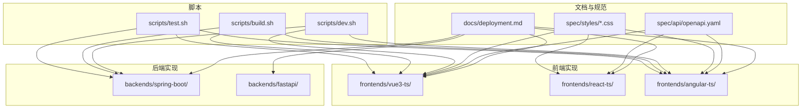
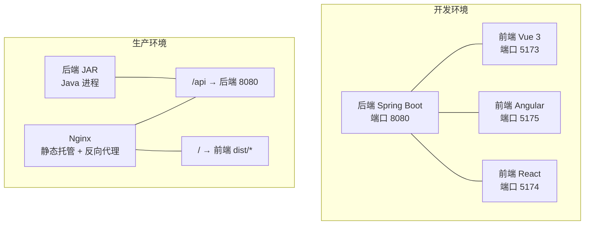
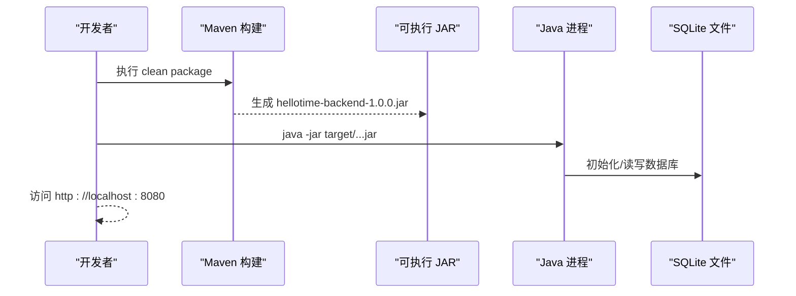
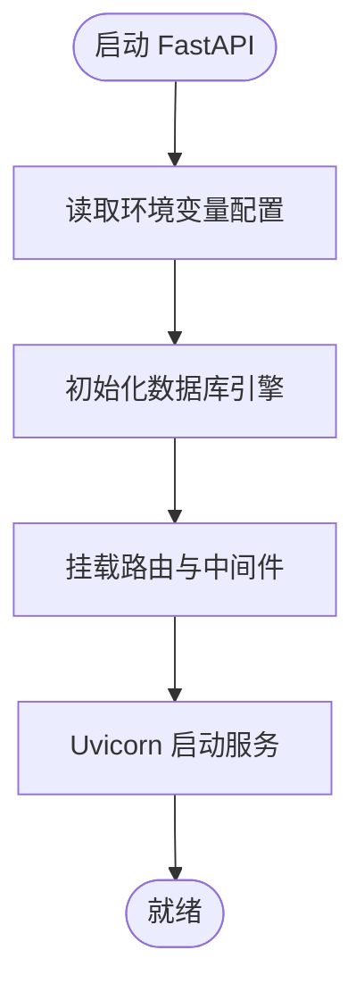
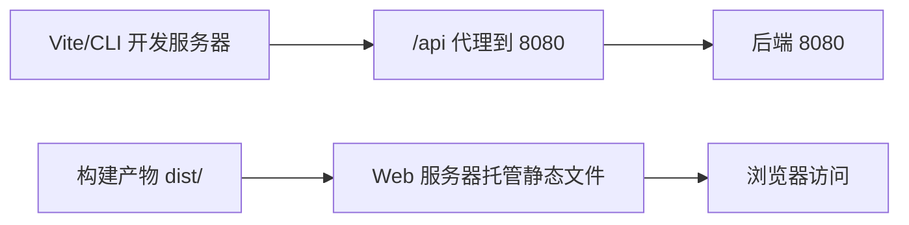
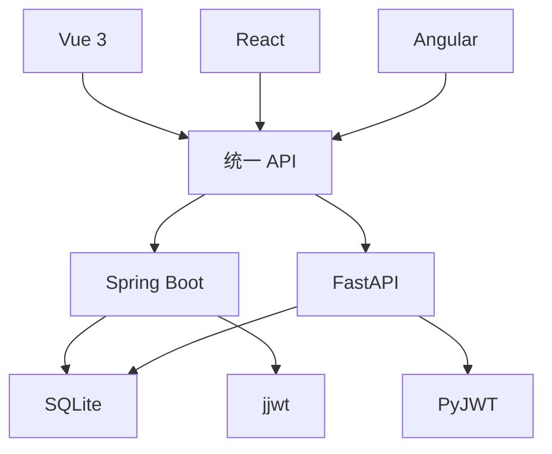

# 部署指南

<cite>
**本文引用的文件**
- [README.md](file://README.md)
- [docs/deployment.md](file://docs/deployment.md)
- [backends/spring-boot/README.md](file://backends/spring-boot/README.md)
- [backends/fastapi/README.md](file://backends/fastapi/README.md)
- [backends/spring-boot/pom.xml](file://backends/spring-boot/pom.xml)
- [backends/fastapi/requirements.txt](file://backends/fastapi/requirements.txt)
- [backends/spring-boot/src/main/resources/application.yml](file://backends/spring-boot/src/main/resources/application.yml)
- [backends/fastapi/app/config.py](file://backends/fastapi/app/config.py)
- [backends/fastapi/app/database.py](file://backends/fastapi/app/database.py)
- [backends/fastapi/app/main.py](file://backends/fastapi/app/main.py)
- [backends/spring-boot/src/main/java/com/hellotime/HelloTimeApplication.java](file://backends/spring-boot/src/main/java/com/hellotime/HelloTimeApplication.java)
- [frontends/vue3-ts/vite.config.ts](file://frontends/vue3-ts/vite.config.ts)
- [frontends/angular-ts/proxy.conf.json](file://frontends/angular-ts/proxy.conf.json)
- [scripts/dev.sh](file://scripts/dev.sh)
- [scripts/build.sh](file://scripts/build.sh)
- [scripts/test.sh](file://scripts/test.sh)
- [frontends/vue3-ts/package.json](file://frontends/vue3-ts/package.json)
- [frontends/react-ts/package.json](file://frontends/react-ts/package.json)
- [frontends/angular-ts/package.json](file://frontends/angular-ts/package.json)
</cite>

## 目录
1. [简介](#简介)
2. [项目结构](#项目结构)
3. [核心组件](#核心组件)
4. [架构总览](#架构总览)
5. [详细组件分析](#详细组件分析)
6. [依赖关系分析](#依赖关系分析)
7. [性能考虑](#性能考虑)
8. [故障排查指南](#故障排查指南)
9. [结论](#结论)
10. [附录](#附录)

## 简介
本指南面向 HelloTime 项目的运维与开发团队，提供从开发环境到生产环境的完整部署策略，涵盖容器化、CI/CD、多云平台部署、配置管理、负载均衡与 SSL、监控与日志、数据库备份与恢复、性能调优以及常见问题排查。项目支持两套后端实现（Spring Boot 与 FastAPI），以及多前端实现（Vue 3、React、Angular），统一遵循共享 API 规范与样式定义。

## 项目结构
HelloTime 采用“前后端分离 + 多实现组合”的架构，核心目录如下：
- docs：项目文档与部署指南
- spec：共享 API 规范与样式定义
- frontends：多前端实现（Vue 3、React、Angular）
- backends：多后端实现（Spring Boot、FastAPI）
- scripts：开发与构建脚本

图表来源
- [README.md:18-34](file://README.md#L18-L34)
- [docs/deployment.md:13-42](file://docs/deployment.md#L13-L42)

章节来源
- [README.md:18-34](file://README.md#L18-L34)
- [docs/deployment.md:13-42](file://docs/deployment.md#L13-L42)

## 核心组件
- 后端（Spring Boot）
  - 技术栈：Spring Boot 3.2.5、Java 17、SQLite、Spring Data JPA、jjwt
  - 配置：application.yml，支持环境变量覆盖（管理员密码、JWT 密钥、端口等）
  - 构建：Maven，打包为可执行 JAR
- 后端（FastAPI）
  - 技术栈：FastAPI、Uvicorn、SQLAlchemy、PyJWT
  - 配置：从环境变量读取数据库 URL、管理员密码、JWT 密钥与过期时间
  - 运行：开发/生产模式通过 Uvicorn 启动
- 前端（Vue 3、React、Angular）
  - 构建工具：Vite（Vue 3、React）、Angular CLI（Angular）
  - 开发代理：本地开发时将 /api 代理至后端 8080 端口
- 脚本
  - dev.sh：一键启动后端与多个前端
  - build.sh：构建后端 JAR 与各前端静态产物
  - test.sh：统一运行后端与前端测试

章节来源
- [backends/spring-boot/README.md:5-12](file://backends/spring-boot/README.md#L5-L12)
- [backends/fastapi/README.md:5-11](file://backends/fastapi/README.md#L5-L11)
- [backends/spring-boot/pom.xml:20-23](file://backends/spring-boot/pom.xml#L20-L23)
- [backends/spring-boot/src/main/resources/application.yml:1-22](file://backends/spring-boot/src/main/resources/application.yml#L1-L22)
- [backends/fastapi/app/config.py:8-17](file://backends/fastapi/app/config.py#L8-L17)
- [frontends/vue3-ts/vite.config.ts:13-21](file://frontends/vue3-ts/vite.config.ts#L13-L21)
- [frontends/angular-ts/proxy.conf.json:1-7](file://frontends/angular-ts/proxy.conf.json#L1-L7)
- [scripts/dev.sh:11-31](file://scripts/dev.sh#L11-L31)
- [scripts/build.sh:11-21](file://scripts/build.sh#L11-L21)
- [scripts/test.sh:11-29](file://scripts/test.sh#L11-L29)

## 架构总览
下图展示了开发与生产两种典型部署形态：开发环境通过脚本同时启动后端与多个前端；生产环境将后端打包为 JAR，前端静态文件由 Web 服务器（如 Nginx）托管并通过反向代理转发 API 请求。

图表来源
- [docs/deployment.md:34-69](file://docs/deployment.md#L34-L69)
- [frontends/vue3-ts/vite.config.ts:13-21](file://frontends/vue3-ts/vite.config.ts#L13-L21)
- [frontends/angular-ts/proxy.conf.json:1-7](file://frontends/angular-ts/proxy.conf.json#L1-7)

章节来源
- [docs/deployment.md:34-69](file://docs/deployment.md#L34-L69)

## 详细组件分析

### 后端（Spring Boot）部署策略
- 环境要求
  - Java 17+，Maven 3.8+（或使用内置 mvnw）
- 构建与运行
  - 构建：clean package（跳过测试）
  - 运行：java -jar target/hellotime-backend-1.0.0.jar
- 配置管理
  - application.yml：数据源、JPA、服务器端口
  - 环境变量：ADMIN_PASSWORD、JWT_SECRET、SERVER_PORT
- 安全与认证
  - 基于 JWT 的管理员认证，HS256 签名，有效期可配置
- 数据库
  - SQLite，默认在运行目录生成 hellotime.db，备份即复制该文件

图表来源
- [backends/spring-boot/README.md:99-107](file://backends/spring-boot/README.md#L99-L107)
- [backends/spring-boot/src/main/resources/application.yml:4-21](file://backends/spring-boot/src/main/resources/application.yml#L4-L21)

章节来源
- [backends/spring-boot/README.md:21-52](file://backends/spring-boot/README.md#L21-L52)
- [backends/spring-boot/src/main/resources/application.yml:1-22](file://backends/spring-boot/src/main/resources/application.yml#L1-L22)

### 后端（FastAPI）部署策略
- 环境要求
  - Python 3.12+，安装 requirements.txt
- 运行模式
  - 开发：uvicorn app.main:app --reload
  - 生产：uvicorn app.main:app --workers 4
- 配置管理
  - DATABASE_URL、ADMIN_PASSWORD、JWT_SECRET、JWT_EXPIRATION_HOURS
- 数据库
  - SQLAlchemy + SQLite，默认相对路径生成数据库文件

图表来源
- [backends/fastapi/app/config.py:8-17](file://backends/fastapi/app/config.py#L8-L17)
- [backends/fastapi/app/database.py:11-14](file://backends/fastapi/app/database.py#L11-L14)
- [backends/fastapi/app/main.py:19-34](file://backends/fastapi/app/main.py#L19-L34)

章节来源
- [backends/fastapi/README.md:21-74](file://backends/fastapi/README.md#L21-L74)
- [backends/fastapi/app/config.py:8-17](file://backends/fastapi/app/config.py#L8-L17)
- [backends/fastapi/app/database.py:11-14](file://backends/fastapi/app/database.py#L11-L14)

### 前端部署策略
- Vue 3（Vite）
  - 开发：vite（端口 5173），/api 代理至后端 8080
  - 构建：vite build，产物 dist/
- React（Vite）
  - 开发：vite（端口 5174），构建与预览命令
  - 构建：tsc -b && vite build
- Angular（CLI）
  - 开发：ng serve（端口 5175），/api 代理至后端 8080
  - 构建：ng build

图表来源
- [frontends/vue3-ts/vite.config.ts:13-21](file://frontends/vue3-ts/vite.config.ts#L13-L21)
- [frontends/angular-ts/proxy.conf.json:1-7](file://frontends/angular-ts/proxy.conf.json#L1-L7)

章节来源
- [frontends/vue3-ts/package.json:6-11](file://frontends/vue3-ts/package.json#L6-L11)
- [frontends/react-ts/package.json:6-11](file://frontends/react-ts/package.json#L6-L11)
- [frontends/angular-ts/package.json:6-10](file://frontends/angular-ts/package.json#L6-L10)

### 配置管理与环境变量
- Spring Boot
  - application.yml：默认端口、数据源、JPA、管理员密码、JWT 密钥与过期时间
  - 环境变量优先级高于配置文件
- FastAPI
  - DATABASE_URL、ADMIN_PASSWORD、JWT_SECRET、JWT_EXPIRATION_HOURS
- 建议
  - 生产环境务必设置 ADMIN_PASSWORD 与 JWT_SECRET，并通过密钥管理服务注入
  - 端口可通过 SERVER_PORT 覆盖

章节来源
- [backends/spring-boot/src/main/resources/application.yml:13-21](file://backends/spring-boot/src/main/resources/application.yml#L13-L21)
- [backends/fastapi/app/config.py:8-17](file://backends/fastapi/app/config.py#L8-L17)
- [docs/deployment.md:71-85](file://docs/deployment.md#L71-L85)

### CI/CD 流水线建议
- 触发条件
  - push 到 main 分支、合并到 main、发布标签
- 步骤
  - 代码检出
  - 环境准备：安装 Java 17/Maven 或 Python 3.12+ 与 Node.js 20+
  - 依赖安装：后端 Maven/Python 前端 npm
  - 自动化测试：后端 ./mvnw test；前端分别运行 vitest/karma/jest
  - 构建：后端 package；前端 vite build
  - 镜像构建与推送（可选）：见容器化章节
  - 部署：部署到目标环境（见云平台章节）
- 质量门禁
  - 测试失败或覆盖率不达标则阻断

章节来源
- [scripts/test.sh:11-29](file://scripts/test.sh#L11-L29)
- [scripts/build.sh:11-21](file://scripts/build.sh#L11-L21)

### Docker 容器化部署
- Spring Boot
  - 基础镜像：官方 OpenJDK 17
  - 构建：mvn package 生成 JAR，COPY 至镜像并暴露 8080
  - 启动：ENTRYPOINT java -jar /app.jar，通过环境变量注入配置
- FastAPI
  - 基础镜像：python:3.12-alpine 或 slim
  - 安装依赖，COPY 代码，EXPOSE 8080，CMD uvicorn 启动
- 前端
  - 使用 Nginx 镜像，复制 dist/ 到 /usr/share/nginx/html，配置反向代理
- 编排
  - docker-compose：后端 + 数据卷 + Nginx（前端静态 + 代理）
  - Kubernetes：Deployment + Service + ConfigMap/Secret + PersistentVolume（可选）

章节来源
- [backends/spring-boot/pom.xml:25-80](file://backends/spring-boot/pom.xml#L25-L80)
- [backends/fastapi/requirements.txt:1-7](file://backends/fastapi/requirements.txt#L1-L7)
- [docs/deployment.md:87-107](file://docs/deployment.md#L87-L107)

### 云平台部署指南（AWS/Azure/GCP）
- AWS
  - EC2：直接部署 JAR + Nginx；或 ECS/EKS + docker-compose/Kubernetes
  - RDS/DocumentDB：替换 SQLite 为关系型数据库（需调整连接配置）
  - ACM：申请与部署 SSL 证书
- Azure
  - App Service：部署 JAR（或容器化）；静态前端部署到 Storage + CDN
  - Azure Database：替换 SQLite
  - Azure Front Door/Load Balancer：反向代理与负载均衡
- GCP
  - Cloud Run：容器化后直接部署；或 GKE + Deployment
  - Cloud SQL：替换 SQLite
  - Cloud CDN/LB：反向代理与负载均衡
- 通用建议
  - 使用 Secret Manager/Key Vault/Secret Manager 管理敏感配置
  - 使用 WAF 与 HTTPS 强制跳转
  - 配置健康检查与自动扩缩容

章节来源
- [docs/deployment.md:44-69](file://docs/deployment.md#L44-L69)

### 负载均衡、反向代理与 SSL
- 反向代理
  - Nginx：静态文件托管 + /api 代理至后端 8080
  - 可选：HAProxy、Envoy、Cloud LB
- 负载均衡
  - 多实例后端横向扩展，结合健康检查
- SSL/TLS
  - 通过 ACME（Let’s Encrypt）或云厂商证书服务自动签发与续期
  - 强制 HTTPS 重定向

章节来源
- [docs/deployment.md:87-107](file://docs/deployment.md#L87-L107)

### 监控与日志管理
- 日志
  - 后端：标准输出 + JSON 日志格式；集中收集至 ELK/Cloud Logging
  - 前端：浏览器控制台与网络面板；服务端错误统一返回
- 监控
  - 指标：CPU、内存、QPS、P95 延迟、错误率
  - 告警：阈值告警 + 业务指标（如创建/查询成功率）
- 链路追踪
  - 可选：OpenTelemetry + Jaeger/Cloud Trace

章节来源
- [docs/deployment.md:44-69](file://docs/deployment.md#L44-L69)

### 数据库备份与恢复策略
- SQLite
  - 备份：复制 hellotime.db 文件
  - 恢复：停止服务后替换数据库文件，再启动
- 建议
  - 定时快照（文件级备份）
  - 热备：使用 WAL 模式与只读副本（如迁移到关系型数据库）

章节来源
- [docs/deployment.md:109-112](file://docs/deployment.md#L109-L112)
- [backends/spring-boot/src/main/resources/application.yml:4-6](file://backends/spring-boot/src/main/resources/application.yml#L4-L6)

### 性能调优与资源优化
- 后端
  - Spring Boot：合理设置 JVM 参数、线程池大小、连接池参数
  - FastAPI：增加 workers 数量，启用 HTTP/2
- 前端
  - 启用 Gzip/Brotli 压缩；CDN 加速；懒加载与代码分割
- 数据库
  - SQLite：使用 WAL 模式；避免大事务；索引优化
- 资源
  - 合理设置容器 CPU/内存限制与 HPA

章节来源
- [backends/fastapi/README.md:43-49](file://backends/fastapi/README.md#L43-L49)
- [docs/deployment.md:87-107](file://docs/deployment.md#L87-L107)

## 依赖关系分析
- 组件耦合
  - 前后端通过统一 API 规范解耦，可独立演进
  - 配置通过环境变量注入，降低硬编码耦合
- 外部依赖
  - Spring Boot：SQLite JDBC、Hibernate Dialect、jjwt
  - FastAPI：SQLAlchemy、PyJWT、Uvicorn
  - 前端：各框架生态与测试工具链

图表来源
- [backends/spring-boot/pom.xml:44-72](file://backends/spring-boot/pom.xml#L44-L72)
- [backends/fastapi/requirements.txt:1-7](file://backends/fastapi/requirements.txt#L1-L7)
- [README.md:16-17](file://README.md#L16-L17)

章节来源
- [backends/spring-boot/pom.xml:25-80](file://backends/spring-boot/pom.xml#L25-L80)
- [backends/fastapi/requirements.txt:1-7](file://backends/fastapi/requirements.txt#L1-L7)
- [README.md:16-17](file://README.md#L16-L17)

## 性能考虑
- 启动与热身
  - 生产环境使用预热与健康检查，避免冷启动抖动
- 并发与连接
  - 合理设置后端并发数与数据库连接池上限
- 缓存
  - 对热点查询结果进行缓存（注意未解锁胶囊内容的可见性）
- 存储
  - SQLite 适合小规模场景；大规模建议迁移到关系型数据库并启用只读副本

章节来源
- [backends/fastapi/README.md:43-49](file://backends/fastapi/README.md#L43-L49)
- [docs/deployment.md:109-112](file://docs/deployment.md#L109-L112)

## 故障排查指南
- 启动失败
  - 端口占用：确认 SERVER_PORT 或容器端口映射
  - 依赖缺失：检查 Java/Python/Node 版本与依赖安装
- 数据库问题
  - 权限不足：确认 hellotime.db 文件权限与路径
  - 连接异常：核对 DATABASE_URL（Spring Boot）或 DATABASE_URL（FastAPI）
- 认证失败
  - JWT 密钥不一致或被篡改：核对 JWT_SECRET
  - 管理员密码错误：核对 ADMIN_PASSWORD
- 前端无法访问 API
  - 代理配置：确认 /api 代理至后端 8080
  - CORS：开发环境允许 localhost:*，生产需配置域名白名单

章节来源
- [backends/spring-boot/src/main/resources/application.yml:13-21](file://backends/spring-boot/src/main/resources/application.yml#L13-L21)
- [backends/fastapi/app/config.py:8-17](file://backends/fastapi/app/config.py#L8-L17)
- [frontends/vue3-ts/vite.config.ts:13-21](file://frontends/vue3-ts/vite.config.ts#L13-L21)
- [frontends/angular-ts/proxy.conf.json:1-7](file://frontends/angular-ts/proxy.conf.json#L1-L7)

## 结论
HelloTime 提供了清晰的前后端分离架构与统一 API 规范，便于在多云与容器化环境中快速部署。通过合理的配置管理、CI/CD 流水线、负载均衡与 SSL、监控与日志、数据库备份与性能优化，可在不同规模与环境下稳定运行。

## 附录
- 快速参考
  - 开发：./scripts/dev.sh
  - 构建：./scripts/build.sh
  - 测试：./scripts/test.sh
- 关键端点
  - /api/v1/capsules（创建/查询）
  - /api/v1/admin/login（管理员登录）
  - /api/v1/admin/capsules（分页列表）
  - /api/v1/admin/capsules/{code}（删除）
  - /health（健康检查）

章节来源
- [scripts/dev.sh:11-31](file://scripts/dev.sh#L11-L31)
- [scripts/build.sh:11-21](file://scripts/build.sh#L11-L21)
- [scripts/test.sh:11-29](file://scripts/test.sh#L11-L29)
- [README.md:171-184](file://README.md#L171-L184)