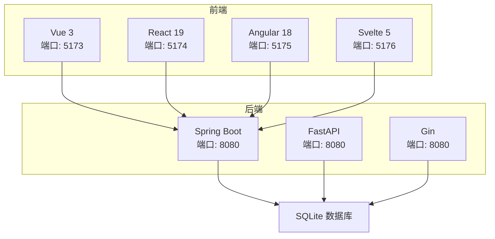
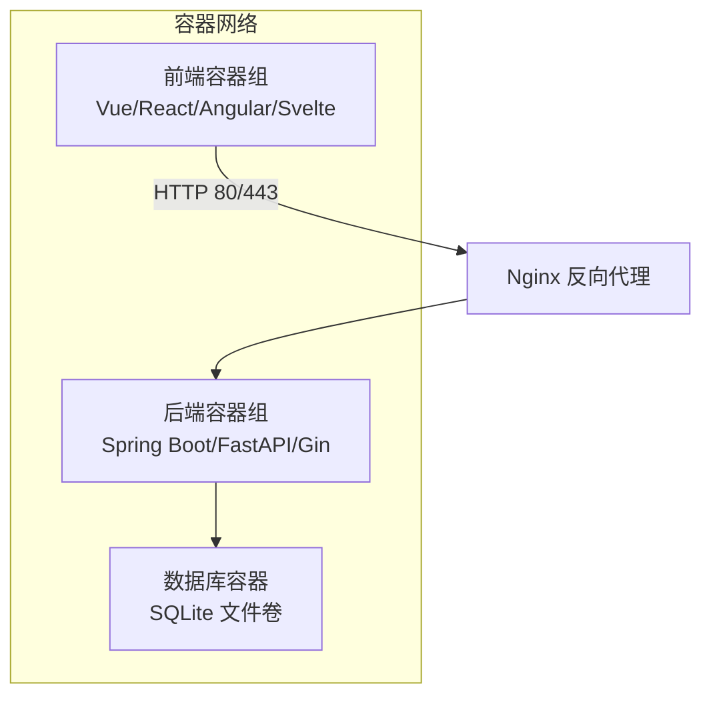
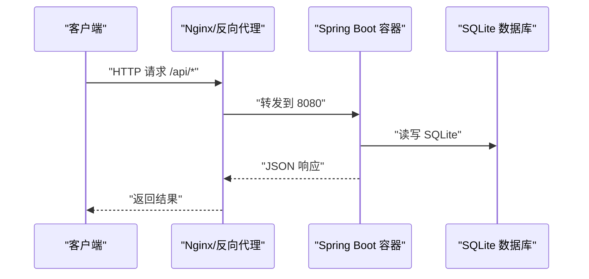
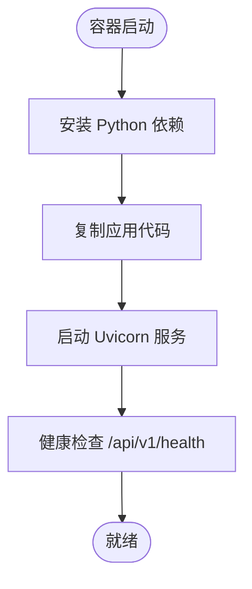
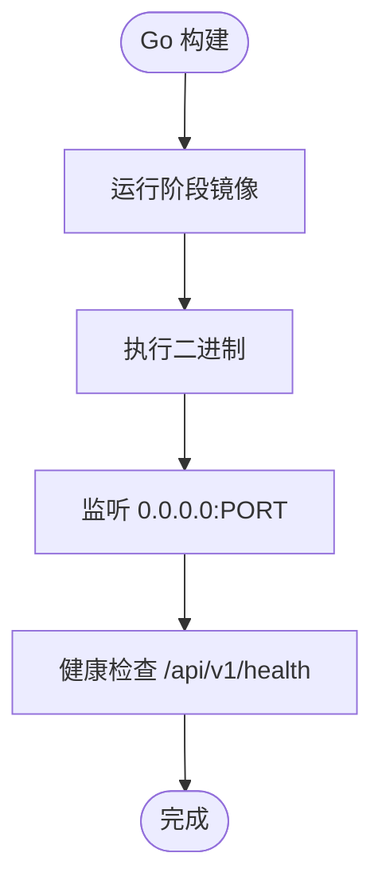
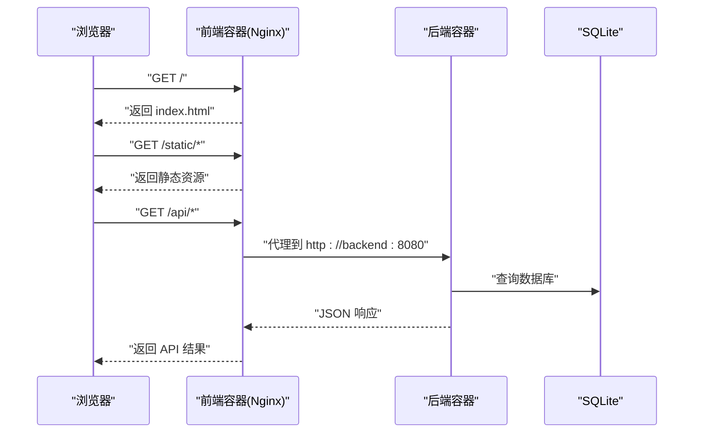
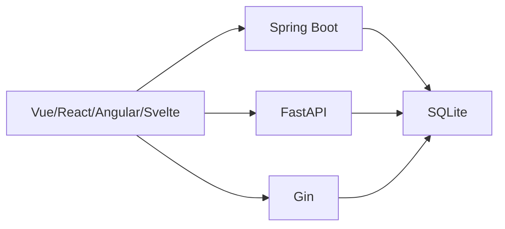

# Docker容器化部署

<cite>
**本文引用的文件**
- [README.md](file://README.md)
- [docs/deployment.md](file://docs/deployment.md)
- [backends/spring-boot/pom.xml](file://backends/spring-boot/pom.xml)
- [backends/spring-boot/src/main/resources/application.yml](file://backends/spring-boot/src/main/resources/application.yml)
- [backends/spring-boot/src/main/java/com/hellotime/HelloTimeApplication.java](file://backends/spring-boot/src/main/java/com/hellotime/HelloTimeApplication.java)
- [backends/fastapi/requirements.txt](file://backends/fastapi/requirements.txt)
- [backends/fastapi/app/main.py](file://backends/fastapi/app/main.py)
- [backends/gin/go.mod](file://backends/gin/go.mod)
- [backends/gin/main.go](file://backends/gin/main.go)
- [frontends/vue3-ts/package.json](file://frontends/vue3-ts/package.json)
- [frontends/vue3-ts/vite.config.ts](file://frontends/vue3-ts/vite.config.ts)
- [frontends/react-ts/vite.config.ts](file://frontends/react-ts/vite.config.ts)
- [frontends/angular-ts/angular.json](file://frontends/angular-ts/angular.json)
- [scripts/dev.sh](file://scripts/dev.sh)
- [scripts/build.sh](file://scripts/build.sh)
</cite>

## 目录
1. [简介](#简介)
2. [项目结构](#项目结构)
3. [核心组件](#核心组件)
4. [架构总览](#架构总览)
5. [详细组件分析](#详细组件分析)
6. [依赖关系分析](#依赖关系分析)
7. [性能考虑](#性能考虑)
8. [故障排查指南](#故障排查指南)
9. [结论](#结论)
10. [附录](#附录)

## 简介
本指南面向HelloTime项目，提供从零开始的Docker容器化部署方案，涵盖后端（Spring Boot、FastAPI、Gin）、前端（Vue 3、React、Angular、Svelte）与SQLite数据库的容器化与编排。内容包括：
- 多阶段构建的Dockerfile编写与镜像优化
- Docker Compose服务编排与网络、卷、环境变量配置
- 容器运行最佳实践（资源限制、健康检查、重启策略）
- 日志收集、监控指标与故障排查方法
- 容器安全加固与权限管理建议

## 项目结构
HelloTime采用“前后端完全解耦”的架构，统一的OpenAPI规范与设计系统确保多技术栈组合的一致性。后端提供三种实现，前端提供四种实现，配合SQLite数据库，形成可独立运行、也可统一编排的微服务形态。

图表来源
- [README.md: 18-32:18-32](file://README.md#L18-L32)
- [frontends/vue3-ts/vite.config.ts: 13-22:13-22](file://frontends/vue3-ts/vite.config.ts#L13-L22)
- [frontends/react-ts/vite.config.ts: 13-22:13-22](file://frontends/react-ts/vite.config.ts#L13-L22)
- [backends/spring-boot/src/main/resources/application.yml: 17-18:17-18](file://backends/spring-boot/src/main/resources/application.yml#L17-L18)
- [backends/fastapi/app/main.py: 21-29:21-29](file://backends/fastapi/app/main.py#L21-L29)
- [backends/gin/main.go: 26](file://backends/gin/main.go#L26)

章节来源
- [README.md: 16-323:16-323](file://README.md#L16-L323)

## 核心组件
- 后端服务
  - Spring Boot：基于Maven构建，使用SQLite作为数据存储，默认监听8080端口，支持JWT认证与管理员接口。
  - FastAPI：基于Python与Uvicorn，使用SQLAlchemy与SQLite，提供统一REST API。
  - Gin：基于Go与GORM，SQLite驱动，提供REST API与JWT认证。
- 前端应用
  - Vue 3、React 19、Angular 18、Svelte 5：均通过Vite开发服务器运行，开发端口分别为5173~5176；生产构建输出静态资源。
- 数据库
  - SQLite：单文件数据库，位于后端运行目录下的hellotime.db。

章节来源
- [backends/spring-boot/pom.xml: 25-79:25-79](file://backends/spring-boot/pom.xml#L25-L79)
- [backends/spring-boot/src/main/resources/application.yml: 4-25:4-25](file://backends/spring-boot/src/main/resources/application.yml#L4-L25)
- [backends/fastapi/requirements.txt: 1-7:1-7](file://backends/fastapi/requirements.txt#L1-L7)
- [backends/gin/go.mod: 5-10:5-10](file://backends/gin/go.mod#L5-L10)
- [frontends/vue3-ts/package.json: 6-12:6-12](file://frontends/vue3-ts/package.json#L6-L12)

## 架构总览
下图展示了容器化后的典型部署拓扑：前端通过反向代理或直接访问后端API；后端连接共享的SQLite数据库卷；各后端实现可独立替换，前端无需改动。

图表来源
- [docs/deployment.md: 87-107:87-107](file://docs/deployment.md#L87-L107)
- [backends/spring-boot/src/main/resources/application.yml: 17-18:17-18](file://backends/spring-boot/src/main/resources/application.yml#L17-L18)

## 详细组件分析

### Spring Boot 后端容器化
- 运行方式
  - 使用JVM运行打包好的Spring Boot JAR，监听8080端口。
  - 环境变量用于配置管理员密码、JWT密钥与服务器端口。
- Dockerfile要点
  - 多阶段构建：基础镜像拉取JDK，构建阶段执行Maven打包，运行阶段仅拷贝最小运行时。
  - 依赖缓存优化：先复制pom.xml再复制源码，提升缓存命中率。
  - 非root用户运行：降低权限风险。
- 健康检查
  - 通过HTTP GET /api/v1/health进行探针检查。
- 环境变量
  - ADMIN_PASSWORD、JWT_SECRET、SERVER_PORT等。

图表来源
- [docs/deployment.md: 64-69:64-69](file://docs/deployment.md#L64-L69)
- [backends/spring-boot/src/main/resources/application.yml: 17-25:17-25](file://backends/spring-boot/src/main/resources/application.yml#L17-L25)

章节来源
- [backends/spring-boot/pom.xml: 82-89:82-89](file://backends/spring-boot/pom.xml#L82-L89)
- [backends/spring-boot/src/main/resources/application.yml: 17-25:17-25](file://backends/spring-boot/src/main/resources/application.yml#L17-L25)
- [backends/spring-boot/src/main/java/com/hellotime/HelloTimeApplication.java: 6-11:6-11](file://backends/spring-boot/src/main/java/com/hellotime/HelloTimeApplication.java#L6-L11)

### FastAPI 后端容器化
- 运行方式
  - 使用Uvicorn运行FastAPI应用，默认监听8080端口。
  - 通过环境变量控制数据库URL、管理员密码、JWT密钥与过期时长。
- Dockerfile要点
  - 多阶段构建：使用轻量级Python镜像作为运行时，安装依赖并仅复制必要文件。
  - 依赖安装优化：先复制requirements.txt再复制源码，利用层缓存。
  - 非root用户运行与工作目录隔离。
- 健康检查
  - 通过HTTP GET /api/v1/health进行探针检查。
- 环境变量
  - DATABASE_URL、ADMIN_PASSWORD、JWT_SECRET、JWT_EXPIRATION_HOURS。

图表来源
- [backends/fastapi/requirements.txt: 1-7:1-7](file://backends/fastapi/requirements.txt#L1-L7)
- [backends/fastapi/app/main.py: 19-34:19-34](file://backends/fastapi/app/main.py#L19-L34)

章节来源
- [backends/fastapi/requirements.txt: 1-7:1-7](file://backends/fastapi/requirements.txt#L1-L7)
- [backends/fastapi/app/main.py: 19-89:19-89](file://backends/fastapi/app/main.py#L19-L89)

### Gin 后端容器化
- 运行方式
  - 使用Go编译产物运行，监听8080端口。
  - 通过环境变量控制端口与数据库路径。
- Dockerfile要点
  - 多阶段构建：构建阶段使用golang镜像编译，运行阶段使用distroless或alpine。
  - 编译优化：启用CGO条件与静态链接（如需）。
  - 非root用户运行与最小权限。
- 健康检查
  - 通过HTTP GET /api/v1/health进行探针检查。
- 环境变量
  - PORT（由main.go读取）。

图表来源
- [backends/gin/go.mod: 1-46:1-46](file://backends/gin/go.mod#L1-L46)
- [backends/gin/main.go: 15-31:15-31](file://backends/gin/main.go#L15-L31)

章节来源
- [backends/gin/go.mod: 1-46:1-46](file://backends/gin/go.mod#L1-L46)
- [backends/gin/main.go: 15-31:15-31](file://backends/gin/main.go#L15-L31)

### 前端容器化与反向代理
- 开发与生产差异
  - 开发：Vite开发服务器，端口5173~5176，具备热更新与API代理。
  - 生产：构建静态资源，由Nginx或其他Web服务器托管。
- 反向代理配置
  - 将前端静态文件根目录指向dist目录，并将/api前缀代理至后端8080端口。
- Dockerfile要点
  - 多阶段构建：构建阶段使用Node，运行阶段使用Nginx或轻量级静态服务器。
  - 缓存优化：先复制package*.json，再复制源码。
  - 最小化运行时与非root用户。

图表来源
- [frontends/vue3-ts/vite.config.ts: 13-22:13-22](file://frontends/vue3-ts/vite.config.ts#L13-L22)
- [frontends/react-ts/vite.config.ts: 13-22:13-22](file://frontends/react-ts/vite.config.ts#L13-L22)
- [docs/deployment.md: 87-107:87-107](file://docs/deployment.md#L87-L107)

章节来源
- [frontends/vue3-ts/vite.config.ts: 13-22:13-22](file://frontends/vue3-ts/vite.config.ts#L13-L22)
- [frontends/react-ts/vite.config.ts: 13-22:13-22](file://frontends/react-ts/vite.config.ts#L13-L22)
- [frontends/angular-ts/angular.json: 24-66:24-66](file://frontends/angular-ts/angular.json#L24-L66)
- [docs/deployment.md: 87-107:87-107](file://docs/deployment.md#L87-L107)

### 数据库容器化与卷管理
- SQLite特性
  - 单文件数据库，便于容器化与持久化。
  - 通过卷挂载将hellotime.db映射到宿主机或共享卷，实现数据持久化。
- 卷建议
  - 使用命名卷或绑定挂载，避免容器重建导致数据丢失。
  - 权限设置为非root用户可读写。
- 备份策略
  - 停机备份：复制hellotime.db文件。
  - 在线备份：使用SQLite在线备份API或事务快照。

章节来源
- [docs/deployment.md: 109-112:109-112](file://docs/deployment.md#L109-L112)
- [backends/spring-boot/src/main/resources/application.yml: 4-6:4-6](file://backends/spring-boot/src/main/resources/application.yml#L4-L6)

## 依赖关系分析
- 后端对数据库的依赖
  - Spring Boot：JPA + SQLite JDBC + Hibernate方言
  - FastAPI：SQLAlchemy + SQLite
  - Gin：GORM + SQLite驱动
- 前端对后端的依赖
  - 统一的OpenAPI规范与路由约定，前端通过代理访问后端API
- 代理与端口映射
  - 前端开发端口：5173~5176
  - 后端服务端口：8080
  - 反向代理端口：80/443

图表来源
- [backends/spring-boot/pom.xml: 44-53:44-53](file://backends/spring-boot/pom.xml#L44-L53)
- [backends/fastapi/requirements.txt: 3](file://backends/fastapi/requirements.txt#L3)
- [backends/gin/go.mod: 8-9:8-9](file://backends/gin/go.mod#L8-L9)

章节来源
- [backends/spring-boot/pom.xml: 44-53:44-53](file://backends/spring-boot/pom.xml#L44-L53)
- [backends/fastapi/requirements.txt: 3](file://backends/fastapi/requirements.txt#L3)
- [backends/gin/go.mod: 8-9:8-9](file://backends/gin/go.mod#L8-L9)

## 性能考虑
- 多阶段构建
  - 减少最终镜像体积，缩短构建时间，提升缓存命中率。
- 运行时优化
  - 后端启用虚拟线程（Spring Boot 21+）与异步I/O（Uvicorn/Gin）。
  - 前端静态资源启用压缩与缓存策略。
- 资源限制
  - 为后端容器设置CPU/内存上限，防止资源争用。
  - 前端容器使用轻量级Nginx或静态服务器，减少资源占用。
- 健康检查与重启策略
  - 健康检查间隔与超时合理配置，避免误判。
  - 重启策略选择unless-stopped或on-failure，结合日志与监控。

## 故障排查指南
- 常见问题定位
  - 端口冲突：确认8080、5173~5176端口未被占用。
  - CORS错误：确认后端CORS配置允许前端开发域名。
  - 数据库连接失败：检查数据库文件权限与路径映射。
- 日志收集
  - 容器日志：docker logs <container> 或使用集中式日志（如Fluent Bit/ELK）。
  - 应用日志：后端输出结构化日志，前端控制台与Network面板排查API调用。
- 监控指标
  - CPU/内存/磁盘IO：使用cAdvisor或Prometheus Exporter。
  - 应用指标：后端暴露健康检查端点与自定义指标。
- 快速恢复
  - 回滚镜像版本，恢复数据库备份文件。
  - 临时关闭不稳定的后端实例，保证前端可用性。

章节来源
- [backends/fastapi/app/main.py: 21-29:21-29](file://backends/fastapi/app/main.py#L21-L29)
- [docs/deployment.md: 87-107:87-107](file://docs/deployment.md#L87-L107)

## 结论
通过多阶段构建与合理的容器编排，HelloTime可以在单一平台上同时运行多个前端与后端实现，并以SQLite作为共享数据存储。结合健康检查、资源限制与安全加固，可实现稳定、可观测且易于维护的生产级部署。

## 附录

### Dockerfile编写与多阶段构建要点
- Spring Boot
  - 构建阶段：复制pom.xml与源码，执行Maven打包
  - 运行阶段：使用JRE镜像，复制JAR，非root用户运行
- FastAPI
  - 构建阶段：复制requirements.txt与源码，安装依赖
  - 运行阶段：使用python slim镜像，仅复制必要文件
- Gin
  - 构建阶段：使用golang镜像编译
  - 运行阶段：使用distroless或alpine，非root用户运行
- 前端
  - 构建阶段：使用Node构建静态资源
  - 运行阶段：使用Nginx或静态服务器镜像

章节来源
- [backends/spring-boot/pom.xml: 82-89:82-89](file://backends/spring-boot/pom.xml#L82-L89)
- [backends/fastapi/requirements.txt: 1-7:1-7](file://backends/fastapi/requirements.txt#L1-L7)
- [backends/gin/go.mod: 1-46:1-46](file://backends/gin/go.mod#L1-L46)
- [frontends/vue3-ts/package.json: 8](file://frontends/vue3-ts/package.json#L8)

### Docker Compose服务编排建议
- 服务定义
  - web：前端容器，暴露80/443，挂载静态资源卷
  - backend-sb：Spring Boot容器，映射8080，挂载数据库卷
  - backend-fa：FastAPI容器，映射8080，挂载数据库卷
  - backend-gi：Gin容器，映射8080，挂载数据库卷
  - db：SQLite文件卷，供后端读写
- 网络与卷
  - 使用自定义桥接网络，便于服务发现
  - 数据库卷使用命名卷或绑定挂载
- 环境变量
  - 通过env_file或environment字段注入敏感信息
- 健康检查与重启策略
  - 为每个后端服务配置健康检查
  - 重启策略：unless-stopped 或 on-failure

章节来源
- [docs/deployment.md: 44-86:44-86](file://docs/deployment.md#L44-L86)
- [backends/spring-boot/src/main/resources/application.yml: 20-25:20-25](file://backends/spring-boot/src/main/resources/application.yml#L20-L25)

### 容器运行最佳实践
- 资源限制
  - 为后端容器设置CPU/内存上限，避免资源争用
- 健康检查
  - 使用HTTP探针检查 /api/v1/health
- 重启策略
  - unless-stopped 或 on-failure
- 日志与监控
  - 集中化日志采集与告警
  - Prometheus/Grafana监控后端指标

章节来源
- [backends/fastapi/app/main.py: 19-34:19-34](file://backends/fastapi/app/main.py#L19-L34)
- [docs/deployment.md: 44-86:44-86](file://docs/deployment.md#L44-L86)

### 容器安全加固与权限管理
- 非root用户运行
  - 所有容器以非root用户启动
- 最小权限原则
  - 仅授予数据库文件读写权限
- 环境变量与密钥
  - 使用密钥管理服务（如Vault/KMS）注入敏感信息
- 网络隔离
  - 仅开放必要端口，使用防火墙规则
- 镜像安全扫描
  - 定期扫描基础镜像与应用镜像的安全漏洞

章节来源
- [backends/spring-boot/src/main/resources/application.yml: 20-25:20-25](file://backends/spring-boot/src/main/resources/application.yml#L20-L25)
- [docs/deployment.md: 71-86:71-86](file://docs/deployment.md#L71-L86)