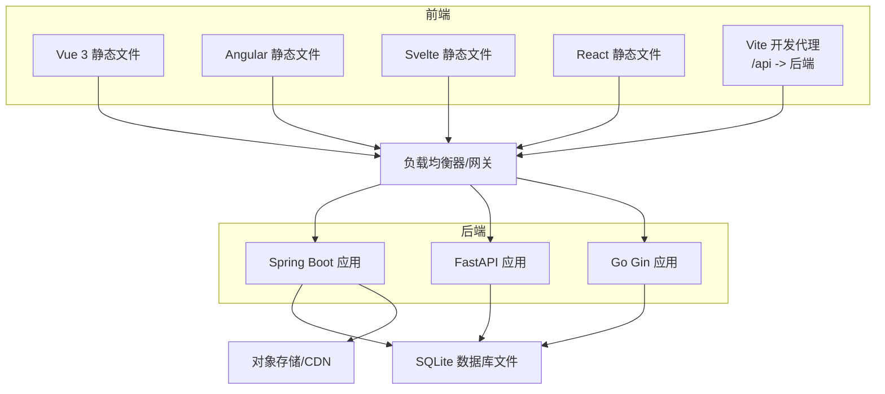
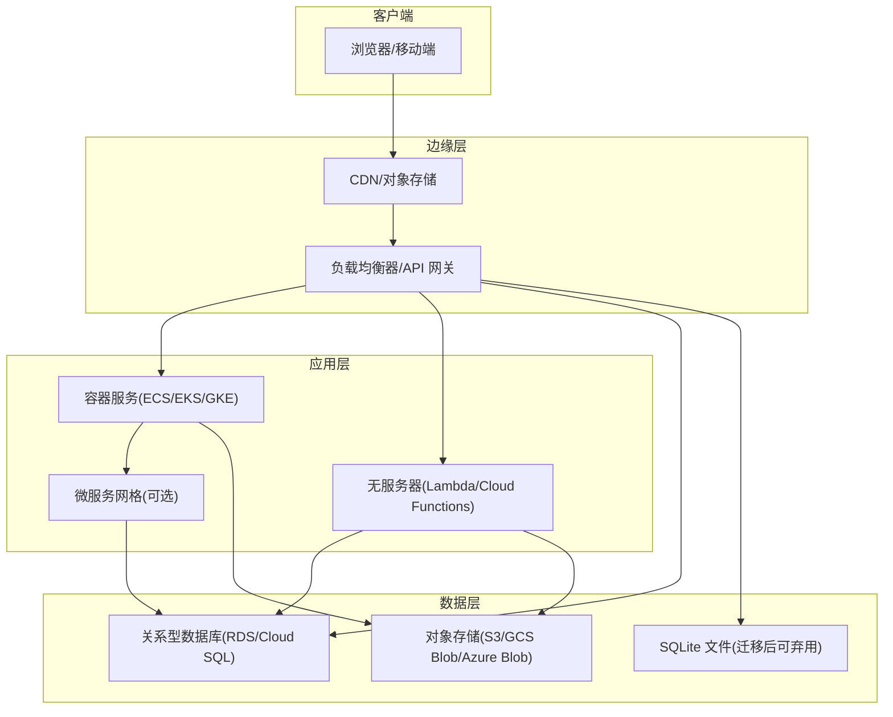
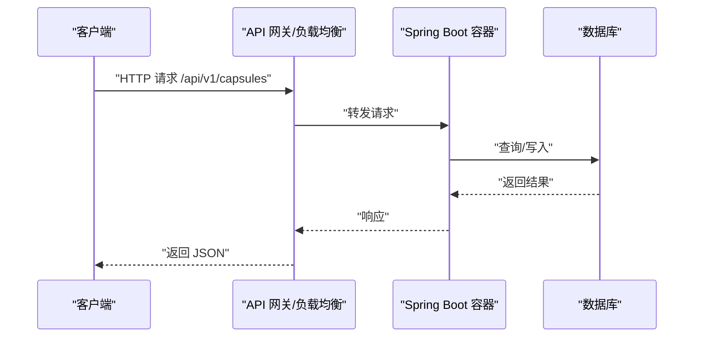
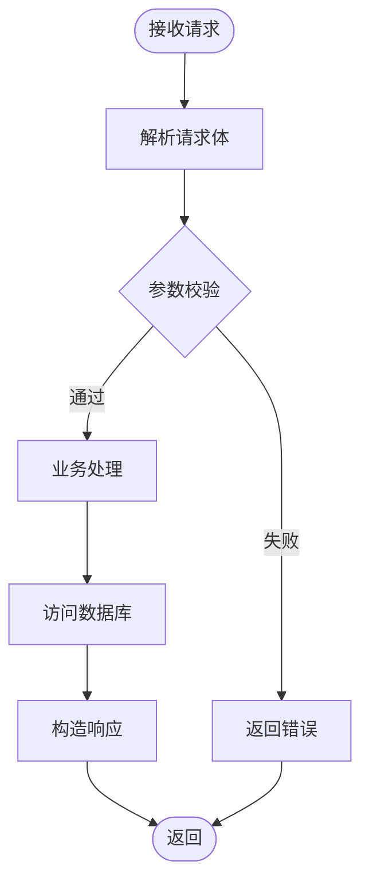
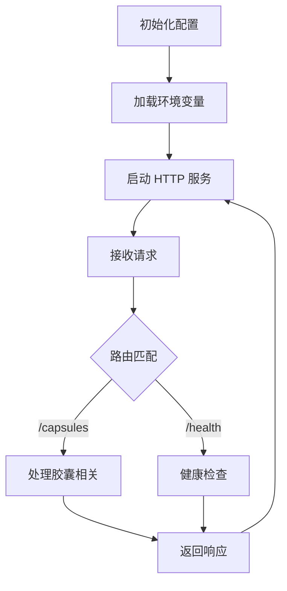
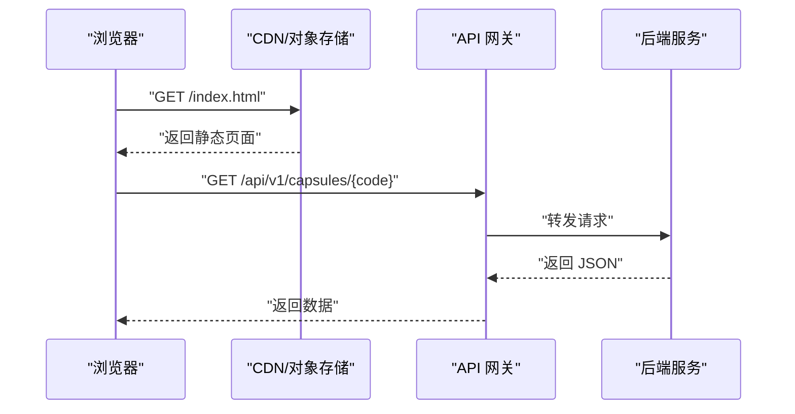
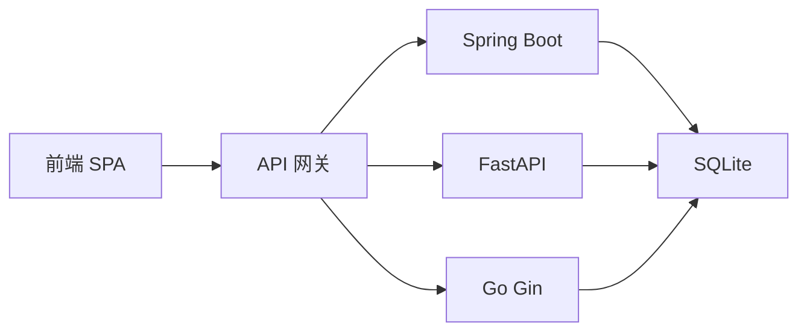

# 云平台部署

<cite>
**本文引用的文件**
- [deployment.md](file://docs/deployment.md)
- [application.yml](file://backends/spring-boot/src/main/resources/application.yml)
- [pom.xml](file://backends/spring-boot/pom.xml)
- [HelloTimeApplication.java](file://backends/spring-boot/src/main/java/com/hellotime/HelloTimeApplication.java)
- [CapsuleController.java](file://backends/spring-boot/src/main/java/com/hellotime/controller/CapsuleController.java)
- [CapsuleService.java](file://backends/spring-boot/src/main/java/com/hellotime/service/CapsuleService.java)
- [config.go](file://backends/gin/config/config.go)
- [config.py](file://backends/fastapi/app/config.py)
- [build.sh](file://scripts/build.sh)
- [dev.sh](file://scripts/dev.sh)
- [vite.config.ts](file://frontends/vue3-ts/vite.config.ts)
- [requirements.txt](file://backends/fastapi/requirements.txt)
- [openapi.yaml](file://spec/api/openapi.yaml)
</cite>

## 目录
1. [简介](#简介)
2. [项目结构](#项目结构)
3. [核心组件](#核心组件)
4. [架构总览](#架构总览)
5. [详细组件分析](#详细组件分析)
6. [依赖关系分析](#依赖关系分析)
7. [性能考虑](#性能考虑)
8. [故障排查指南](#故障排查指南)
9. [结论](#结论)
10. [附录](#附录)

## 简介
本指南面向在 AWS、Azure、Google Cloud 等主流云平台部署 HelloTime 的工程团队与运维人员。HelloTime 是一个“时间胶囊”应用，后端采用多语言实现（Spring Boot、FastAPI、Go Gin），前端提供 Vue 3、Angular、Svelte、React、Vue 3 等版本。部署目标包括：
- 云原生部署：容器服务（ECS/EKS/GKE）、无服务器函数（Lambda/Cloud Functions）、微服务架构
- 云数据库：关系型与嵌入式数据库的迁移与高可用策略
- 对象存储与 CDN 加速：静态资源与媒体资源的分发
- 负载均衡、自动扩缩容、蓝绿部署
- 成本优化与资源监控
- 云安全与 IAM 权限管理、网络 ACL 设置
- CI/CD 流水线在云平台的集成

## 项目结构
HelloTime 采用前后端分离架构，后端提供 REST API，前端以 SPA 形式运行并通过反向代理访问后端。构建产物为：
- 后端：Spring Boot 生成可执行 JAR；FastAPI 与 Go Gin 可打包为容器镜像
- 前端：各框架构建后的静态文件，由 Nginx 或对象存储/CDN 提供

图表来源
- [application.yml:1-26](file://backends/spring-boot/src/main/resources/application.yml#L1-L26)
- [vite.config.ts:1-23](file://frontends/vue3-ts/vite.config.ts#L1-L23)
- [build.sh:1-41](file://scripts/build.sh#L1-L41)

章节来源
- [deployment.md:1-112](file://docs/deployment.md#L1-L112)
- [build.sh:1-41](file://scripts/build.sh#L1-L41)

## 核心组件
- 后端服务（Spring Boot）
  - 使用 SQLite 作为本地数据库，JPA/Hibernate 管理实体与 DDL 自动更新
  - 提供 REST API，基础路径包含版本号，如 /api/v1/capsules
  - 支持虚拟线程（Java 21+），提升并发性能
- 后端服务（FastAPI）
  - 基于 Python 的高性能异步 Web 框架，适合快速扩展与云原生部署
- 后端服务（Go Gin）
  - 轻量级 HTTP 框架，适合微服务与无服务器场景
- 前端
  - 多框架并行：Vue 3、Angular、Svelte、React、Vue 3
  - Vite 开发代理将 /api 请求转发至后端，便于联调
- 部署脚本
  - 统一构建脚本负责后端 JAR 与各前端静态产物的产出
  - 开发脚本并行启动后端与多个前端开发服务器

章节来源
- [application.yml:1-26](file://backends/spring-boot/src/main/resources/application.yml#L1-L26)
- [HelloTimeApplication.java:1-12](file://backends/spring-boot/src/main/java/com/hellotime/HelloTimeApplication.java#L1-L12)
- [CapsuleController.java:1-57](file://backends/spring-boot/src/main/java/com/hellotime/controller/CapsuleController.java#L1-L57)
- [CapsuleService.java:1-196](file://backends/spring-boot/src/main/java/com/hellotime/service/CapsuleService.java#L1-L196)
- [config.go:1-51](file://backends/gin/config/config.go#L1-L51)
- [config.py:1-18](file://backends/fastapi/app/config.py#L1-L18)
- [vite.config.ts:1-23](file://frontends/vue3-ts/vite.config.ts#L1-L23)
- [build.sh:1-41](file://scripts/build.sh#L1-L41)
- [dev.sh:1-52](file://scripts/dev.sh#L1-L52)

## 架构总览
以下为云平台部署的总体架构示意，涵盖容器化、无服务器、微服务三种路径，并标注数据库、对象存储与 CDN 的位置。

图表来源
- [application.yml:1-26](file://backends/spring-boot/src/main/resources/application.yml#L1-L26)
- [deployment.md:44-112](file://docs/deployment.md#L44-L112)

## 详细组件分析

### 后端（Spring Boot）云原生部署
- 容器化
  - 使用 Maven 打包生成可执行 JAR，配合 Dockerfile 构建镜像
  - 推荐基于官方 JRE 镜像，减少镜像体积
- 云服务选择
  - ECS（阿里云）：ECS 实例 + RDS；或 ECS + ACK（Kubernetes）
  - Azure：App Service、AKS 或 VMSS + Azure SQL
  - GCP：Cloud Run、GKE 或 Compute Engine + Cloud SQL
- 配置与环境变量
  - 数据源 URL、JWT 密钥、端口等通过环境变量注入
  - 生产环境务必替换默认 JWT 密钥
- 健康检查与就绪探针
  - 暴露 /api/v1/health 路径，用于健康检查
- 日志与指标
  - 输出结构化日志，接入平台日志服务
  - 暴露 Prometheus 指标端点（如需）

图表来源
- [CapsuleController.java:1-57](file://backends/spring-boot/src/main/java/com/hellotime/controller/CapsuleController.java#L1-L57)
- [application.yml:1-26](file://backends/spring-boot/src/main/resources/application.yml#L1-L26)

章节来源
- [pom.xml:1-91](file://backends/spring-boot/pom.xml#L1-L91)
- [application.yml:1-26](file://backends/spring-boot/src/main/resources/application.yml#L1-L26)
- [deployment.md:44-112](file://docs/deployment.md#L44-L112)

### 后端（FastAPI）云原生部署
- 容器化与镜像
  - 基于 Python 运行时构建镜像，使用 requirements.txt 安装依赖
- 无服务器部署
  - 将 FastAPI 应用适配为云函数入口，结合 API 网关触发
- 微服务拆分
  - 将不同领域（如用户、订单、通知）拆分为独立服务，通过 API 网关聚合

图表来源
- [config.py:1-18](file://backends/fastapi/app/config.py#L1-L18)
- [requirements.txt:1-7](file://backends/fastapi/requirements.txt#L1-L7)

章节来源
- [config.py:1-18](file://backends/fastapi/app/config.py#L1-L18)
- [requirements.txt:1-7](file://backends/fastapi/requirements.txt#L1-L7)

### 后端（Go Gin）云原生部署
- 容器化
  - 编译为静态二进制，使用精简镜像（如 alpine）
- 无服务器
  - 适配云函数运行时，注意冷启动与超时限制
- 微服务
  - 将 Gin 服务拆分为更细粒度的服务，结合服务发现与 API 网关

图表来源
- [config.go:1-51](file://backends/gin/config/config.go#L1-L51)

章节来源
- [config.go:1-51](file://backends/gin/config/config.go#L1-L51)

### 前端静态资源与 CDN
- 构建产物
  - 各前端框架构建后输出静态文件，放置于对象存储或 CDN
- 反向代理
  - 开发阶段使用 Vite 代理 /api；生产阶段由网关统一转发
- CDN 加速
  - 静态资源走 CDN，API 走就近网关，降低延迟

图表来源
- [vite.config.ts:1-23](file://frontends/vue3-ts/vite.config.ts#L1-L23)
- [deployment.md:87-107](file://docs/deployment.md#L87-L107)

章节来源
- [vite.config.ts:1-23](file://frontends/vue3-ts/vite.config.ts#L1-L23)
- [deployment.md:87-107](file://docs/deployment.md#L87-L107)

### 数据库与对象存储
- SQLite
  - 默认本地文件，适合开发与小规模测试
  - 生产建议迁移到关系型数据库（RDS/Cloud SQL/Azure SQL）
- 对象存储
  - 存放前端静态资源、媒体文件与备份
  - 与 CDN 结合实现全球加速
- 备份与恢复
  - 关系型数据库定期备份；SQLite 文件可直接复制

章节来源
- [application.yml:1-26](file://backends/spring-boot/src/main/resources/application.yml#L1-L26)
- [deployment.md:109-112](file://docs/deployment.md#L109-L112)

### 负载均衡、自动扩缩容与蓝绿部署
- 负载均衡
  - 使用云平台提供的负载均衡器或 API 网关，分发流量至后端实例或容器组
- 自动扩缩容
  - 基于 CPU/内存或自定义指标进行扩缩容
  - 容器服务可结合 HPA（水平自动伸缩）
- 蓝绿部署
  - 新版本部署到备用组，验证通过后切换流量，回滚迅速

章节来源
- [deployment.md:44-112](file://docs/deployment.md#L44-L112)

### 云安全与 IAM 权限管理
- 最小权限原则
  - 为后端服务绑定最小权限的 IAM 角色，仅授予访问数据库与对象存储所需权限
- 网络 ACL 与安全组
  - 限制后端仅允许来自网关/负载均衡器的入站流量
  - 出站仅允许访问数据库与对象存储
- TLS 与证书
  - 网关统一终止 TLS，后端之间内网通信可使用 mTLS（如启用）
- 敏感配置
  - JWT 密钥、数据库凭据等放入密钥管理服务（KMS/Key Vault/Secret Manager）

章节来源
- [application.yml:20-26](file://backends/spring-boot/src/main/resources/application.yml#L20-L26)

### CI/CD 流水线集成
- 触发条件
  - push 到主分支或合并请求
- 步骤建议
  - 代码检出 → 单元测试 → 构建后端 JAR 与前端静态文件 → 扫描镜像漏洞 → 推送镜像 → 部署到目标环境（蓝绿/滚动）
- 环境管理
  - 不同环境（dev/staging/prod）使用不同配置与密钥
- 回滚策略
  - 记录镜像版本，支持一键回滚

章节来源
- [build.sh:1-41](file://scripts/build.sh#L1-L41)
- [dev.sh:1-52](file://scripts/dev.sh#L1-L52)

## 依赖关系分析
后端三栈共享相同的 API 表面（/api/v1/capsules），前端通过统一网关访问。数据库方面，Spring Boot 使用 SQLite，其他后端可复用相同表结构或迁移至关系型数据库。

图表来源
- [CapsuleController.java:1-57](file://backends/spring-boot/src/main/java/com/hellotime/controller/CapsuleController.java#L1-L57)
- [application.yml:1-26](file://backends/spring-boot/src/main/resources/application.yml#L1-L26)
- [config.py:1-18](file://backends/fastapi/app/config.py#L1-L18)
- [config.go:1-51](file://backends/gin/config/config.go#L1-L51)

章节来源
- [CapsuleController.java:1-57](file://backends/spring-boot/src/main/java/com/hellotime/controller/CapsuleController.java#L1-L57)
- [application.yml:1-26](file://backends/spring-boot/src/main/resources/application.yml#L1-L26)
- [config.py:1-18](file://backends/fastapi/app/config.py#L1-L18)
- [config.go:1-51](file://backends/gin/config/config.go#L1-L51)

## 性能考虑
- 数据库
  - SQLite 适合小规模，生产建议迁移到具备读副本与备份能力的关系型数据库
- 缓存
  - 对热点胶囊详情增加缓存层（Redis/云内存数据库），降低数据库压力
- 并发
  - Spring Boot 已启用虚拟线程（Java 21+），可进一步优化线程池与连接池
- 网络
  - API 网关就近接入，CDN 加速静态资源，减少跨域与证书握手开销

## 故障排查指南
- 健康检查
  - 访问 /api/v1/health 确认服务可用
- 日志定位
  - 查看容器/实例日志，关注数据库连接、JWT 解析、请求耗时
- 数据一致性
  - 核对 SQLite 文件权限与挂载卷，避免并发写入冲突
- 网络连通性
  - 确认安全组/ACL 放通网关到后端与数据库的端口

章节来源
- [deployment.md:1-112](file://docs/deployment.md#L1-L112)

## 结论
HelloTime 具备良好的云原生适配性：后端多语言实现、前端静态化、清晰的 API 设计与统一的配置注入方式。结合对象存储与 CDN、负载均衡与自动扩缩容、蓝绿部署与完善的 CI/CD，可在 AWS、Azure、GCP 上实现高可用、低成本、易扩展的生产部署。

## 附录
- API 规范
  - 参考 OpenAPI 规范文件，明确接口字段与约束
- 环境变量清单
  - ADMIN_PASSWORD、JWT_SECRET、SERVER_PORT、DATABASE_URL 等

章节来源
- [openapi.yaml](file://spec/api/openapi.yaml)
- [application.yml:20-26](file://backends/spring-boot/src/main/resources/application.yml#L20-L26)
- [config.py:1-18](file://backends/fastapi/app/config.py#L1-L18)
- [config.go:32-43](file://backends/gin/config/config.go#L32-L43)