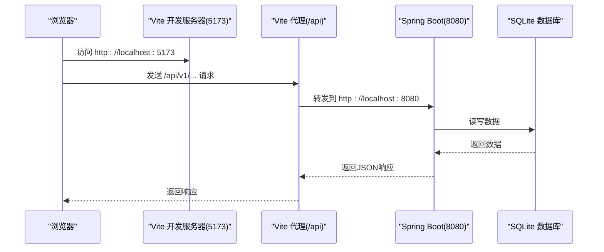
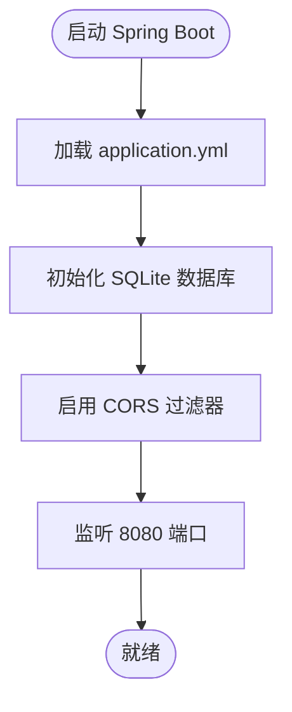
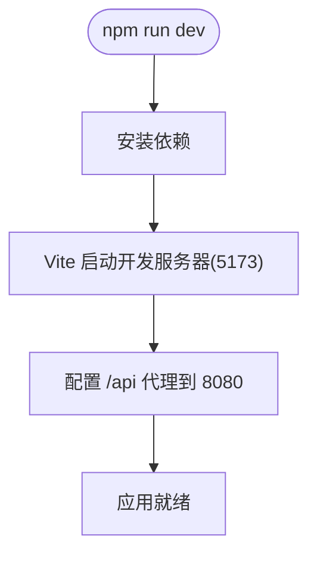
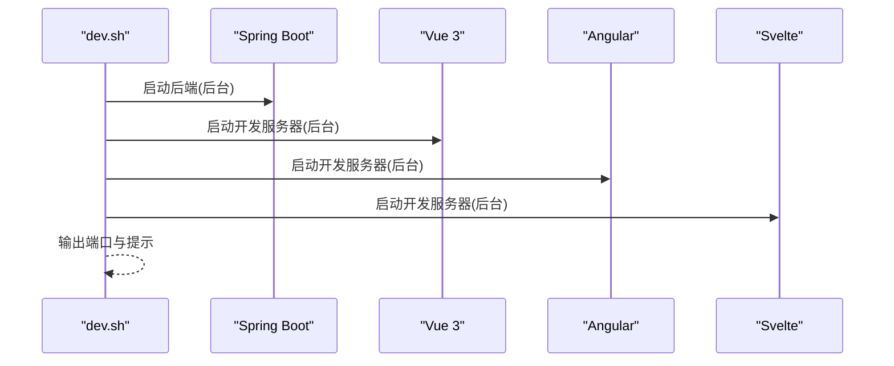
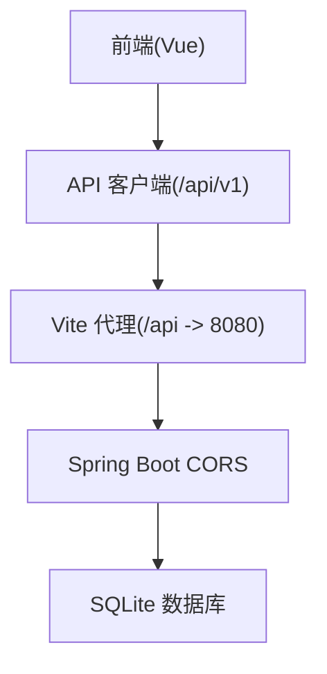
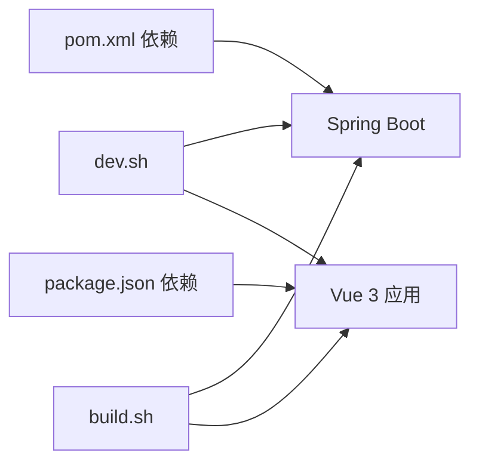

# 开发环境部署

<cite>
**本文引用的文件**
- [README.md](file://README.md)
- [backends/spring-boot/README.md](file://backends/spring-boot/README.md)
- [frontends/vue3-ts/README.md](file://frontends/vue3-ts/README.md)
- [scripts/dev.sh](file://scripts/dev.sh)
- [scripts/build.sh](file://scripts/build.sh)
- [scripts/test.sh](file://scripts/test.sh)
- [backends/spring-boot/src/main/resources/application.yml](file://backends/spring-boot/src/main/resources/application.yml)
- [backends/spring-boot/src/main/java/com/hellotime/config/CorsConfig.java](file://backends/spring-boot/src/main/java/com/hellotime/config/CorsConfig.java)
- [backends/spring-boot/pom.xml](file://backends/spring-boot/pom.xml)
- [frontends/vue3-ts/vite.config.ts](file://frontends/vue3-ts/vite.config.ts)
- [frontends/vue3-ts/package.json](file://frontends/vue3-ts/package.json)
- [frontends/vue3-ts/src/api/index.ts](file://frontends/vue3-ts/src/api/index.ts)
- [frontends/vue3-ts/src/main.ts](file://frontends/vue3-ts/src/main.ts)
</cite>

## 目录
1. [简介](#简介)
2. [项目结构](#项目结构)
3. [核心组件](#核心组件)
4. [架构总览](#架构总览)
5. [详细组件分析](#详细组件分析)
6. [依赖关系分析](#依赖关系分析)
7. [性能考虑](#性能考虑)
8. [故障排查指南](#故障排查指南)
9. [结论](#结论)
10. [附录](#附录)

## 简介
本指南面向HelloTime项目的开发者，提供从零搭建开发环境的完整步骤，涵盖后端Spring Boot应用的启动方式（Maven Wrapper与IDE运行）、前端Vue 3开发服务器的启动流程（npm install与npm run dev）、前后端联调的代理与跨域配置、开发脚本的使用方法（dev.sh与build.sh），以及热重载、调试模式、源码映射等开发特性说明，并给出性能优化建议与常见问题解决方案。

## 项目结构
HelloTime采用“前后端完全解耦”的多实现架构：同一套API规范与设计系统被多个前端框架（Vue 3、React、Angular、Svelte）与多个后端框架（Spring Boot、FastAPI、Gin）共同实现。开发时可独立运行任一前端与任一后端进行联调。

- 后端（Spring Boot）位于 backends/spring-boot，使用Java 21与SQLite数据库，默认监听8080端口。
- 前端（Vue 3）位于 frontends/vue3-ts，使用Vite 7，默认监听5173端口。
- 开发脚本位于 scripts/，提供一键启动、构建与测试能力。

```mermaid
graph TB
subgraph "后端"
SB["Spring Boot 应用<br/>端口: 8080"]
end
subgraph "前端"
VUE["Vue 3 应用<br/>端口: 5173"]
end
SB <- --> VUE
```

图表来源
- [backends/spring-boot/src/main/resources/application.yml:17-18](file://backends/spring-boot/src/main/resources/application.yml#L17-L18)
- [frontends/vue3-ts/vite.config.ts:13-21](file://frontends/vue3-ts/vite.config.ts#L13-L21)

章节来源
- [README.md: 37-63:37-63](file://README.md#L37-L63)
- [README.md: 67-82:67-82](file://README.md#L67-L82)

## 核心组件
- 后端Spring Boot应用
  - 使用Maven Wrapper快速启动：在 backends/spring-boot 目录执行 ./mvnw spring-boot:run。
  - 支持通过环境变量配置管理员密码与JWT密钥。
  - 默认数据库为SQLite，数据库文件位于 data/hellotime.db。
- 前端Vue 3应用
  - 使用Vite作为开发服务器，默认端口5173。
  - 通过Vite代理将 /api 前缀转发至后端8080端口。
  - 通过环境变量VITE_API_BASE_URL可调整后端地址。
- 开发脚本
  - scripts/dev.sh：同时启动后端与多个前端（Vue 5173、Angular 5175、Svelte 5176）。
  - scripts/build.sh：构建后端JAR与各前端静态资源。
  - scripts/test.sh：运行后端与前端测试。

章节来源
- [backends/spring-boot/README.md: 28-38:28-38](file://backends/spring-boot/README.md#L28-L38)
- [backends/spring-boot/README.md: 40-52:40-52](file://backends/spring-boot/README.md#L40-L52)
- [frontends/vue3-ts/README.md: 29-41:29-41](file://frontends/vue3-ts/README.md#L29-L41)
- [frontends/vue3-ts/README.md: 43-49:43-49](file://frontends/vue3-ts/README.md#L43-L49)
- [scripts/dev.sh: 11-26:11-26](file://scripts/dev.sh#L11-L26)
- [scripts/build.sh: 11-15:11-15](file://scripts/build.sh#L11-L15)
- [scripts/test.sh: 11-16:11-16](file://scripts/test.sh#L11-L16)

## 架构总览
下图展示了开发阶段的典型交互：前端通过Vite代理访问后端API，后端使用SQLite存储数据；Spring Boot提供CORS过滤器以允许本地跨域请求。



图表来源
- [frontends/vue3-ts/vite.config.ts:15-20](file://frontends/vue3-ts/vite.config.ts#L15-L20)
- [backends/spring-boot/src/main/resources/application.yml:17-18](file://backends/spring-boot/src/main/resources/application.yml#L17-L18)
- [backends/spring-boot/src/main/java/com/hellotime/config/CorsConfig.java:14-26](file://backends/spring-boot/src/main/java/com/hellotime/config/CorsConfig.java#L14-L26)

## 详细组件分析

### 后端：Spring Boot 应用
- 启动方式
  - 使用Maven Wrapper：在 backends/spring-boot 目录执行 ./mvnw spring-boot:run。
  - IDE运行：导入pom.xml后直接运行主类。
- 环境变量
  - ADMIN_PASSWORD：管理员登录密码。
  - JWT_SECRET：JWT签名密钥。
- 数据库
  - SQLite，数据库文件路径在配置中指定，首次运行自动创建。
- CORS
  - 允许 http://localhost:* 的来源，支持常用HTTP方法与凭据传递。



图表来源
- [backends/spring-boot/src/main/resources/application.yml:1-26](file://backends/spring-boot/src/main/resources/application.yml#L1-L26)
- [backends/spring-boot/src/main/java/com/hellotime/config/CorsConfig.java:14-26](file://backends/spring-boot/src/main/java/com/hellotime/config/CorsConfig.java#L14-L26)

章节来源
- [backends/spring-boot/README.md: 28-38:28-38](file://backends/spring-boot/README.md#L28-L38)
- [backends/spring-boot/README.md: 40-52:40-52](file://backends/spring-boot/README.md#L40-L52)
- [backends/spring-boot/src/main/resources/application.yml:1-26](file://backends/spring-boot/src/main/resources/application.yml#L1-L26)
- [backends/spring-boot/src/main/java/com/hellotime/config/CorsConfig.java:14-26](file://backends/spring-boot/src/main/java/com/hellotime/config/CorsConfig.java#L14-L26)

### 前端：Vue 3 开发服务器
- 启动流程
  - 安装依赖：npm install。
  - 启动开发服务器：npm run dev。
- 代理与跨域
  - Vite配置将 /api 前缀代理到 http://localhost:8080，便于前后端联调。
- API客户端
  - 统一的API封装模块，自动处理JSON序列化与统一错误处理，请求前缀为 /api/v1。
- 全局样式
  - 通过 main.ts 引入来自 spec 目录的设计令牌与基础样式，保证视觉一致性。



图表来源
- [frontends/vue3-ts/vite.config.ts:13-21](file://frontends/vue3-ts/vite.config.ts#L13-L21)
- [frontends/vue3-ts/src/api/index.ts:8-37](file://frontends/vue3-ts/src/api/index.ts#L8-L37)
- [frontends/vue3-ts/src/main.ts:9-13](file://frontends/vue3-ts/src/main.ts#L9-L13)

章节来源
- [frontends/vue3-ts/README.md: 29-41:29-41](file://frontends/vue3-ts/README.md#L29-L41)
- [frontends/vue3-ts/README.md: 43-49:43-49](file://frontends/vue3-ts/README.md#L43-L49)
- [frontends/vue3-ts/vite.config.ts:15-20](file://frontends/vue3-ts/vite.config.ts#L15-L20)
- [frontends/vue3-ts/src/api/index.ts:8-37](file://frontends/vue3-ts/src/api/index.ts#L8-L37)
- [frontends/vue3-ts/src/main.ts:9-13](file://frontends/vue3-ts/src/main.ts#L9-L13)

### 开发脚本：dev.sh 与 build.sh
- dev.sh
  - 后端：在后台启动Spring Boot。
  - 前端：同时启动Vue 3、Angular、Svelte的开发服务器。
  - 提供统一的端口输出与信号捕获，Ctrl+C可停止所有服务。
- build.sh
  - 后端：使用Maven打包生成可执行JAR。
  - 前端：分别构建Vue 3、Angular、Svelte的静态产物。



图表来源
- [scripts/dev.sh:11-37](file://scripts/dev.sh#L11-L37)

章节来源
- [scripts/dev.sh: 11-46:11-46](file://scripts/dev.sh#L11-L46)
- [scripts/build.sh: 11-33:11-33](file://scripts/build.sh#L11-L33)

### 联调代理与跨域处理
- Vite代理
  - 将 /api 前缀的请求转发到 http://localhost:8080，避免开发期跨域问题。
- Spring Boot CORS
  - 允许 http://localhost:* 来源，支持预检请求与凭据传递，适用于本地联调场景。
- API客户端
  - 前端通过 /api/v1 前缀发起请求，配合Vite代理与后端CORS，实现顺畅联调。



图表来源
- [frontends/vue3-ts/vite.config.ts:15-20](file://frontends/vue3-ts/vite.config.ts#L15-L20)
- [backends/spring-boot/src/main/java/com/hellotime/config/CorsConfig.java:14-26](file://backends/spring-boot/src/main/java/com/hellotime/config/CorsConfig.java#L14-L26)
- [frontends/vue3-ts/src/api/index.ts:8-37](file://frontends/vue3-ts/src/api/index.ts#L8-L37)

章节来源
- [frontends/vue3-ts/vite.config.ts:15-20](file://frontends/vue3-ts/vite.config.ts#L15-L20)
- [backends/spring-boot/src/main/java/com/hellotime/config/CorsConfig.java:14-26](file://backends/spring-boot/src/main/java/com/hellotime/config/CorsConfig.java#L14-L26)
- [frontends/vue3-ts/src/api/index.ts:8-37](file://frontends/vue3-ts/src/api/index.ts#L8-L37)

### 开发特性：热重载、调试模式、源码映射
- 热重载
  - Vue 3 + Vite 开发服务器默认启用热更新，修改代码后浏览器自动刷新。
- 调试模式
  - 后端可通过IDE附加调试（JVM参数与断点），前端可在浏览器开发者工具中设置断点。
- 源码映射
  - 建议在开发环境中保持TypeScript与Vite的Source Map开启，便于定位问题。

章节来源
- [frontends/vue3-ts/README.md: 35-39:35-39](file://frontends/vue3-ts/README.md#L35-L39)
- [backends/spring-boot/README.md: 28-38:28-38](file://backends/spring-boot/README.md#L28-L38)

## 依赖关系分析
- 后端依赖
  - Spring Web、Spring Data JPA、SQLite JDBC、Hibernate方言、JWT相关依赖。
- 前端依赖
  - Vue 3、Vue Router、Vite、TypeScript、Vitest等。
- 脚本依赖
  - dev.sh依赖后端与前端的启动命令；build.sh依赖后端Maven与前端构建脚本。



图表来源
- [backends/spring-boot/pom.xml:25-79](file://backends/spring-boot/pom.xml#L25-L79)
- [frontends/vue3-ts/package.json:13-28](file://frontends/vue3-ts/package.json#L13-L28)
- [scripts/dev.sh:11-37](file://scripts/dev.sh#L11-L37)
- [scripts/build.sh:11-33](file://scripts/build.sh#L11-L33)

章节来源
- [backends/spring-boot/pom.xml:25-79](file://backends/spring-boot/pom.xml#L25-L79)
- [frontends/vue3-ts/package.json:13-28](file://frontends/vue3-ts/package.json#L13-L28)

## 性能考虑
- 后端
  - 使用虚拟线程（Java 21+）提升并发性能。
  - 关闭SQL日志输出，减少I/O开销。
- 前端
  - 开发阶段启用热重载与Source Map；生产构建时使用压缩与Tree-shaking。
- 联调
  - 仅在本地启用宽松的CORS策略；生产环境请收紧来源限制。

章节来源
- [backends/spring-boot/src/main/resources/application.yml:12-15](file://backends/spring-boot/src/main/resources/application.yml#L12-L15)
- [backends/spring-boot/src/main/resources/application.yml:10-11](file://backends/spring-boot/src/main/resources/application.yml#L10-L11)

## 故障排查指南
- 后端无法启动
  - 确认已安装Java 21与Maven 3.6+。
  - 检查环境变量 ADMIN_PASSWORD 与 JWT_SECRET 是否正确设置。
  - 查看数据库文件路径是否可写。
- 前端无法访问后端
  - 确认Vite代理配置中的目标地址与后端端口一致。
  - 检查浏览器网络面板，确认 /api 前缀请求已转发。
- 跨域错误
  - 确认Spring Boot CORS配置允许 http://localhost:*。
  - 若使用自定义来源，请在CORS配置中添加对应来源。
- 端口冲突
  - 后端默认8080，前端Vue默认5173；如冲突请在各自配置中修改端口。
- 依赖安装失败
  - 清理缓存后重试：npm install。
- 一键脚本异常
  - 确保脚本具备执行权限：chmod +x scripts/*.sh。
  - 使用 ./scripts/dev.sh 或 ./scripts/build.sh 启动。

章节来源
- [backends/spring-boot/README.md:23-27](file://backends/spring-boot/README.md#L23-L27)
- [backends/spring-boot/README.md:40-52](file://backends/spring-boot/README.md#L40-L52)
- [frontends/vue3-ts/README.md:43-49](file://frontends/vue3-ts/README.md#L43-L49)
- [frontends/vue3-ts/vite.config.ts:15-20](file://frontends/vue3-ts/vite.config.ts#L15-L20)
- [backends/spring-boot/src/main/java/com/hellotime/config/CorsConfig.java:17-20](file://backends/spring-boot/src/main/java/com/hellotime/config/CorsConfig.java#L17-L20)
- [scripts/dev.sh:48-49](file://scripts/dev.sh#L48-L49)

## 结论
通过本指南，您可以快速完成HelloTime项目的开发环境搭建：后端使用Maven Wrapper或IDE启动，前端使用Vite开发服务器，借助Vite代理与Spring Boot CORS实现顺畅联调。配合dev.sh与build.sh脚本，可高效地进行本地开发与构建。遇到问题时，可依据故障排查指南逐项定位并解决。

## 附录
- 快速启动（Spring Boot + Vue 3）
  - 后端：进入 backends/spring-boot，执行 ./mvnw spring-boot:run。
  - 前端：进入 frontends/vue3-ts，执行 npm install 与 npm run dev。
- 一键启动
  - 执行 ./scripts/dev.sh，同时启动后端与多个前端开发服务器。
- 构建产物
  - 后端：target/hellotime-backend-1.0.0.jar。
  - 前端：dist/（Vue 3）、dist/angular-ts/（Angular）、dist/（Svelte）。

章节来源
- [README.md: 67-82:67-82](file://README.md#L67-L82)
- [scripts/dev.sh: 11-46:11-46](file://scripts/dev.sh#L11-L46)
- [scripts/build.sh: 11-33:11-33](file://scripts/build.sh#L11-L33)