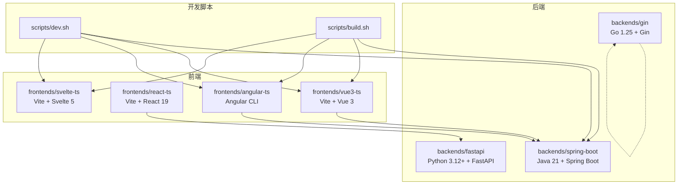
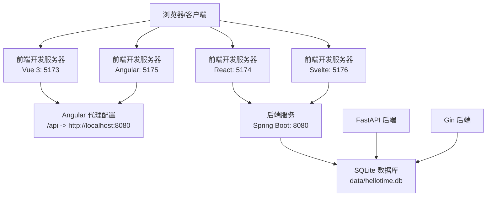
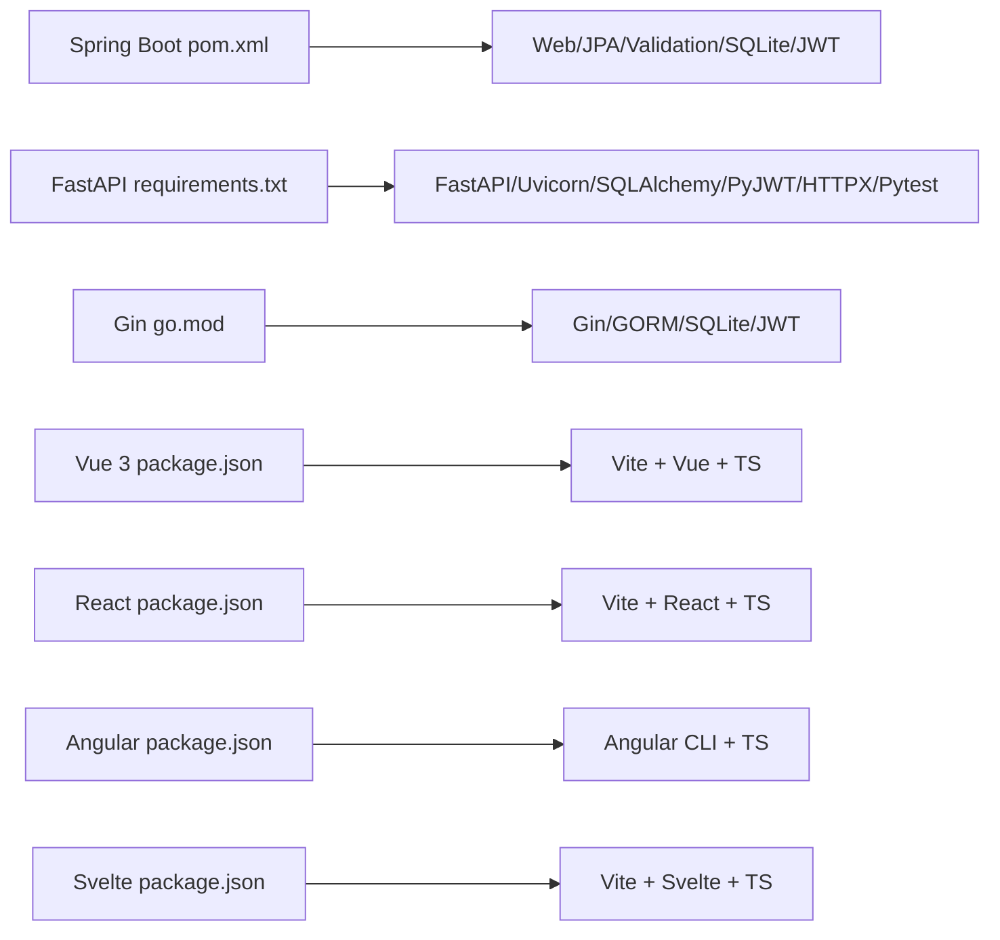
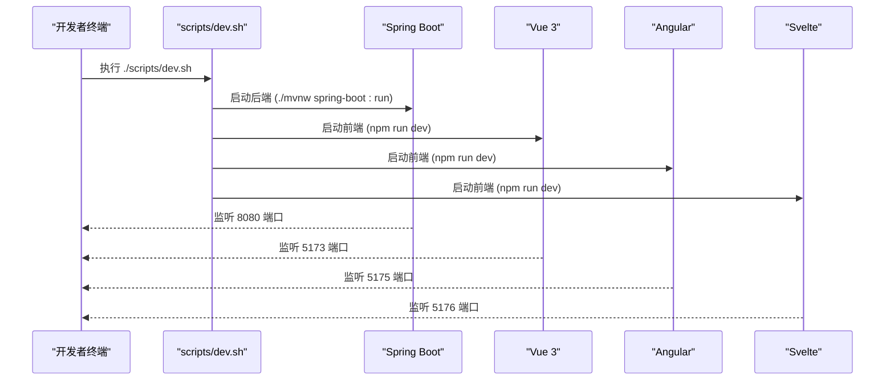
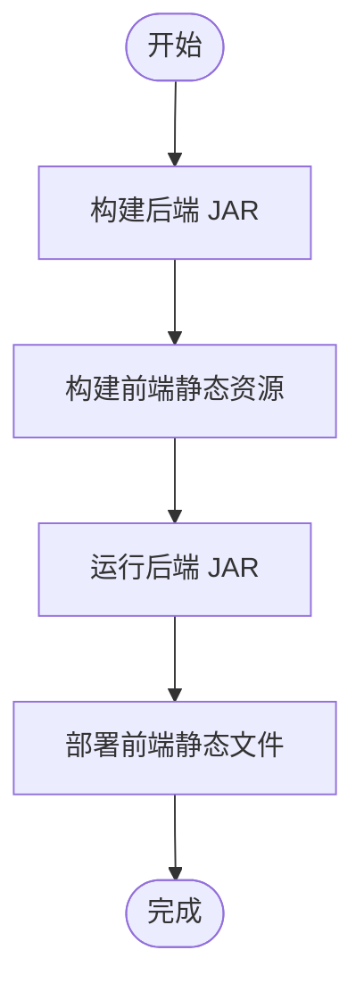

# 环境准备

<cite>
**本文引用的文件**
- [README.md](file://README.md)
- [deployment.md](file://docs/deployment.md)
- [dev.sh](file://scripts/dev.sh)
- [build.sh](file://scripts/build.sh)
- [application.yml](file://backends/spring-boot/src/main/resources/application.yml)
- [config.py](file://backends/fastapi/app/config.py)
- [config.go](file://backends/gin/config/config.go)
- [proxy.conf.json](file://frontends/angular-ts/proxy.conf.json)
- [pom.xml](file://backends/spring-boot/pom.xml)
- [requirements.txt](file://backends/fastapi/requirements.txt)
- [go.mod](file://backends/gin/go.mod)
- [package.json（Vue 3）](file://frontends/vue3-ts/package.json)
- [package.json（React）](file://frontends/react-ts/package.json)
- [package.json（Angular）](file://frontends/angular-ts/package.json)
- [package.json（Svelte）](file://frontends/svelte-ts/package.json)
- [maven-wrapper.properties](file://backends/spring-boot/.mvn/wrapper/maven-wrapper.properties)
</cite>

## 目录
1. [简介](#简介)
2. [项目结构](#项目结构)
3. [核心组件](#核心组件)
4. [架构总览](#架构总览)
5. [详细组件分析](#详细组件分析)
6. [依赖分析](#依赖分析)
7. [性能考虑](#性能考虑)
8. [故障排查指南](#故障排查指南)
9. [结论](#结论)
10. [附录](#附录)

## 简介
本指南面向 HelloTime 项目的开发者与运维人员，提供从零开始搭建开发与生产环境的完整步骤，涵盖所需软硬件要求、安装配置流程、环境变量设置、验证方法以及常见问题排查。项目支持多后端（Spring Boot、FastAPI、Gin）与多前端（Vue 3、React、Angular、Svelte），并提供一键启动脚本与构建脚本，便于快速验证。

## 项目结构
HelloTime 采用“前后端完全解耦”的架构：前端实现可独立运行并与任意后端组合；后端实现遵循统一的 API 规范与数据库模型。开发与部署脚本位于 scripts/ 目录，后端与前端分别位于 backends/ 与 frontends/ 下。

图表来源
- [dev.sh:1-52](file://scripts/dev.sh#L1-L52)
- [build.sh:1-41](file://scripts/build.sh#L1-L41)
- [pom.xml:20-23](file://backends/spring-boot/pom.xml#L20-L23)
- [requirements.txt:1-7](file://backends/fastapi/requirements.txt#L1-L7)
- [go.mod](file://backends/gin/go.mod#L3)
- [package.json（Vue 3）](file://frontends/vue3-ts/package.json#L6)
- [package.json（React）](file://frontends/react-ts/package.json#L7)
- [package.json（Angular）](file://frontends/angular-ts/package.json#L6)
- [package.json（Svelte）](file://frontends/svelte-ts/package.json#L7)

章节来源
- [README.md:37-63](file://README.md#L37-L63)
- [dev.sh:1-52](file://scripts/dev.sh#L1-L52)
- [build.sh:1-41](file://scripts/build.sh#L1-L41)

## 核心组件
- 后端框架与语言
  - Spring Boot（Java 21）、FastAPI（Python 3.12+）、Gin（Go 1.25）
- 前端框架与工具
  - Vue 3（Vite）、React 19（Vite）、Angular（Angular CLI）、Svelte 5（Vite）
- 数据库
  - SQLite（单文件数据库，位于 data/ 目录）
- 认证机制
  - JWT Bearer Token（HS256，有效期 2 小时）

章节来源
- [README.md:16-36](file://README.md#L16-L36)
- [pom.xml:20-23](file://backends/spring-boot/pom.xml#L20-L23)
- [requirements.txt:1-7](file://backends/fastapi/requirements.txt#L1-L7)
- [go.mod](file://backends/gin/go.mod#L3)
- [application.yml:1-26](file://backends/spring-boot/src/main/resources/application.yml#L1-L26)

## 架构总览
下图展示了开发模式下的典型交互：前端通过本地代理访问后端服务，后端连接 SQLite 数据库；生产模式下后端打包为可执行 JAR，前端静态资源由 Web 服务器托管并通过反向代理转发 API 请求。

图表来源
- [proxy.conf.json:1-8](file://frontends/angular-ts/proxy.conf.json#L1-L8)
- [application.yml:4-18](file://backends/spring-boot/src/main/resources/application.yml#L4-L18)
- [README.md:16-36](file://README.md#L16-L36)

## 详细组件分析

### 开发环境要求与安装步骤
- Java 与 Maven
  - 后端 Spring Boot 需要 Java 21（项目属性中声明），Maven 3.8+（或使用 Maven Wrapper）
  - 安装步骤（通用）：下载并安装 JDK 21，安装 Maven 或直接使用项目内置的 Maven Wrapper
  - 验证：java -version、mvn -version
- Node.js 与包管理器
  - 前端需要 Node.js 20+ 与 npm 9+（用于各前端工程）
  - 安装步骤（通用）：下载并安装 Node.js（含 npm），验证 node -v、npm -v
- Python 与 pip（仅 FastAPI）
  - FastAPI 后端需要 Python 3.12+，安装依赖通过 pip
  - 安装步骤（通用）：安装 Python 3.12+，pip install -r requirements.txt
- Go 与模块（仅 Gin）
  - Gin 后端需要 Go 1.25+，使用 go mod 管理依赖
  - 安装步骤（通用）：安装 Go 1.25+，进入 backends/gin 执行 go run main.go

章节来源
- [deployment.md:3-12](file://docs/deployment.md#L3-L12)
- [pom.xml:20-23](file://backends/spring-boot/pom.xml#L20-L23)
- [requirements.txt:1-7](file://backends/fastapi/requirements.txt#L1-L7)
- [go.mod](file://backends/gin/go.mod#L3)
- [README.md:65-148](file://README.md#L65-L148)

### 环境变量配置
- Spring Boot（Java）
  - 关键变量：ADMIN_PASSWORD、JWT_SECRET、SERVER_PORT（默认 8080）
  - 配置位置：application.yml 中通过占位符读取环境变量
- FastAPI（Python）
  - 关键变量：DATABASE_URL、ADMIN_PASSWORD、JWT_SECRET、JWT_EXPIRATION_HOURS
  - 配置位置：app/config.py 中从环境变量读取
- Gin（Go）
  - 关键变量：DATABASE_URL、ADMIN_PASSWORD、JWT_SECRET、JWT_EXPIRATION_HOURS、PORT
  - 配置位置：config/config.go 中从环境变量读取

章节来源
- [application.yml:20-25](file://backends/spring-boot/src/main/resources/application.yml#L20-L25)
- [config.py:8-17](file://backends/fastapi/app/config.py#L8-L17)
- [config.go:32-42](file://backends/gin/config/config.go#L32-L42)
- [README.md:265-281](file://README.md#L265-L281)

### 端口与代理配置
- 后端服务端口
  - Spring Boot 默认 8080（可在 application.yml 中调整）
  - Gin 默认 8080（可通过 PORT 环境变量覆盖）
- 前端开发端口
  - Vue 3: 5173、React: 5174、Angular: 5175、Svelte: 5176
- Angular 代理
  - /api 请求代理至后端 8080 端口，避免跨域问题

章节来源
- [application.yml:17-18](file://backends/spring-boot/src/main/resources/application.yml#L17-L18)
- [config.go](file://backends/gin/config/config.go#L36)
- [README.md:18-24](file://README.md#L18-L24)
- [proxy.conf.json:1-8](file://frontends/angular-ts/proxy.conf.json#L1-L8)

### 一键启动与构建脚本
- 开发环境一键启动
  - 同时启动后端与全部前端，按 Ctrl+C 停止
- 生产构建
  - 构建后端 JAR 与前端静态资源，输出至指定目录

章节来源
- [dev.sh:1-52](file://scripts/dev.sh#L1-L52)
- [build.sh:1-41](file://scripts/build.sh#L1-L41)

### 环境验证方法
- 后端健康检查
  - 访问 http://localhost:8080/api/v1/health，确认返回健康状态
- 前端页面访问
  - Vue 3: http://localhost:5173、React: http://localhost:5174、Angular: http://localhost:5175、Svelte: http://localhost:5176
- API 代理验证（Angular）
  - 前端通过 /api 访问后端接口，确认无跨域错误
- 数据库文件生成
  - 启动后端后，检查 data/ 目录是否生成 hellotime.db

章节来源
- [README.md:219-232](file://README.md#L219-L232)
- [proxy.conf.json:1-8](file://frontends/angular-ts/proxy.conf.json#L1-L8)
- [application.yml:4-6](file://backends/spring-boot/src/main/resources/application.yml#L4-L6)

## 依赖分析
- 后端依赖
  - Spring Boot：Web、JPA、Validation、SQLite JDBC、Hibernate 社区方言、JWT（jjwt）
  - FastAPI：FastAPI、Uvicorn、SQLAlchemy、PyJWT、HTTPX、Pytest
  - Gin：Gin、JWT（golang-jwt）、GORM + SQLite 驱动
- 前端依赖
  - Vue 3、React 19、Angular、Svelte 均基于 Vite 或 Angular CLI，使用 TypeScript 与现代构建工具链

图表来源
- [pom.xml:25-80](file://backends/spring-boot/pom.xml#L25-L80)
- [requirements.txt:1-7](file://backends/fastapi/requirements.txt#L1-L7)
- [go.mod:5-10](file://backends/gin/go.mod#L5-L10)
- [package.json（Vue 3）:11-36](file://frontends/vue3-ts/package.json#L11-L36)
- [package.json（React）:13-29](file://frontends/react-ts/package.json#L13-L29)
- [package.json（Angular）:11-36](file://frontends/angular-ts/package.json#L11-L36)
- [package.json（Svelte）:12-19](file://frontends/svelte-ts/package.json#L12-L19)

章节来源
- [pom.xml:25-80](file://backends/spring-boot/pom.xml#L25-L80)
- [requirements.txt:1-7](file://backends/fastapi/requirements.txt#L1-L7)
- [go.mod:5-10](file://backends/gin/go.mod#L5-L10)
- [package.json（Vue 3）:11-36](file://frontends/vue3-ts/package.json#L11-L36)
- [package.json（React）:13-29](file://frontends/react-ts/package.json#L13-L29)
- [package.json（Angular）:11-36](file://frontends/angular-ts/package.json#L11-L36)
- [package.json（Svelte）:12-19](file://frontends/svelte-ts/package.json#L12-L19)

## 性能考虑
- 后端线程模型
  - Spring Boot 在 Java 21 上启用虚拟线程，有助于提升高并发场景下的吞吐
- 数据库选择
  - SQLite 适合开发与小规模生产，若需更高并发建议迁移到关系型数据库并配合连接池
- 前端构建优化
  - 使用 Vite 的快速冷启动与热更新；生产构建开启压缩与代码分割

章节来源
- [application.yml:12-15](file://backends/spring-boot/src/main/resources/application.yml#L12-L15)
- [README.md:18-24](file://README.md#L18-L24)

## 故障排查指南
- 端口冲突
  - 症状：启动失败或端口被占用
  - 处理：修改 SERVER_PORT（Spring Boot）或 PORT（Gin）环境变量，或释放占用端口
- 跨域与代理问题（Angular）
  - 症状：前端调用 /api 报跨域错误
  - 处理：确认 proxy.conf.json 已生效，后端端口与代理目标一致
- 数据库连接失败
  - 症状：启动时报数据库连接异常
  - 处理：检查 DATABASE_URL（FastAPI/Gin）或 JDBC URL（Spring Boot），确认 data/ 目录可写
- 环境变量未生效
  - 症状：JWT 密钥或管理员密码不符合预期
  - 处理：确认已在当前 shell 会话导出 ADMIN_PASSWORD、JWT_SECRET 等变量，或在启动命令前临时导出
- 前端依赖安装失败
  - 症状：npm install 报错
  - 处理：升级 Node.js 至 20+，清理缓存并重试；必要时更换镜像源
- 后端依赖安装失败（FastAPI）
  - 症状：pip install 报错
  - 处理：升级 Python 至 3.12+，使用虚拟环境隔离依赖，重试安装
- 后端依赖安装失败（Gin）
  - 症状：go mod 下载失败
  - 处理：检查网络与代理设置，必要时配置 GOPROXY

章节来源
- [application.yml:17-25](file://backends/spring-boot/src/main/resources/application.yml#L17-L25)
- [config.py:8-17](file://backends/fastapi/app/config.py#L8-L17)
- [config.go:32-42](file://backends/gin/config/config.go#L32-L42)
- [proxy.conf.json:1-8](file://frontends/angular-ts/proxy.conf.json#L1-L8)
- [deployment.md:71-86](file://docs/deployment.md#L71-L86)

## 结论
通过本指南，您可以在 Windows、macOS、Linux 上完成 HelloTime 项目的环境准备与验证。建议优先使用一键启动脚本进行快速验证，并在生产环境中严格设置环境变量与端口，确保安全与稳定。

## 附录

### 开发环境一键启动流程（序列图）

图表来源
- [dev.sh:12-37](file://scripts/dev.sh#L12-L37)
- [application.yml:17-18](file://backends/spring-boot/src/main/resources/application.yml#L17-L18)
- [package.json（Vue 3）](file://frontends/vue3-ts/package.json#L6)
- [package.json（Angular）](file://frontends/angular-ts/package.json#L6)
- [package.json（Svelte）](file://frontends/svelte-ts/package.json#L7)

### 生产构建与运行流程（流程图）

图表来源
- [build.sh:11-21](file://scripts/build.sh#L11-L21)
- [deployment.md:46-69](file://docs/deployment.md#L46-L69)