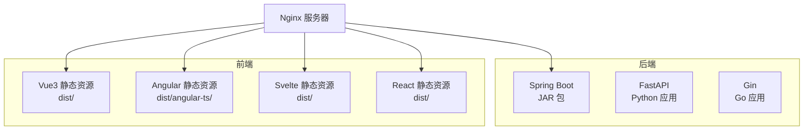
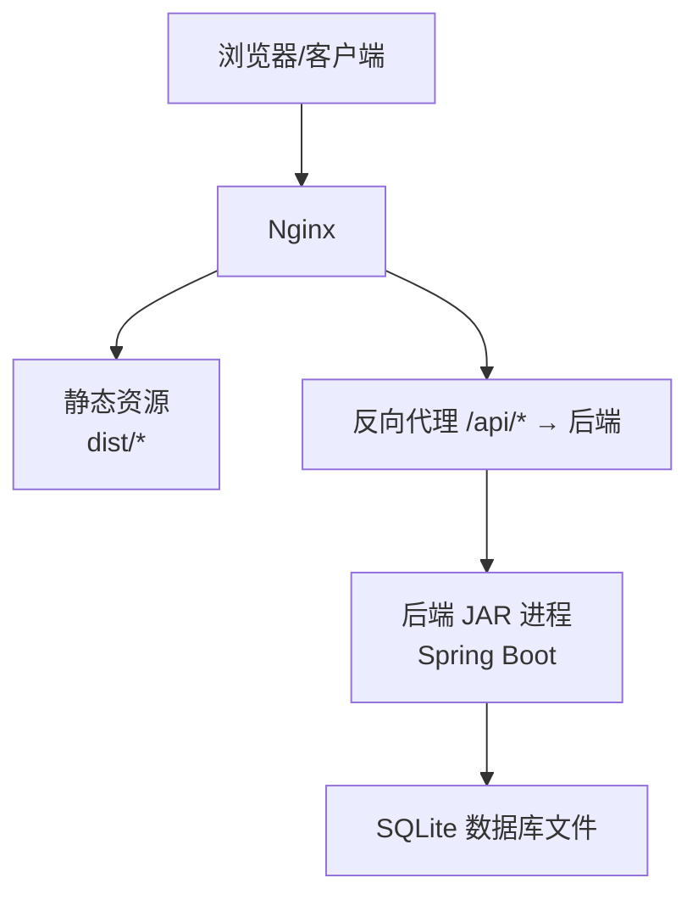
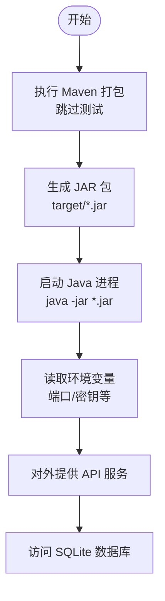
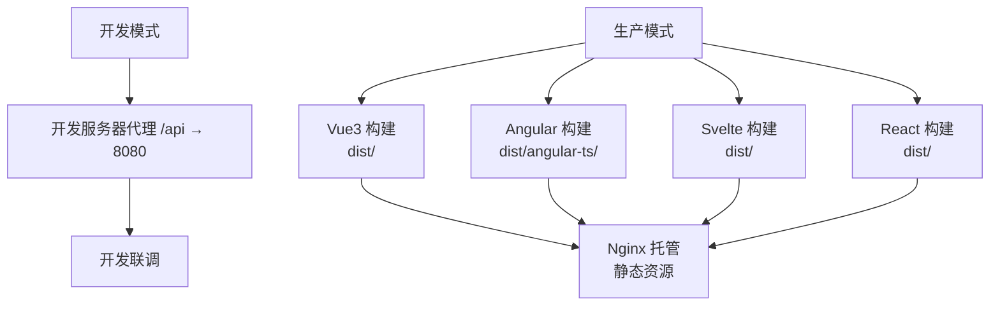
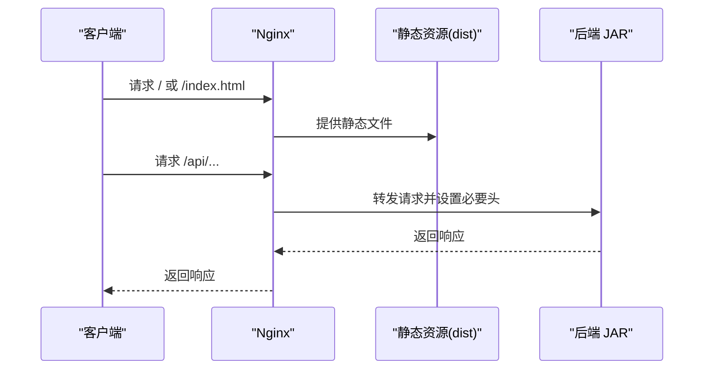
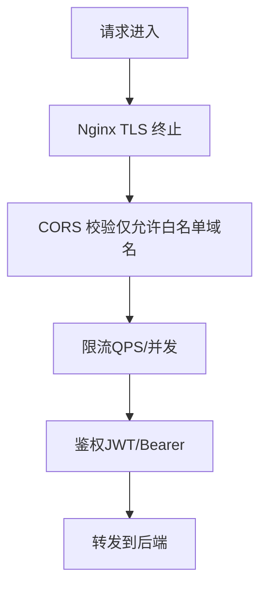
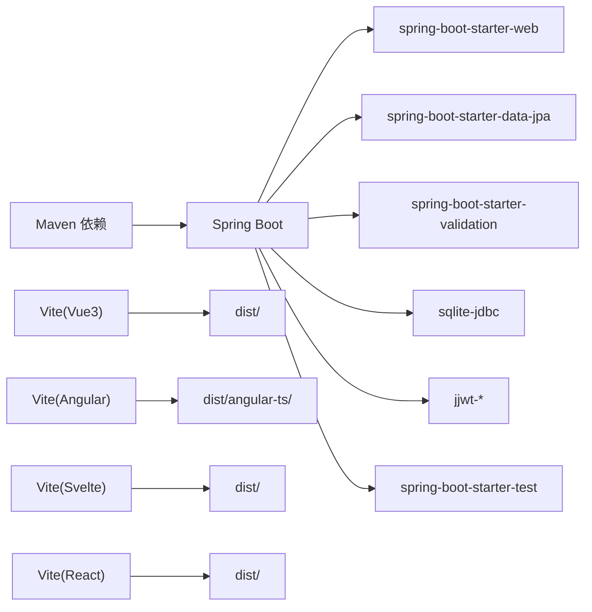

# 生产环境部署

<cite>
**本文引用的文件**
- [pom.xml](file://backends/spring-boot/pom.xml)
- [application.yml](file://backends/spring-boot/src/main/resources/application.yml)
- [build.sh](file://scripts/build.sh)
- [deployment.md](file://docs/deployment.md)
- [vite.config.ts (React)](file://frontends/react-ts/vite.config.ts)
- [vite.config.ts (Vue3)](file://frontends/vue3-ts/vite.config.ts)
- [angular.json](file://frontends/angular-ts/angular.json)
- [CorsConfig.java](file://backends/spring-boot/src/main/java/com/hellotime/config/CorsConfig.java)
- [auth.go](file://backends/gin/middleware/auth.go)
- [main.py (FastAPI)](file://backends/fastapi/app/main.py)
- [openapi.yaml](file://spec/api/openapi.yaml)
</cite>

## 目录
1. [简介](#简介)
2. [项目结构](#项目结构)
3. [核心组件](#核心组件)
4. [架构总览](#架构总览)
5. [详细组件分析](#详细组件分析)
6. [依赖关系分析](#依赖关系分析)
7. [性能考虑](#性能考虑)
8. [故障排查指南](#故障排查指南)
9. [结论](#结论)
10. [附录](#附录)

## 简介
本指南面向生产环境部署 HelloTime 项目，覆盖后端 Spring Boot JAR 包构建与运行、多前端框架（Vue3、Angular、Svelte、React）静态资源构建与优化、Nginx 托管与 CDN 缓存策略、安全加固（HTTPS、CORS、API 限流）、以及监控与日志配置建议。文档严格基于仓库现有配置与实现进行说明，避免臆测。

## 项目结构
- 后端提供三套实现（Spring Boot、FastAPI、Gin），生产部署优先推荐 Spring Boot（见“核心组件”）。
- 前端提供 Vue3、Angular、Svelte、React 四套实现，生产构建产物均为静态文件，可由 Nginx 等 Web 服务器托管。
- 顶层脚本提供一键构建后端与多前端产物，便于 CI/CD 流水线集成。

图表来源
- [build.sh:11-33](file://scripts/build.sh#L11-L33)
- [deployment.md:44-69](file://docs/deployment.md#L44-L69)

章节来源
- [build.sh:11-33](file://scripts/build.sh#L11-L33)
- [deployment.md:44-69](file://docs/deployment.md#L44-L69)

## 核心组件
- 后端（推荐）：Spring Boot（JDK 21，SQLite，JPA/Hibernate，JWT，CORS，虚拟线程）
- 前端（任选其一）：Vue3、Angular、Svelte、React（生产模式构建，开启资源哈希与体积预算）
- 静态托管：Nginx（反向代理 /api 到后端，静态文件根目录指向对应 dist/）

章节来源
- [pom.xml:20-23](file://backends/spring-boot/pom.xml#L20-L23)
- [application.yml:1-26](file://backends/spring-boot/src/main/resources/application.yml#L1-L26)
- [angular.json:48-66](file://frontends/angular-ts/angular.json#L48-L66)
- [vite.config.ts (Vue3):1-23](file://frontends/vue3-ts/vite.config.ts#L1-L23)
- [vite.config.ts (React):1-23](file://frontends/react-ts/vite.config.ts#L1-L23)

## 架构总览
生产部署采用“Nginx + 后端 JAR”的经典分离架构。Nginx 负责静态资源分发与 /api 前缀的反向代理；后端通过 JVM 进程承载业务逻辑与数据访问。

图表来源
- [deployment.md:87-107](file://docs/deployment.md#L87-L107)
- [application.yml:4-11](file://backends/spring-boot/src/main/resources/application.yml#L4-L11)

## 详细组件分析

### 后端 JAR 包构建与运行（Spring Boot）
- 构建工具与目标：使用 Maven Wrapper 执行打包，跳过测试以加速生产构建。
- 运行方式：直接以 Java 运行器启动 JAR，监听端口可由环境变量覆盖。
- 数据源与持久化：默认使用 SQLite，数据库文件路径可在运行目录生成。
- 安全与跨域：内置 CORS 配置允许本地开发域名，生产需按域名精确放行。
- 性能特性：启用虚拟线程（JDK 21+），适合高并发 I/O 场景。

图表来源
- [build.sh:14-15](file://scripts/build.sh#L14-L15)
- [deployment.md:46-52](file://docs/deployment.md#L46-L52)
- [application.yml:4-25](file://backends/spring-boot/src/main/resources/application.yml#L4-L25)

章节来源
- [pom.xml:82-89](file://backends/spring-boot/pom.xml#L82-L89)
- [application.yml:1-26](file://backends/spring-boot/src/main/resources/application.yml#L1-L26)
- [build.sh:14-15](file://scripts/build.sh#L14-L15)
- [deployment.md:46-52](file://docs/deployment.md#L46-L52)

### 前端静态资源构建与优化
- Vue3（推荐用于生产）：生产配置启用输出哈希与体积预算，适配 CDN 缓存与长期缓存策略。
- Angular：生产配置启用输出哈希，输出目录为 dist/angular-ts/。
- Svelte/React：生产构建产物位于 dist/，可与 Vue3 采用相同缓存策略。
- 代理与开发：各前端开发服务器内置 /api 代理至后端 8080 端口，生产环境由 Nginx 统一代理。

图表来源
- [vite.config.ts (Vue3):13-21](file://frontends/vue3-ts/vite.config.ts#L13-L21)
- [angular.json:48-66](file://frontends/angular-ts/angular.json#L48-L66)
- [build.sh:17-33](file://scripts/build.sh#L17-L33)

章节来源
- [vite.config.ts (Vue3):1-23](file://frontends/vue3-ts/vite.config.ts#L1-L23)
- [vite.config.ts (React):1-23](file://frontends/react-ts/vite.config.ts#L1-L23)
- [angular.json:48-66](file://frontends/angular-ts/angular.json#L48-L66)
- [build.sh:17-33](file://scripts/build.sh#L17-L33)

### 静态文件托管与缓存策略（Nginx）
- 静态根目录：指向对应前端 dist/ 目录，支持 SPA 的 index.html 回退。
- 反向代理：/api 前缀代理至后端 8080 端口，保留 Host 与真实 IP 头。
- 缓存建议：对带内容哈希的静态资源设置长缓存，对 HTML 设置短缓存或不缓存；对 /api 接口禁用缓存或使用协商缓存。

图表来源
- [deployment.md:87-107](file://docs/deployment.md#L87-L107)

章节来源
- [deployment.md:87-107](file://docs/deployment.md#L87-L107)

### 安全加固
- HTTPS：在 Nginx 层启用 TLS，证书与密钥由运维统一管理。
- CORS：生产环境应将允许来源精确限定为实际域名，而非通配或 localhost。
- API 限流：建议在 Nginx 或前置网关层配置限流规则，防止恶意刷量。
- JWT：生产必须替换默认密钥，使用足够长度的随机密钥，并妥善保管。

图表来源
- [CorsConfig.java:14-26](file://backends/spring-boot/src/main/java/com/hellotime/config/CorsConfig.java#L14-L26)
- [auth.go:13-36](file://backends/gin/middleware/auth.go#L13-L36)
- [openapi.yaml:166-171](file://spec/api/openapi.yaml#L166-L171)

章节来源
- [CorsConfig.java:14-26](file://backends/spring-boot/src/main/java/com/hellotime/config/CorsConfig.java#L14-L26)
- [auth.go:13-36](file://backends/gin/middleware/auth.go#L13-L36)
- [openapi.yaml:166-171](file://spec/api/openapi.yaml#L166-L171)

### 监控与日志
- 后端日志：建议将 Spring Boot 日志输出到标准输出，配合容器平台收集；生产关闭冗余 SQL 日志。
- Nginx 日志：开启访问与错误日志，记录请求耗时、状态码分布，便于容量与稳定性分析。
- 健康检查：后端提供 /api/v1/health，Nginx 可配置健康检查探针。
- 指标采集：结合 Prometheus/Grafana 对后端与 Nginx 指标进行可视化。

章节来源
- [main.py (FastAPI):19-34](file://backends/fastapi/app/main.py#L19-L34)
- [application.yml:10-11](file://backends/spring-boot/src/main/resources/application.yml#L10-L11)

## 依赖关系分析
- 后端依赖：Web、JPA、Validation、SQLite JDBC、Hibernate 社区方言、JWT 依赖、测试 Starter。
- 前端依赖：各框架自有生态（Vue3 使用 @vitejs/plugin-vue，Angular 使用 @angular-devkit/build-angular，React 使用 @vitejs/plugin-react，Svelte 使用官方插件），生产构建均输出 dist/。
- 运行时依赖：JDK 21（Spring Boot 3.2.5）、Node.js 20+（前端构建）。

图表来源
- [pom.xml:25-80](file://backends/spring-boot/pom.xml#L25-L80)
- [angular.json:24-47](file://frontends/angular-ts/angular.json#L24-L47)
- [vite.config.ts (Vue3):1-23](file://frontends/vue3-ts/vite.config.ts#L1-L23)
- [vite.config.ts (React):1-23](file://frontends/react-ts/vite.config.ts#L1-L23)

章节来源
- [pom.xml:25-80](file://backends/spring-boot/pom.xml#L25-L80)
- [angular.json:24-47](file://frontends/angular-ts/angular.json#L24-L47)
- [vite.config.ts (Vue3):1-23](file://frontends/vue3-ts/vite.config.ts#L1-L23)
- [vite.config.ts (React):1-23](file://frontends/react-ts/vite.config.ts#L1-L23)

## 性能考虑
- JVM 参数建议：根据实例规格设置堆大小与 GC 策略；启用并行或并发回收器；开启类数据共享（CDS）以降低启动时间。
- 虚拟线程：JDK 21+ 的虚拟线程适合高并发 I/O，注意与阻塞操作隔离。
- 前端缓存：对静态资源设置强缓存与 ETag，HTML 不缓存或短缓存；CDN 层支持 gzip/br 压缩。
- 数据库：SQLite 适合中小规模场景，生产建议评估读写分离与迁移至更健壮的数据库。

## 故障排查指南
- 后端无法启动：检查数据库文件权限与路径、JWT 密钥是否正确、端口占用情况。
- CORS 失败：确认生产 CORS 放行列表是否包含当前域名，凭证与预检请求是否正确。
- 静态资源 404：确认 Nginx root 指向正确的 dist/ 目录，SPA 回退规则生效。
- /api 无响应：检查 Nginx 反代配置与后端进程状态，查看后端与 Nginx 错误日志。

章节来源
- [CorsConfig.java:14-26](file://backends/spring-boot/src/main/java/com/hellotime/config/CorsConfig.java#L14-L26)
- [deployment.md:87-107](file://docs/deployment.md#L87-L107)
- [application.yml:4-11](file://backends/spring-boot/src/main/resources/application.yml#L4-L11)

## 结论
本指南提供了基于仓库现有实现的生产部署路径：使用 Spring Boot 作为后端，Vue3 作为首选前端，Nginx 承担静态托管与反向代理。通过严格的 CORS 白名单、HTTPS、JWT 密钥轮换与限流策略，结合日志与指标监控，可满足中小型项目的生产需求。对于更高吞吐与复杂场景，建议引入前置网关、CDN 加速与数据库集群化方案。

## 附录
- 环境变量清单（生产必配）
  - ADMIN_PASSWORD：管理员登录密码
  - JWT_SECRET：JWT 签名密钥（务必替换）
  - SERVER_PORT：后端监听端口（默认 8080）
- API 规范参考：OpenAPI 描述了健康检查、胶囊 CRUD、管理员登录与分页查询等接口，可用于联调与自动化测试。

章节来源
- [deployment.md:71-85](file://docs/deployment.md#L71-L85)
- [openapi.yaml:10-164](file://spec/api/openapi.yaml#L10-L164)