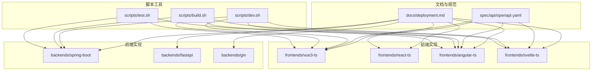
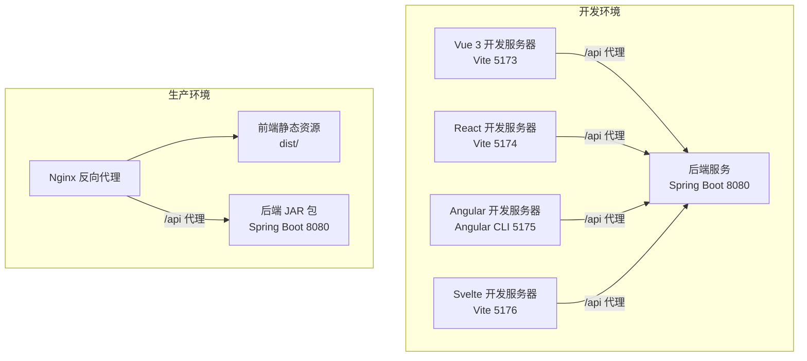
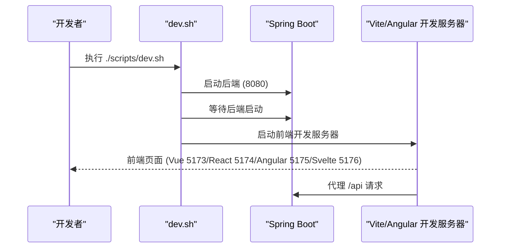
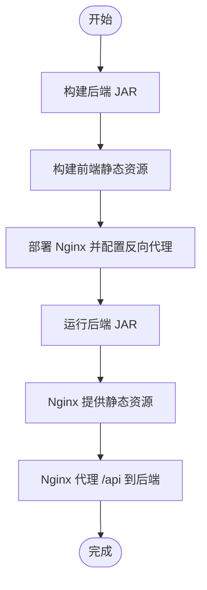
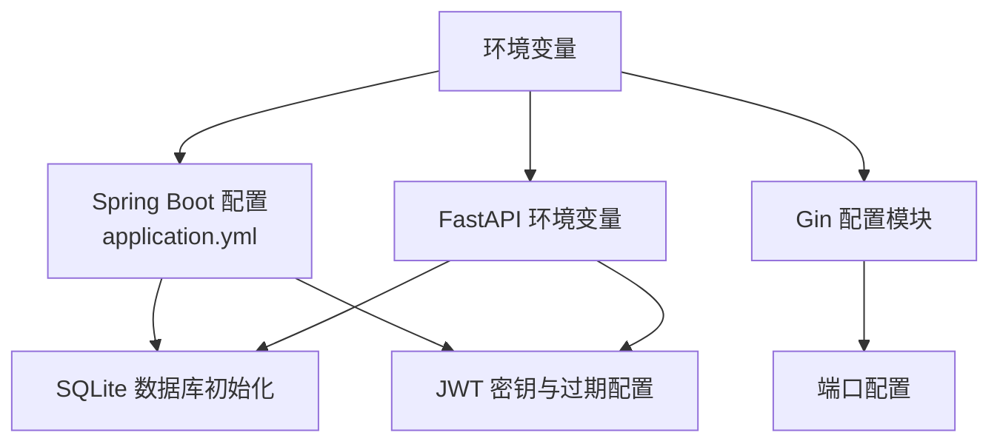
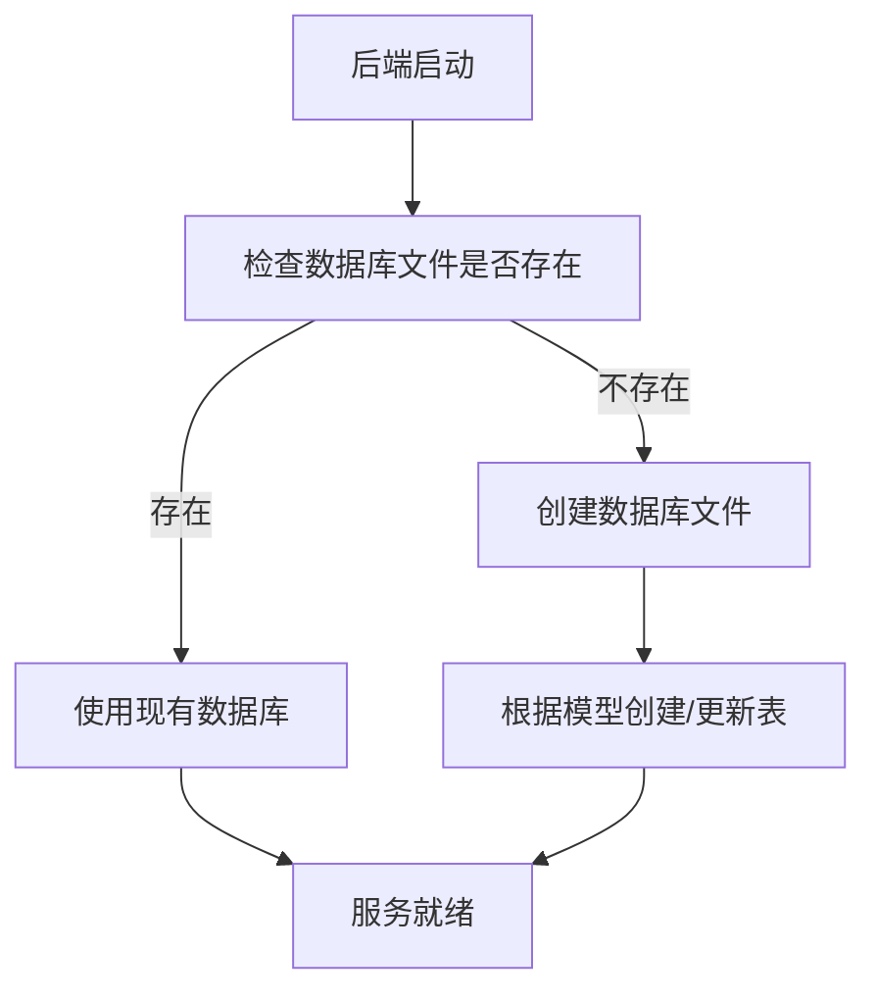
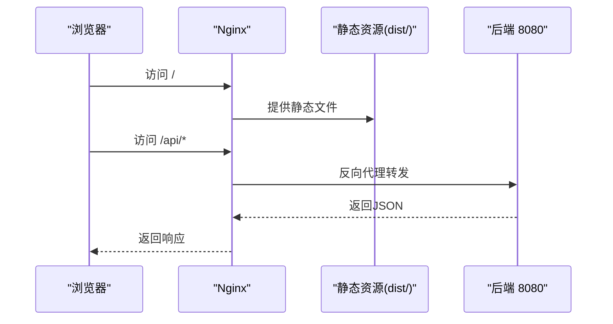
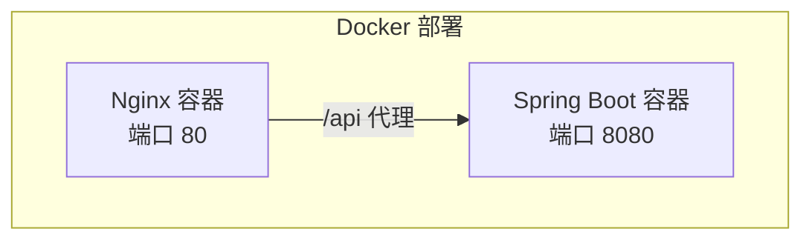
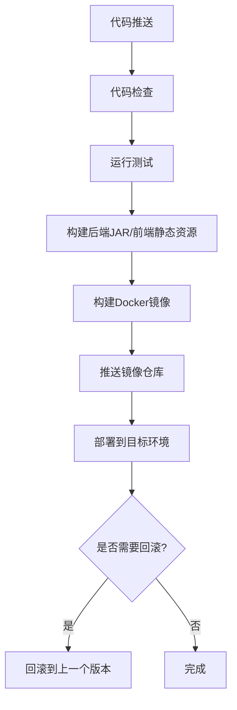
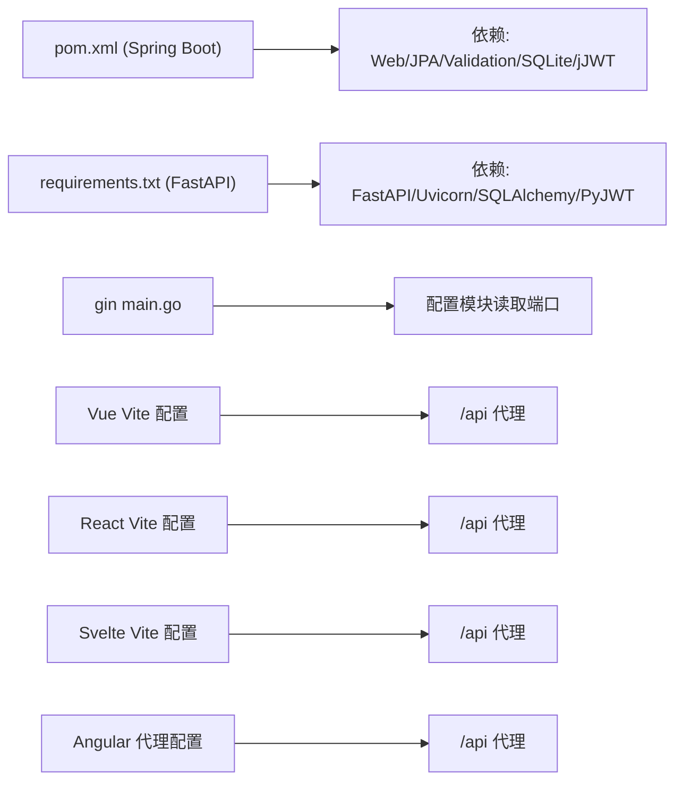

# 部署指南

<cite>
**本文引用的文件**
- [README.md](file://README.md)
- [docs/deployment.md](file://docs/deployment.md)
- [scripts/dev.sh](file://scripts/dev.sh)
- [scripts/build.sh](file://scripts/build.sh)
- [scripts/test.sh](file://scripts/test.sh)
- [backends/spring-boot/pom.xml](file://backends/spring-boot/pom.xml)
- [backends/spring-boot/src/main/resources/application.yml](file://backends/spring-boot/src/main/resources/application.yml)
- [backends/fastapi/requirements.txt](file://backends/fastapi/requirements.txt)
- [backends/fastapi/app/main.py](file://backends/fastapi/app/main.py)
- [backends/gin/main.go](file://backends/gin/main.go)
- [frontends/vue3-ts/vite.config.ts](file://frontends/vue3-ts/vite.config.ts)
- [frontends/react-ts/vite.config.ts](file://frontends/react-ts/vite.config.ts)
- [frontends/svelte-ts/vite.config.ts](file://frontends/svelte-ts/vite.config.ts)
- [frontends/angular-ts/proxy.conf.json](file://frontends/angular-ts/proxy.conf.json)
- [frontends/angular-ts/package.json](file://frontends/angular-ts/package.json)
- [frontends/vue3-ts/package.json](file://frontends/vue3-ts/package.json)
- [spec/api/openapi.yaml](file://spec/api/openapi.yaml)
</cite>

## 目录
1. [简介](#简介)
2. [项目结构](#项目结构)
3. [核心组件](#核心组件)
4. [架构总览](#架构总览)
5. [详细组件分析](#详细组件分析)
6. [依赖关系分析](#依赖关系分析)
7. [性能考虑](#性能考虑)
8. [故障排查指南](#故障排查指南)
9. [结论](#结论)
10. [附录](#附录)

## 简介
本指南面向运维工程师与DevOps团队，提供HelloTime项目的完整部署参考手册，涵盖开发环境与生产环境的多套部署方案（本地、Docker容器化、云平台），并详细说明环境变量配置、数据库初始化、静态资源处理、反向代理配置、性能优化、监控告警、日志管理、负载均衡与SSL证书部署、域名解析以及CI/CD流水线搭建与自动化部署流程。

## 项目结构
HelloTime是一个前后端完全解耦的多实现项目，统一遵循OpenAPI规范与设计系统，支持多种前端框架与后端实现的自由组合。项目主要由以下部分组成：
- 文档与规范：docs/ 与 spec/（含OpenAPI与设计令牌）
- 多前端实现：frontends/vue3-ts、frontends/react-ts、frontends/angular-ts、frontends/svelte-ts
- 多后端实现：backends/spring-boot、backends/fastapi、backends/gin
- 脚本工具：scripts/（开发、构建、测试）

**图表来源**
- [docs/deployment.md:1-112](file://docs/deployment.md#L1-L112)
- [README.md:37-63](file://README.md#L37-L63)

**章节来源**
- [README.md:1-323](file://README.md#L1-L323)
- [docs/deployment.md:1-112](file://docs/deployment.md#L1-L112)

## 核心组件
- 后端服务（Spring Boot、FastAPI、Gin）：提供统一REST API，支持健康检查、胶囊管理、管理员认证等。
- 前端应用（Vue 3、React 19、Angular 18、Svelte 5）：基于Vite构建，开发时通过代理转发至后端。
- 数据库：SQLite，随应用启动自动初始化。
- 配置与环境变量：后端通过application.yml与环境变量注入配置；前端通过Vite代理配置API路径。
- 部署脚本：dev.sh用于一键启动开发环境；build.sh用于生产构建；test.sh用于全量测试。

**章节来源**
- [backends/spring-boot/src/main/resources/application.yml:1-26](file://backends/spring-boot/src/main/resources/application.yml#L1-L26)
- [backends/fastapi/app/main.py:19-35](file://backends/fastapi/app/main.py#L19-L35)
- [backends/gin/main.go:15-31](file://backends/gin/main.go#L15-L31)
- [frontends/vue3-ts/vite.config.ts:13-21](file://frontends/vue3-ts/vite.config.ts#L13-L21)
- [frontends/react-ts/vite.config.ts:13-22](file://frontends/react-ts/vite.config.ts#L13-L22)
- [frontends/svelte-ts/vite.config.ts:19-28](file://frontends/svelte-ts/vite.config.ts#L19-L28)
- [frontends/angular-ts/proxy.conf.json:1-8](file://frontends/angular-ts/proxy.conf.json#L1-L8)
- [scripts/dev.sh:11-44](file://scripts/dev.sh#L11-L44)
- [scripts/build.sh:11-41](file://scripts/build.sh#L11-L41)
- [scripts/test.sh:11-34](file://scripts/test.sh#L11-L34)

## 架构总览
下图展示了开发与生产两种典型部署形态：开发环境通过前端Vite代理访问后端；生产环境将后端打包为JAR，前端静态资源由Nginx托管并通过反向代理转发API请求。

**图表来源**
- [docs/deployment.md:87-107](file://docs/deployment.md#L87-L107)
- [frontends/vue3-ts/vite.config.ts:13-21](file://frontends/vue3-ts/vite.config.ts#L13-L21)
- [frontends/react-ts/vite.config.ts:13-22](file://frontends/react-ts/vite.config.ts#L13-L22)
- [frontends/angular-ts/proxy.conf.json:1-8](file://frontends/angular-ts/proxy.conf.json#L1-L8)
- [frontends/svelte-ts/vite.config.ts:19-28](file://frontends/svelte-ts/vite.config.ts#L19-L28)

## 详细组件分析

### 开发环境部署
- 启动后端：使用Maven Wrapper直接启动Spring Boot，默认监听8080端口。
- 启动前端：各前端项目分别使用各自开发服务器端口，Vue 3为5173、React为5174、Angular为5175、Svelte为5176。
- 一键启动：dev.sh同时启动后端与多个前端，并等待后端启动后再启动前端。
- API代理：前端开发服务器通过Vite/Angular CLI代理将/api前缀请求转发至后端。

**图表来源**
- [scripts/dev.sh:11-44](file://scripts/dev.sh#L11-L44)
- [frontends/vue3-ts/vite.config.ts:13-21](file://frontends/vue3-ts/vite.config.ts#L13-L21)
- [frontends/react-ts/vite.config.ts:13-22](file://frontends/react-ts/vite.config.ts#L13-L22)
- [frontends/angular-ts/proxy.conf.json:1-8](file://frontends/angular-ts/proxy.conf.json#L1-L8)
- [frontends/svelte-ts/vite.config.ts:19-28](file://frontends/svelte-ts/vite.config.ts#L19-L28)

**章节来源**
- [docs/deployment.md:13-43](file://docs/deployment.md#L13-L43)
- [scripts/dev.sh:11-44](file://scripts/dev.sh#L11-L44)
- [frontends/vue3-ts/vite.config.ts:13-21](file://frontends/vue3-ts/vite.config.ts#L13-L21)
- [frontends/react-ts/vite.config.ts:13-22](file://frontends/react-ts/vite.config.ts#L13-L22)
- [frontends/angular-ts/proxy.conf.json:1-8](file://frontends/angular-ts/proxy.conf.json#L1-L8)
- [frontends/svelte-ts/vite.config.ts:19-28](file://frontends/svelte-ts/vite.config.ts#L19-L28)

### 生产环境部署
- 后端构建：使用Maven打包生成可执行JAR，位于target/hellotime-backend-1.0.0.jar。
- 前端构建：各前端项目使用各自构建命令输出静态资源至dist/或dist/<frontend>目录。
- 运行方式：后端以JAR方式运行；前端静态资源由Nginx或其他Web服务器托管。
- 反向代理：Nginx将/api前缀转发至后端8080端口，静态资源由Nginx直接提供。

**图表来源**
- [docs/deployment.md:44-107](file://docs/deployment.md#L44-L107)
- [scripts/build.sh:11-41](file://scripts/build.sh#L11-L41)

**章节来源**
- [docs/deployment.md:44-107](file://docs/deployment.md#L44-L107)
- [scripts/build.sh:11-41](file://scripts/build.sh#L11-L41)

### 环境变量配置
- Spring Boot：通过application.yml读取环境变量，包括管理员密码、JWT密钥、JWT过期小时数、数据源URL、JPA方言、服务器端口等。
- FastAPI：通过环境变量控制数据库URL、管理员密码、JWT密钥与过期小时数。
- Gin：通过配置模块读取端口等参数（入口main.go中读取配置模块）。

**图表来源**
- [backends/spring-boot/src/main/resources/application.yml:17-25](file://backends/spring-boot/src/main/resources/application.yml#L17-L25)
- [backends/fastapi/app/main.py:19-35](file://backends/fastapi/app/main.py#L19-L35)
- [backends/gin/main.go:26](file://backends/gin/main.go#L26)

**章节来源**
- [README.md:265-282](file://README.md#L265-L282)
- [backends/spring-boot/src/main/resources/application.yml:1-26](file://backends/spring-boot/src/main/resources/application.yml#L1-L26)
- [backends/fastapi/requirements.txt:1-7](file://backends/fastapi/requirements.txt#L1-L7)
- [backends/gin/main.go:15-31](file://backends/gin/main.go#L15-L31)

### 数据库初始化
- SQLite：后端启动时自动创建数据库文件（默认在运行目录下生成hellotime.db）。Spring Boot通过JPA自动更新schema，FastAPI在应用启动时创建表。
- 数据库文件位置：Spring Boot配置指向data/hellotime.db；默认行为会在运行目录生成数据库文件。

**图表来源**
- [backends/spring-boot/src/main/resources/application.yml:4-11](file://backends/spring-boot/src/main/resources/application.yml#L4-L11)
- [backends/fastapi/app/main.py:16-17](file://backends/fastapi/app/main.py#L16-L17)

**章节来源**
- [docs/deployment.md:109-112](file://docs/deployment.md#L109-L112)
- [backends/spring-boot/src/main/resources/application.yml:4-11](file://backends/spring-boot/src/main/resources/application.yml#L4-L11)
- [backends/fastapi/app/main.py:16-17](file://backends/fastapi/app/main.py#L16-L17)

### 静态资源处理与反向代理
- 前端静态资源：各前端构建后输出至dist/或dist/<frontend>目录。
- Nginx配置：示例中将根路径映射到dist目录，并将/api前缀代理至后端8080端口；同时保留SPA路由回退至index.html。
- 前端开发代理：Vite/Angular CLI在开发时将/api转发至后端8080端口。

**图表来源**
- [docs/deployment.md:87-107](file://docs/deployment.md#L87-L107)
- [frontends/vue3-ts/vite.config.ts:15-20](file://frontends/vue3-ts/vite.config.ts#L15-L20)
- [frontends/react-ts/vite.config.ts:15-20](file://frontends/react-ts/vite.config.ts#L15-L20)
- [frontends/angular-ts/proxy.conf.json:1-8](file://frontends/angular-ts/proxy.conf.json#L1-L8)
- [frontends/svelte-ts/vite.config.ts:21-26](file://frontends/svelte-ts/vite.config.ts#L21-L26)

**章节来源**
- [docs/deployment.md:87-107](file://docs/deployment.md#L87-L107)
- [frontends/vue3-ts/vite.config.ts:13-21](file://frontends/vue3-ts/vite.config.ts#L13-L21)
- [frontends/react-ts/vite.config.ts:13-22](file://frontends/react-ts/vite.config.ts#L13-L22)
- [frontends/angular-ts/proxy.conf.json:1-8](file://frontends/angular-ts/proxy.conf.json#L1-L8)
- [frontends/svelte-ts/vite.config.ts:19-28](file://frontends/svelte-ts/vite.config.ts#L19-L28)

### Docker容器化部署
- Spring Boot镜像：使用多阶段构建，先在构建阶段编译JAR，再在运行阶段仅拷贝JAR与运行时依赖，减少镜像体积。
- 前端镜像：使用Nginx作为静态资源服务器，将dist目录挂载到Nginx的静态目录。
- 网络与端口：后端容器暴露8080端口；Nginx容器暴露80端口；通过反向代理将/api转发至后端。
- 环境变量：通过Docker环境变量注入ADMIN_PASSWORD、JWT_SECRET等配置。

[本节为概念性说明，不直接对应具体源文件，故无图表来源]

### 云平台部署
- 选择云厂商提供的容器服务（如Kubernetes、ECS、Cloud Run等），将后端与前端分别容器化并部署。
- 使用云厂商的负载均衡器分发流量，配置健康检查与自动扩缩容策略。
- 将数据库文件持久化存储（推荐使用云数据库或对象存储备份）。
- 配置SSL证书与域名解析，启用HTTPS与HTTP/2。

[本节为通用指导，不直接对应具体源文件，故无章节来源]

### CI/CD流水线与自动化部署
- 触发条件：代码推送至主分支或打标签。
- 步骤：
  - 代码检出与缓存
  - 依赖安装（后端Maven/Python包、前端npm包）
  - 单元测试与集成测试
  - 构建后端JAR与前端静态资源
  - 生成Docker镜像并推送到镜像仓库
  - 部署到目标环境（Kubernetes/云容器服务）
- 回滚策略：支持基于镜像标签的快速回滚与蓝绿/金丝雀发布。

[本节为通用指导，不直接对应具体源文件，故无章节来源]

## 依赖关系分析
- 后端依赖：Spring Boot使用SQLite JDBC与Hibernate方言；FastAPI使用SQLAlchemy与PyJWT；Gin通过配置模块读取端口。
- 前端依赖：各前端使用Vite与对应生态，开发时通过代理转发API请求。
- 构建脚本：dev.sh负责开发环境一键启动；build.sh负责生产构建；test.sh负责全量测试。

**图表来源**
- [backends/spring-boot/pom.xml:25-79](file://backends/spring-boot/pom.xml#L25-L79)
- [backends/fastapi/requirements.txt:1-7](file://backends/fastapi/requirements.txt#L1-L7)
- [backends/gin/main.go:15-31](file://backends/gin/main.go#L15-L31)
- [frontends/vue3-ts/vite.config.ts:15-20](file://frontends/vue3-ts/vite.config.ts#L15-L20)
- [frontends/react-ts/vite.config.ts:15-20](file://frontends/react-ts/vite.config.ts#L15-L20)
- [frontends/svelte-ts/vite.config.ts:21-26](file://frontends/svelte-ts/vite.config.ts#L21-L26)
- [frontends/angular-ts/proxy.conf.json:1-8](file://frontends/angular-ts/proxy.conf.json#L1-L8)

**章节来源**
- [backends/spring-boot/pom.xml:25-79](file://backends/spring-boot/pom.xml#L25-L79)
- [backends/fastapi/requirements.txt:1-7](file://backends/fastapi/requirements.txt#L1-L7)
- [backends/gin/main.go:15-31](file://backends/gin/main.go#L15-L31)
- [frontends/vue3-ts/vite.config.ts:15-20](file://frontends/vue3-ts/vite.config.ts#L15-L20)
- [frontends/react-ts/vite.config.ts:15-20](file://frontends/react-ts/vite.config.ts#L15-L20)
- [frontends/svelte-ts/vite.config.ts:21-26](file://frontends/svelte-ts/vite.config.ts#L21-L26)
- [frontends/angular-ts/proxy.conf.json:1-8](file://frontends/angular-ts/proxy.conf.json#L1-L8)

## 性能考虑
- 后端线程模型：Spring Boot在Java 21+环境中启用虚拟线程，提升高并发下的吞吐与延迟表现。
- 数据库连接：SQLite适用于小规模场景；生产建议使用云数据库或读写分离。
- 前端缓存：合理设置静态资源缓存策略，避免频繁重复下载；对HTML采用短缓存，对JS/CSS采用长缓存。
- 反向代理：开启gzip压缩与HTTP/2，提升传输效率；限制请求体大小，防止资源滥用。
- CDN加速：将静态资源部署至CDN，降低边缘延迟。

[本节为通用指导，不直接对应具体源文件，故无章节来源]

## 故障排查指南
- 后端无法启动：检查JAVA_OPTS与端口占用；确认数据库文件权限与路径；核对JWT密钥与管理员密码。
- 前端代理失败：确认Vite/Angular CLI代理配置中的target是否指向后端8080端口；检查跨域CORS配置。
- Nginx 404或502：确认静态资源目录映射正确；检查/api代理是否指向后端；查看后端健康检查端点。
- 数据库问题：确认SQLite数据库文件存在且可读写；必要时重建数据库并重新初始化表结构。
- 日志定位：后端可通过日志查看请求与异常；前端可在浏览器控制台查看网络请求与错误信息。

**章节来源**
- [docs/deployment.md:87-107](file://docs/deployment.md#L87-L107)
- [backends/spring-boot/src/main/resources/application.yml:17-25](file://backends/spring-boot/src/main/resources/application.yml#L17-L25)
- [backends/fastapi/app/main.py:21-29](file://backends/fastapi/app/main.py#L21-L29)

## 结论
本指南提供了从开发到生产的完整部署路径，结合多后端与多前端实现，满足不同团队的技术栈偏好。通过合理的环境变量管理、数据库初始化、静态资源与反向代理配置，以及性能优化与监控告警建议，可稳定支撑HelloTime在各类环境中的运行。建议在生产环境中引入容器化与CI/CD流水线，配合负载均衡与SSL证书，确保高可用与安全。

## 附录

### 环境变量清单（Spring Boot）
- ADMIN_PASSWORD：管理员密码（默认值见部署文档）
- JWT_SECRET：JWT签名密钥（生产环境必须修改）
- SERVER_PORT：后端服务端口（默认8080）
- DATABASE_URL：数据库连接URL（Spring Boot使用JDBC URL）

**章节来源**
- [docs/deployment.md:71-86](file://docs/deployment.md#L71-L86)
- [backends/spring-boot/src/main/resources/application.yml:17-25](file://backends/spring-boot/src/main/resources/application.yml#L17-L25)

### 环境变量清单（FastAPI）
- DATABASE_URL：数据库连接URL（默认sqlite:///hellotime.db）
- ADMIN_PASSWORD：管理员密码（默认值见部署文档）
- JWT_SECRET：JWT签名密钥（生产环境必须修改）
- JWT_EXPIRATION_HOURS：Token有效期（小时）

**章节来源**
- [README.md:274-282](file://README.md#L274-L282)
- [backends/fastapi/requirements.txt:1-7](file://backends/fastapi/requirements.txt#L1-L7)

### API规范与路由
- OpenAPI规范：统一的REST API定义，包含健康检查、胶囊管理、管理员认证等端点。
- 路由示例：/api/v1/health、/api/v1/capsules、/api/v1/admin/login、/api/v1/admin/capsules、/api/v1/admin/capsules/{code}。

**章节来源**
- [README.md:219-232](file://README.md#L219-L232)
- [spec/api/openapi.yaml](file://spec/api/openapi.yaml)