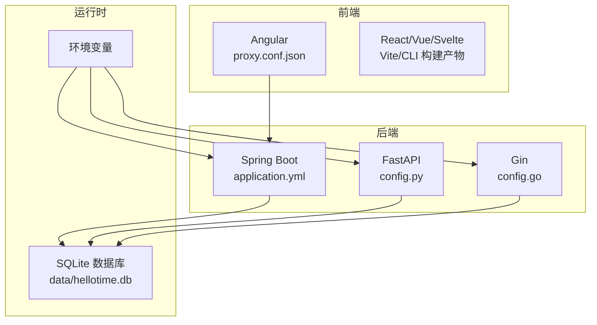
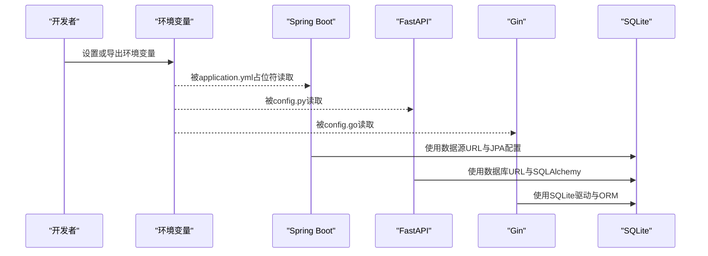
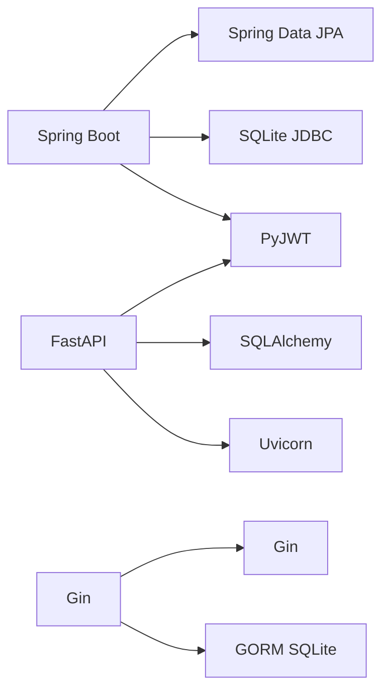

# 配置管理

<cite>
**本文引用的文件**
- [application.yml](file://backends/spring-boot/src/main/resources/application.yml)
- [application.yml（测试）](file://backends/spring-boot/src/test/resources/application.yml)
- [config.py](file://backends/fastapi/app/config.py)
- [config.go](file://backends/gin/config/config.go)
- [main.py（FastAPI）](file://backends/fastapi/app/main.py)
- [requirements.txt（FastAPI）](file://backends/fastapi/requirements.txt)
- [go.mod（Gin）](file://backends/gin/go.mod)
- [pom.xml（Spring Boot）](file://backends/spring-boot/pom.xml)
- [proxy.conf.json（Angular）](file://frontends/angular-ts/proxy.conf.json)
- [dev.sh](file://scripts/dev.sh)
- [build.sh](file://scripts/build.sh)
</cite>

## 目录
1. [简介](#简介)
2. [项目结构](#项目结构)
3. [核心组件](#核心组件)
4. [架构总览](#架构总览)
5. [详细组件分析](#详细组件分析)
6. [依赖分析](#依赖分析)
7. [性能考虑](#性能考虑)
8. [故障排查指南](#故障排查指南)
9. [结论](#结论)
10. [附录](#附录)

## 简介
本指南面向HelloTime项目的配置管理，系统性说明环境变量与配置文件在不同后端框架中的使用方式，覆盖开发、测试、生产三类环境的差异与最佳实践；解释配置文件的结构与优先级；提供敏感信息保护策略（JWT密钥、数据库连接、第三方API密钥）；并给出配置热更新、配置验证与配置审计的实现思路与参考路径。

## 项目结构
HelloTime采用多后端并行的架构设计，分别提供FastAPI、Gin、Spring Boot三种后端实现，前端包含Angular、React、Svelte、Vue三个版本。配置管理的关键点在于：
- 后端通过环境变量注入配置，避免硬编码敏感信息
- 不同后端对环境变量的读取方式一致，但具体实现语言不同
- 测试环境使用内存数据库与显式配置，便于隔离与自动化
- 前端通过代理将请求转发至后端，开发阶段统一指向本地后端端口

图表来源
- [application.yml:1-26](file://backends/spring-boot/src/main/resources/application.yml#L1-L26)
- [config.py:1-18](file://backends/fastapi/app/config.py#L1-L18)
- [config.go:1-51](file://backends/gin/config/config.go#L1-L51)
- [proxy.conf.json（Angular）:1-8](file://frontends/angular-ts/proxy.conf.json#L1-L8)

章节来源
- [application.yml:1-26](file://backends/spring-boot/src/main/resources/application.yml#L1-L26)
- [config.py:1-18](file://backends/fastapi/app/config.py#L1-L18)
- [config.go:1-51](file://backends/gin/config/config.go#L1-L51)
- [proxy.conf.json（Angular）:1-8](file://frontends/angular-ts/proxy.conf.json#L1-L8)

## 核心组件
- 环境变量读取器（后端）
  - Spring Boot：通过application.yml中的占位符读取环境变量，并提供默认值
  - FastAPI：通过Python标准库读取环境变量并提供默认值
  - Gin：通过Go标准库读取环境变量并提供默认值
- 配置文件
  - Spring Boot：application.yml集中定义数据源、JPA、线程、服务器端口及业务配置
  - FastAPI/Gin：通过环境变量驱动配置，不依赖额外YAML/JSON配置文件
- 前端代理
  - Angular通过proxy.conf.json将/api前缀转发到本地后端端口，便于开发联调

章节来源
- [application.yml:1-26](file://backends/spring-boot/src/main/resources/application.yml#L1-L26)
- [config.py:1-18](file://backends/fastapi/app/config.py#L1-L18)
- [config.go:1-51](file://backends/gin/config/config.go#L1-L51)
- [proxy.conf.json（Angular）:1-8](file://frontends/angular-ts/proxy.conf.json#L1-L8)

## 架构总览
下图展示配置在各层的流向与作用范围，强调“环境变量优先”的原则以及测试环境的隔离策略。

图表来源
- [application.yml:1-26](file://backends/spring-boot/src/main/resources/application.yml#L1-L26)
- [config.py:1-18](file://backends/fastapi/app/config.py#L1-L18)
- [config.go:1-51](file://backends/gin/config/config.go#L1-L51)

## 详细组件分析

### Spring Boot 配置（application.yml）
- 数据源与JPA
  - 数据库URL使用相对路径，便于在不同部署环境中定位数据库文件
  - Hibernate DDL策略为自动更新，适合开发与测试；生产中应改为更严格的策略
  - 显示SQL在开发阶段可开启，生产应关闭
- 线程模型
  - 启用虚拟线程（Java 21+），提升高并发下的吞吐
- 服务器端口
  - 默认8080，可通过环境变量覆盖
- 业务配置
  - 管理员密码与JWT密钥通过占位符读取，支持默认值
  - JWT过期时间以小时为单位，可在环境变量中调整

章节来源
- [application.yml:1-26](file://backends/spring-boot/src/main/resources/application.yml#L1-L26)

### FastAPI 配置（config.py）
- 数据库连接
  - 通过环境变量读取数据库URL，默认指向项目根目录下的SQLite文件
- 管理员密码
  - 默认值便于本地开发，生产需强制覆盖
- JWT配置
  - 密钥与过期时间均来自环境变量，提供默认安全强度
- 与其他模块的关系
  - 在应用入口中创建数据库表结构，确保初始化阶段配置可用

章节来源
- [config.py:1-18](file://backends/fastapi/app/config.py#L1-L18)
- [main.py（FastAPI）:1-89](file://backends/fastapi/app/main.py#L1-L89)

### Gin 配置（config.go）
- 变量声明与默认值
  - 数据库路径、管理员密码、JWT密钥、端口、JWT过期时间均有默认值
- 初始化流程
  - 包初始化时即加载配置，保证全局可用
- 类型转换
  - 将字符串形式的过期时间转换为整数，失败则回退到默认值

章节来源
- [config.go:1-51](file://backends/gin/config/config.go#L1-L51)

### 前端代理（Angular）
- 代理规则
  - 将/api前缀的请求转发到本地后端端口，简化跨域与联调
- 与后端端口一致性
  - 开发脚本统一后端端口为8080，前端代理亦指向该端口

章节来源
- [proxy.conf.json（Angular）:1-8](file://frontends/angular-ts/proxy.conf.json#L1-L8)
- [dev.sh:1-52](file://scripts/dev.sh#L1-L52)

### 测试环境配置（Spring Boot）
- 内存数据库
  - 使用内存数据库进行单元测试，避免持久化影响
- 显式配置
  - 在测试配置中直接提供管理员密码与JWT密钥，确保测试稳定性

章节来源
- [application.yml（测试）:1-16](file://backends/spring-boot/src/test/resources/application.yml#L1-L16)

## 依赖分析
- Spring Boot
  - 依赖JPA与SQLite JDBC，启用Hibernate方言适配SQLite
  - 引入JWT相关依赖用于鉴权
- FastAPI
  - 依赖SQLAlchemy、PyJWT、Uvicorn等，支撑Web与数据库访问
- Gin
  - 依赖Gin框架与GORM SQLite驱动，支撑Web与数据库访问

图表来源
- [pom.xml（Spring Boot）:1-91](file://backends/spring-boot/pom.xml#L1-L91)
- [requirements.txt（FastAPI）:1-7](file://backends/fastapi/requirements.txt#L1-L7)
- [go.mod（Gin）:1-46](file://backends/gin/go.mod#L1-L46)

章节来源
- [pom.xml（Spring Boot）:1-91](file://backends/spring-boot/pom.xml#L1-L91)
- [requirements.txt（FastAPI）:1-7](file://backends/fastapi/requirements.txt#L1-L7)
- [go.mod（Gin）:1-46](file://backends/gin/go.mod#L1-L46)

## 性能考虑
- 虚拟线程（Spring Boot）
  - 在Java 21+环境下启用虚拟线程，有助于提升高并发场景下的吞吐与资源利用率
- 数据库连接池与SQL日志
  - 生产环境建议引入连接池与SQL日志开关控制，避免不必要的开销
- 前端静态资源与后端接口
  - 前端构建产物由各自打包工具生成，后端仅提供API；生产部署时建议将静态资源交由反向代理或CDN分发

## 故障排查指南
- 环境变量未生效
  - 检查环境变量是否正确导出，确认后端读取逻辑与变量名一致
  - 对照各后端配置文件的占位符或读取函数
- 数据库连接失败
  - 确认数据库URL与文件权限，检查相对路径在不同工作目录下的解析
  - 测试环境使用内存数据库时，确认测试配置已加载
- JWT鉴权异常
  - 校验JWT密钥长度与格式，确认过期时间合理
  - 生产环境务必使用强随机密钥并妥善保管
- 前端无法访问后端
  - 检查代理配置与后端端口，确保开发脚本启动顺序与端口一致

章节来源
- [application.yml:1-26](file://backends/spring-boot/src/main/resources/application.yml#L1-L26)
- [config.py:1-18](file://backends/fastapi/app/config.py#L1-L18)
- [config.go:1-51](file://backends/gin/config/config.go#L1-L51)
- [application.yml（测试）:1-16](file://backends/spring-boot/src/test/resources/application.yml#L1-L16)
- [proxy.conf.json（Angular）:1-8](file://frontends/angular-ts/proxy.conf.json#L1-L8)
- [dev.sh:1-52](file://scripts/dev.sh#L1-L52)

## 结论
HelloTime的配置体系遵循“环境变量优先、默认值兜底”的原则，三套后端实现保持一致的配置读取模式，测试环境通过内存数据库与显式配置实现稳定隔离。建议在生产环境强化敏感信息保护、完善配置验证与审计机制，并结合CI/CD流程实现配置的版本化与变更追踪。

## 附录

### 环境变量清单与用途
- DATABASE_URL
  - 作用：数据库连接地址（SQLite相对路径）
  - 默认值：见各后端配置
- ADMIN_PASSWORD
  - 作用：管理员登录密码
  - 默认值：见各后端配置
- JWT_SECRET
  - 作用：JWT签名密钥
  - 默认值：见各后端配置
- JWT_EXPIRATION_HOURS
  - 作用：JWT过期时间（小时）
  - 默认值：见各后端配置
- PORT
  - 作用：服务监听端口（Gin）
  - 默认值：8080

章节来源
- [application.yml:1-26](file://backends/spring-boot/src/main/resources/application.yml#L1-L26)
- [config.py:1-18](file://backends/fastapi/app/config.py#L1-L18)
- [config.go:1-51](file://backends/gin/config/config.go#L1-L51)

### 配置文件结构与优先级
- Spring Boot
  - application.yml为主配置文件，支持占位符读取环境变量
  - 测试环境使用测试专用配置文件，覆盖关键配置
- FastAPI/Gin
  - 通过环境变量驱动，不依赖额外配置文件
  - 若需扩展，可在各自包内新增配置模块并保持默认值兜底

章节来源
- [application.yml:1-26](file://backends/spring-boot/src/main/resources/application.yml#L1-L26)
- [application.yml（测试）:1-16](file://backends/spring-boot/src/test/resources/application.yml#L1-L16)
- [config.py:1-18](file://backends/fastapi/app/config.py#L1-L18)
- [config.go:1-51](file://backends/gin/config/config.go#L1-L51)

### 敏感信息安全管理方案
- 密钥轮换
  - 使用强随机密钥，定期轮换并安全存储
- 存储与分发
  - 使用平台机密管理服务或加密的环境变量注入
- 最小权限
  - 限制数据库连接凭据与密钥的可见范围
- 审计与告警
  - 记录敏感配置变更与访问日志，建立变更审批与告警机制

### 配置热更新、验证与审计（实现思路）
- 热更新
  - Spring Boot：结合外部配置中心（如Spring Cloud Config）与刷新端点
  - FastAPI/Gin：通过进程重启或容器编排实现配置变更生效
- 验证
  - 在应用启动时对关键配置进行校验（如密钥长度、端口合法性、数据库连通性）
- 审计
  - 记录配置加载来源与最终值，支持变更追踪与回滚

### 配置模板与最佳实践
- 开发环境
  - 使用默认值与本地数据库文件，便于快速启动
- 测试环境
  - 使用内存数据库与显式配置，确保测试隔离
- 生产环境
  - 所有敏感信息通过环境变量注入，禁用SQL日志与调试输出
  - 使用强随机密钥与合理的过期时间
  - 建立CI/CD流水线中的配置校验与审批流程