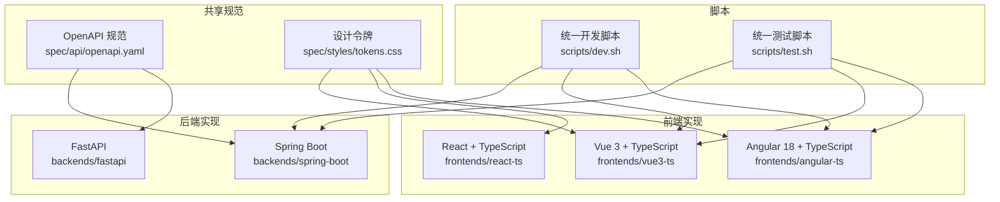
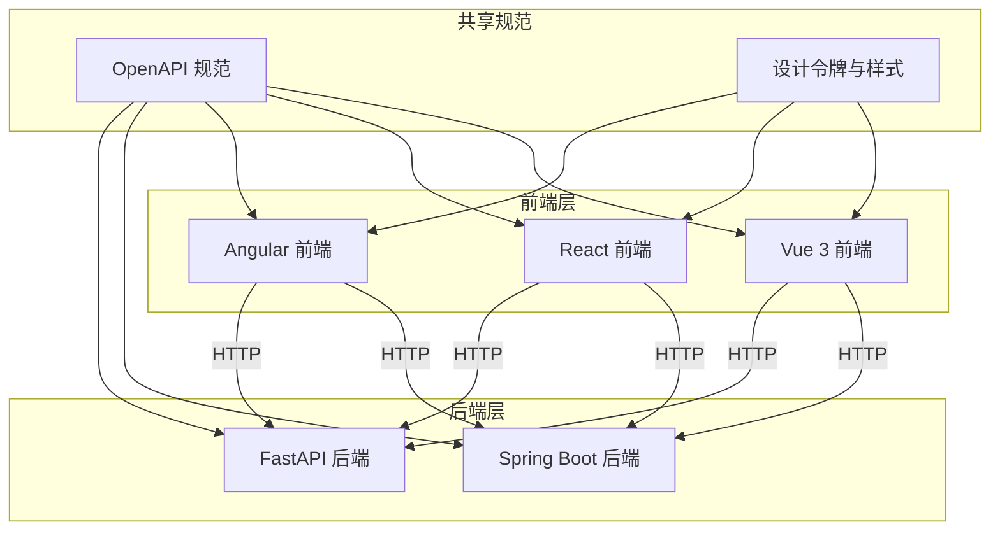
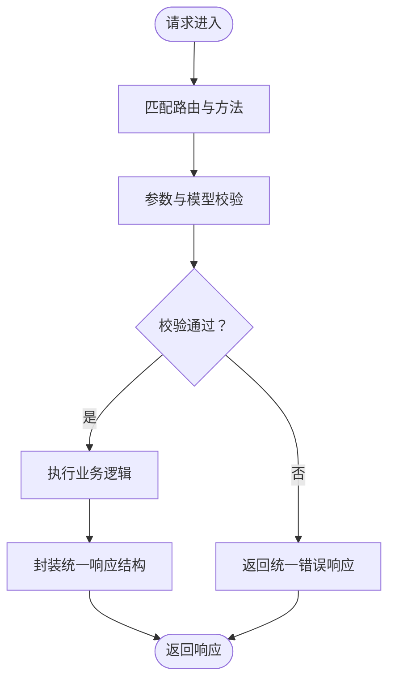
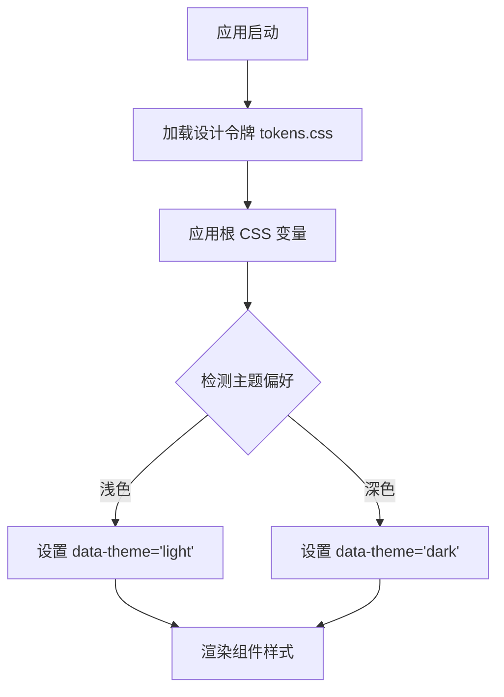
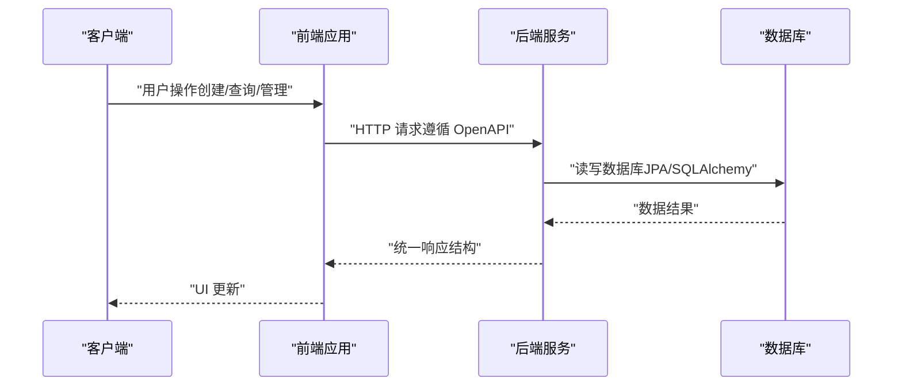
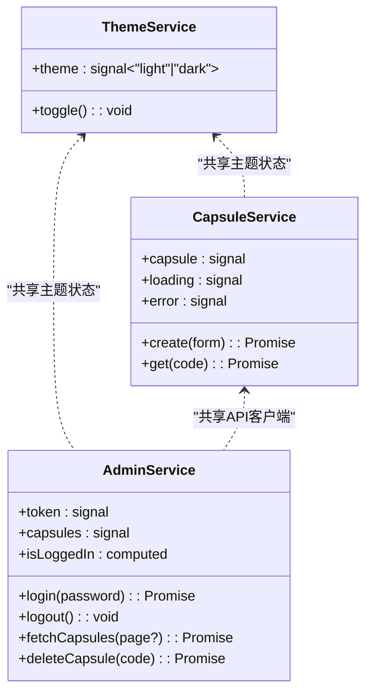
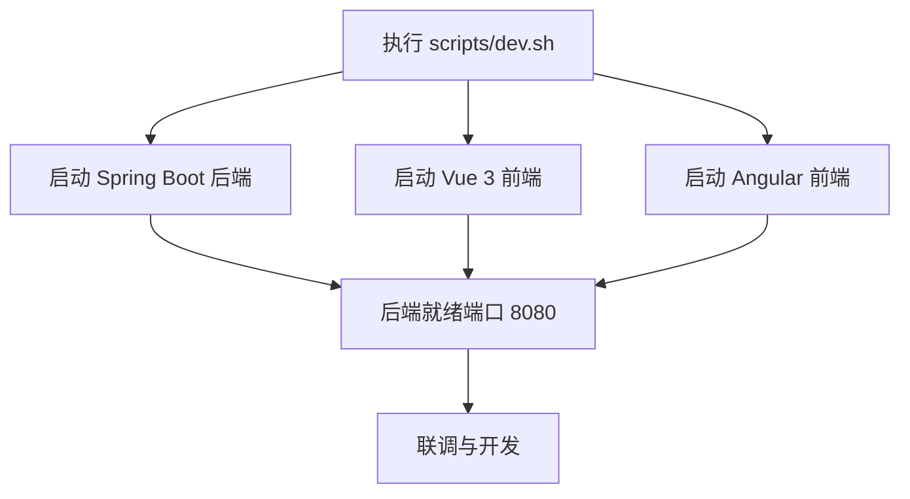
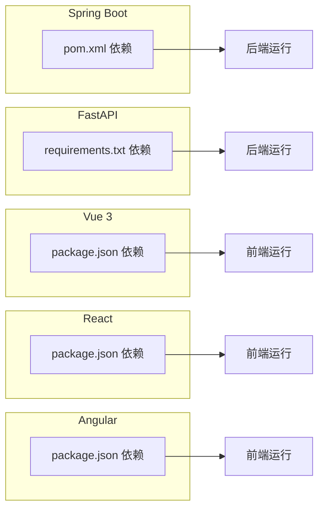

# 项目概述

<cite>
**本文引用的文件**
- [README.md](file://README.md)
- [CLAUDE.md](file://CLAUDE.md)
- [spec/api/openapi.yaml](file://spec/api/openapi.yaml)
- [spec/styles/tokens.css](file://spec/styles/tokens.css)
- [scripts/dev.sh](file://scripts/dev.sh)
- [scripts/test.sh](file://scripts/test.sh)
- [backends/spring-boot/README.md](file://backends/spring-boot/README.md)
- [backends/fastapi/README.md](file://backends/fastapi/README.md)
- [frontends/vue3-ts/README.md](file://frontends/vue3-ts/README.md)
- [frontends/react-ts/README.md](file://frontends/react-ts/README.md)
- [frontends/angular-ts/README.md](file://frontends/angular-ts/README.md)
- [backends/spring-boot/pom.xml](file://backends/spring-boot/pom.xml)
- [backends/fastapi/requirements.txt](file://backends/fastapi/requirements.txt)
- [frontends/vue3-ts/package.json](file://frontends/vue3-ts/package.json)
- [frontends/react-ts/package.json](file://frontends/react-ts/package.json)
- [frontends/angular-ts/package.json](file://frontends/angular-ts/package.json)
</cite>

## 目录
1. [简介](#简介)
2. [项目结构](#项目结构)
3. [核心组件](#核心组件)
4. [架构总览](#架构总览)
5. [详细组件分析](#详细组件分析)
6. [依赖关系分析](#依赖关系分析)
7. [性能考虑](#性能考虑)
8. [故障排查指南](#故障排查指南)
9. [结论](#结论)
10. [附录](#附录)

## 简介
HelloTime（时间胶囊）是一个“类似 RealWorld”的技术展示应用，旨在通过统一的 API 规范与可复用的前端样式，演示多种前后端技术栈组合的能力。项目采用“前后端完全解耦、多框架并存、统一规范”的设计理念，支持 Vue 3 + Spring Boot、React + FastAPI、Angular + Spring Boot 等多种组合。用户可以创建带有未来开启时间的消息胶囊，到期后方可查看内容；管理员可通过简单认证获取 JWT Token，对所有胶囊进行分页查询与删除。

- 项目定位：技术展示与教学示例，强调“统一规范 + 多栈组合”
- 设计哲学：前后端完全解耦、多框架并存、统一 API 与样式规范
- 主要功能：创建胶囊、查询胶囊（未到时间隐藏内容）、管理员登录与管理、响应式设计、深色主题
- 技术特色：统一 OpenAPI 规范、共享设计令牌、SQLite 数据库、JWT 认证、健康检查动态展示技术栈

**章节来源**
- [README.md:1-259](file://README.md#L1-L259)
- [CLAUDE.md:5-177](file://CLAUDE.md#L5-L177)

## 项目结构
项目采用 monorepo 结构，将共享规范（API 与样式）与多套前后端实现集中管理，便于跨实现保持一致性与可替换性。

**图表来源**
- [README.md:18-34](file://README.md#L18-L34)
- [CLAUDE.md:54-64](file://CLAUDE.md#L54-L64)

**章节来源**
- [README.md:18-34](file://README.md#L18-L34)
- [CLAUDE.md:54-64](file://CLAUDE.md#L54-L64)

## 核心组件
- 统一 API 规范：以 OpenAPI YAML 定义 REST 端点与数据模型，确保各实现行为一致
- 共享样式系统：通过 CSS 自定义属性与设计令牌，实现跨前端的一致视觉与主题切换
- 后端实现：Spring Boot（Java 17 + SQLite + JPA）与 FastAPI（Python 3.12 + SQLite + SQLAlchemy），均遵循统一 API 与响应格式
- 前端实现：Vue 3（Composition API + TypeScript）、React（Hooks + TypeScript）、Angular 18（Standalone Components + Signals），共享 API 客户端、类型与设计系统
- 开发与测试：提供统一启动脚本与测试脚本，支持一键启动与测试

**章节来源**
- [README.md:146-254](file://README.md#L146-L254)
- [CLAUDE.md:120-177](file://CLAUDE.md#L120-L177)

## 架构总览
系统采用“共享规范 + 多实现”的架构，前后端通过统一的 REST API 通信，样式通过共享设计令牌统一风格。后端负责业务逻辑与数据持久化，前端负责用户交互与状态管理，二者通过 HTTP 协议解耦。

**图表来源**
- [README.md:3-16](file://README.md#L3-L16)
- [CLAUDE.md:120-127](file://CLAUDE.md#L120-L127)

**章节来源**
- [README.md:3-16](file://README.md#L3-L16)
- [CLAUDE.md:120-127](file://CLAUDE.md#L120-L127)

## 详细组件分析

### 统一 API 规范（OpenAPI）
- 规范位置：spec/api/openapi.yaml
- 关键端点
  - 健康检查：GET /api/v1/health
  - 创建胶囊：POST /api/v1/capsules
  - 查询胶囊：GET /api/v1/capsules/{code}
  - 管理员登录：POST /api/v1/admin/login
  - 管理员分页查询：GET /api/v1/admin/capsules
  - 管理员删除胶囊：DELETE /api/v1/admin/capsules/{code}
- 数据模型与约束：请求体字段长度、日期时间格式、8 位字母数字编码等
- 响应格式：统一 success/data/message/errorCode 结构，错误码枚举一致

**图表来源**
- [spec/api/openapi.yaml:10-164](file://spec/api/openapi.yaml#L10-L164)

**章节来源**
- [spec/api/openapi.yaml:10-164](file://spec/api/openapi.yaml#L10-L164)
- [README.md:171-213](file://README.md#L171-L213)

### 共享设计令牌与主题系统
- 设计令牌：spec/styles/tokens.css 定义颜色、字体、间距、圆角、阴影、过渡与布局等 CSS 自定义属性
- 深色主题：通过在 documentElement 上设置 data-theme="dark" 切换，所有颜色与阴影变量自动更新
- 前端集成：Vue/React/Angular 三种实现均引入共享样式文件，保证视觉一致性

**图表来源**
- [spec/styles/tokens.css:1-104](file://spec/styles/tokens.css#L1-L104)

**章节来源**
- [spec/styles/tokens.css:1-104](file://spec/styles/tokens.css#L1-L104)
- [CLAUDE.md:128-133](file://CLAUDE.md#L128-L133)

### 后端实现（Spring Boot + FastAPI）
- Spring Boot
  - 技术栈：Spring Boot 3 + Java 17 + SQLite + JPA + JWT
  - 端点：遵循 OpenAPI 规范，统一响应格式，全局异常处理
  - 配置：JWT 密钥、管理员密码通过环境变量注入
- FastAPI
  - 技术栈：FastAPI >= 0.115 + Python 3.12 + SQLite + SQLAlchemy + PyJWT
  - 特性：异步接口、自动生成 OpenAPI 文档、Pydantic 数据验证、统一响应格式
  - 配置：数据库 URL、管理员密码、JWT 密钥与过期时间通过环境变量注入

**图表来源**
- [backends/spring-boot/README.md:54-76](file://backends/spring-boot/README.md#L54-L76)
- [backends/fastapi/README.md:76-98](file://backends/fastapi/README.md#L76-L98)

**章节来源**
- [backends/spring-boot/README.md:54-76](file://backends/spring-boot/README.md#L54-L76)
- [backends/fastapi/README.md:76-98](file://backends/fastapi/README.md#L76-L98)

### 前端实现（Vue 3 / React / Angular）
- Vue 3
  - 技术栈：Vue 3 + TypeScript + Vite + Vue Router + Vitest
  - 组合式函数：useCapsule/useAdmin/useTheme 管理状态与逻辑
  - 路由：/、/create、/open/:code、/admin、/about
- React
  - 技术栈：React 19 + TypeScript + Vite + React Router + Vitest
  - 自定义 Hooks：useCapsule/useAdmin/useTheme
  - 样式：CSS Modules
- Angular 18
  - 技术栈：Angular 18 + Standalone Components + Signals + Karma + Jasmine
  - 服务：ThemeService/CapsuleService/AdminService
  - 路由：懒加载 + withComponentInputBinding()

**图表来源**
- [frontends/angular-ts/README.md:53-82](file://frontends/angular-ts/README.md#L53-L82)

**章节来源**
- [frontends/vue3-ts/README.md:51-94](file://frontends/vue3-ts/README.md#L51-L94)
- [frontends/react-ts/README.md:51-92](file://frontends/react-ts/README.md#L51-L92)
- [frontends/angular-ts/README.md:53-92](file://frontends/angular-ts/README.md#L53-L92)

### 统一启动脚本与测试脚本
- 统一开发脚本：同时启动后端与多个前端（Spring Boot + Vue 3 + Angular），便于联调
- 统一测试脚本：依次运行后端与三个前端的测试，确保全栈质量

**图表来源**
- [scripts/dev.sh:1-45](file://scripts/dev.sh#L1-L45)

**章节来源**
- [scripts/dev.sh:1-45](file://scripts/dev.sh#L1-L45)
- [scripts/test.sh:1-34](file://scripts/test.sh#L1-L34)

## 依赖关系分析
- 后端依赖
  - Spring Boot：Web、JPA、Validation、SQLite JDBC、JWT（jjwt）
  - FastAPI：FastAPI、Uvicorn、SQLAlchemy、PyJWT、HTTPX、Pytest
- 前端依赖
  - Vue 3：vue、vue-router
  - React：react、react-router-dom
  - Angular：@angular/* 核心包、rxjs、zone.js
- 构建与测试
  - Vite、TypeScript、Vitest（Vue/React/Angular）
  - Karma + Jasmine（Angular）

**图表来源**
- [backends/spring-boot/pom.xml:25-79](file://backends/spring-boot/pom.xml#L25-L79)
- [backends/fastapi/requirements.txt:1-7](file://backends/fastapi/requirements.txt#L1-L7)
- [frontends/vue3-ts/package.json:13-28](file://frontends/vue3-ts/package.json#L13-L28)
- [frontends/react-ts/package.json:13-29](file://frontends/react-ts/package.json#L13-L29)
- [frontends/angular-ts/package.json:11-36](file://frontends/angular-ts/package.json#L11-L36)

**章节来源**
- [backends/spring-boot/pom.xml:25-79](file://backends/spring-boot/pom.xml#L25-L79)
- [backends/fastapi/requirements.txt:1-7](file://backends/fastapi/requirements.txt#L1-L7)
- [frontends/vue3-ts/package.json:13-28](file://frontends/vue3-ts/package.json#L13-L28)
- [frontends/react-ts/package.json:13-29](file://frontends/react-ts/package.json#L13-L29)
- [frontends/angular-ts/package.json:11-36](file://frontends/angular-ts/package.json#L11-L36)

## 性能考虑
- 前后端完全解耦：可独立扩展与部署，利于微服务化演进
- SQLite 轻量存储：单机开发与演示场景高效稳定
- 统一响应格式：减少前端解析成本，便于缓存与错误处理
- 前端状态管理：Vue/React/Angular 分别采用组合式函数/Hooks/Signals，避免复杂状态库依赖
- 构建优化：Vite 提供快速冷启动与热更新，Angular AOT 构建提升运行时性能

[本节为通用指导，不直接分析具体文件]

## 故障排查指南
- 端口冲突
  - 后端默认 8080，前端 Vue 3/React 5173、Angular 5175
  - 可通过修改脚本或环境变量调整端口
- CORS 问题
  - 开发环境下已配置允许 localhost:* 跨域请求
- 数据库文件
  - SQLite 数据库文件默认在项目根目录生成，注意权限与路径
- 环境变量
  - Spring Boot：ADMIN_PASSWORD、JWT_SECRET
  - FastAPI：DATABASE_URL、ADMIN_PASSWORD、JWT_SECRET、JWT_EXPIRATION_HOURS
- 测试失败
  - 确保依赖安装完整，使用统一测试脚本运行

**章节来源**
- [README.md:214-254](file://README.md#L214-L254)
- [CLAUDE.md:224-241](file://CLAUDE.md#L224-L241)

## 结论
HelloTime 通过统一的 API 规范与共享设计系统，展示了多种技术栈组合的可行性与一致性。其“前后端完全解耦、多框架并存、统一规范”的架构理念，既适合初学者理解时间胶囊概念与基本前后端协作，也为经验开发者提供了可扩展、可维护的工程化范式。借助统一启动与测试脚本，团队可快速搭建与验证多栈组合方案。

[本节为总结性内容，不直接分析具体文件]

## 附录

### 快速开始指南
- 方案 1：Spring Boot + Vue 3
  - 后端：cd backends/spring-boot && ./mvnw spring-boot:run
  - 前端：cd frontends/vue3-ts && npm install && npm run dev
- 方案 2：FastAPI + React
  - 后端：cd backends/fastapi && pip install -r requirements.txt && uvicorn app.main:app --port 8080
  - 前端：cd frontends/react-ts && npm install && npm run dev
- 方案 3：Spring Boot + Angular
  - 后端：cd backends/spring-boot && ./mvnw spring-boot:run
  - 前端：cd frontends/angular-ts && npm install && npm run dev
- 统一启动：./scripts/dev.sh 同时启动后端与全部前端
- 统一测试：./scripts/test.sh 运行全部测试

**章节来源**
- [README.md:36-112](file://README.md#L36-L112)
- [scripts/dev.sh:1-45](file://scripts/dev.sh#L1-L45)
- [scripts/test.sh:1-34](file://scripts/test.sh#L1-L34)

### API 端点一览
- GET /api/v1/health：健康检查（返回技术栈信息）
- POST /api/v1/capsules：创建胶囊
- GET /api/v1/capsules/{code}：查询胶囊（未到时间 content 为 null）
- POST /api/v1/admin/login：管理员登录（返回 JWT Token）
- GET /api/v1/admin/capsules：分页查询胶囊（需认证）
- DELETE /api/v1/admin/capsules/{code}：删除胶囊（需认证）

**章节来源**
- [README.md:171-184](file://README.md#L171-L184)
- [spec/api/openapi.yaml:10-164](file://spec/api/openapi.yaml#L10-L164)