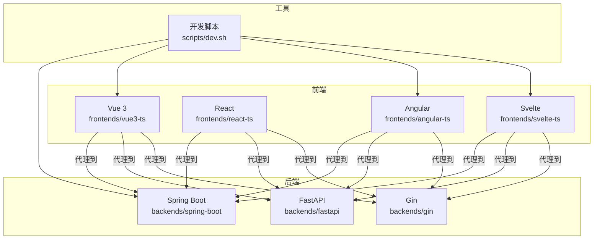
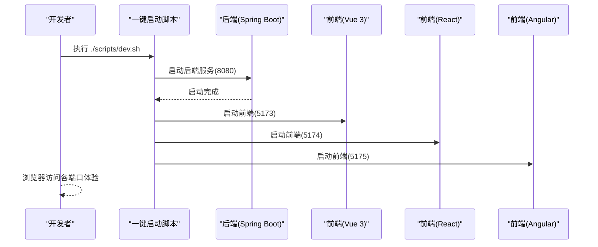
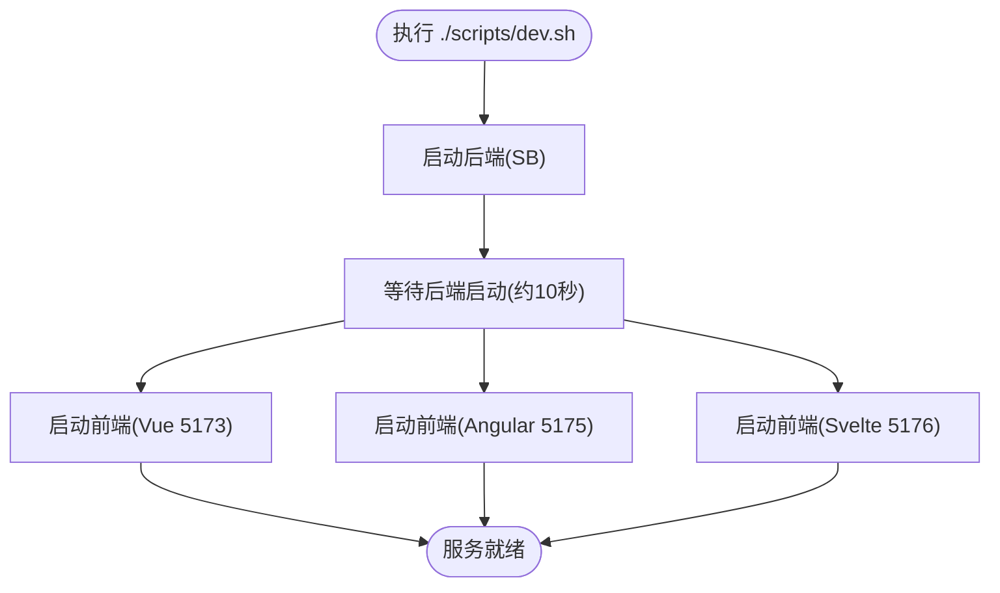
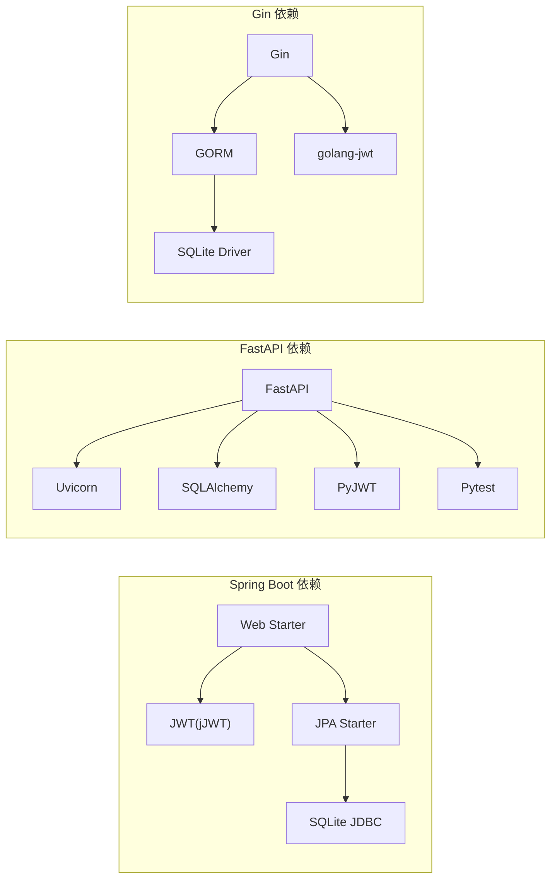

# 快速开始

<cite>
**本文引用的文件**
- [README.md](file://README.md)
- [scripts/dev.sh](file://scripts/dev.sh)
- [backends/fastapi/README.md](file://backends/fastapi/README.md)
- [backends/fastapi/requirements.txt](file://backends/fastapi/requirements.txt)
- [backends/gin/README.md](file://backends/gin/README.md)
- [backends/gin/go.mod](file://backends/gin/go.mod)
- [backends/spring-boot/README.md](file://backends/spring-boot/README.md)
- [backends/spring-boot/pom.xml](file://backends/spring-boot/pom.xml)
- [frontends/vue3-ts/README.md](file://frontends/vue3-ts/README.md)
- [frontends/vue3-ts/vite.config.ts](file://frontends/vue3-ts/vite.config.ts)
- [frontends/react-ts/README.md](file://frontends/react-ts/README.md)
- [frontends/angular-ts/README.md](file://frontends/angular-ts/README.md)
- [frontends/angular-ts/proxy.conf.json](file://frontends/angular-ts/proxy.conf.json)
- [frontends/vue3-ts/package.json](file://frontends/vue3-ts/package.json)
- [frontends/react-ts/package.json](file://frontends/react-ts/package.json)
- [frontends/angular-ts/package.json](file://frontends/angular-ts/package.json)
</cite>

## 目录
1. [简介](#简介)
2. [项目结构](#项目结构)
3. [核心组件](#核心组件)
4. [架构总览](#架构总览)
5. [详细组件分析](#详细组件分析)
6. [依赖分析](#依赖分析)
7. [性能考虑](#性能考虑)
8. [故障排查指南](#故障排查指南)
9. [结论](#结论)
10. [附录](#附录)

## 简介
HelloTime 是一个“时间胶囊”应用，通过统一的 API 规范与设计系统，展示多种前后端技术栈的自由组合能力。项目提供四种常见组合的快速启动方式，并支持一键启动全部服务，便于开发者快速搭建开发环境并运行项目。

## 项目结构
项目采用“前后端分离 + 统一规范”的组织方式：
- docs/：项目文档（需求、设计、部署指南）
- spec/：共享规范（OpenAPI 3.0 + 设计令牌）
- frontends/：前端实现（Vue 3、React、Angular、Svelte），可独立运行
- backends/：后端实现（Spring Boot、FastAPI、Gin），可独立运行
- scripts/：开发/构建/测试脚本（一键启动、测试）

图表来源
- [README.md:37-63](file://README.md#L37-L63)
- [scripts/dev.sh:1-52](file://scripts/dev.sh#L1-L52)

章节来源
- [README.md:37-63](file://README.md#L37-L63)

## 核心组件
- 统一 API 规范：所有后端实现遵循 OpenAPI 3.0，提供一致的 REST 接口。
- 设计系统：前端共享 CSS 设计令牌与样式，保证视觉一致性。
- 多技术组合：支持 Spring Boot + Vue 3、FastAPI + React、Spring Boot + Angular、Gin + Vue 3 等组合。
- 一键启动：提供脚本同时启动后端与多个前端，便于联调。

章节来源
- [README.md:16-36](file://README.md#L16-L36)
- [README.md:65-151](file://README.md#L65-L151)

## 架构总览
下图展示了四种推荐组合的启动流程与端口分配：

图表来源
- [scripts/dev.sh:11-46](file://scripts/dev.sh#L11-L46)
- [README.md:67-140](file://README.md#L67-L140)

## 详细组件分析

### Spring Boot + Vue 3
- 后端：Spring Boot 3 + Java 21，默认端口 8080；使用 SQLite + JPA；JWT 管理员认证。
- 前端：Vue 3 + TypeScript + Vite，默认端口 5173；通过 Vite 代理转发 /api 到后端。
- 启动步骤
  - 后端：进入 backends/spring-boot，使用 Maven Wrapper 启动。
  - 前端：进入 frontends/vue3-ts，安装依赖后启动开发服务器。
- 端口与访问
  - 后端：http://localhost:8080
  - 前端：http://localhost:5173
- 环境变量
  - ADMIN_PASSWORD、JWT_SECRET（可在运行时通过环境变量覆盖）。

章节来源
- [backends/spring-boot/README.md:21-52](file://backends/spring-boot/README.md#L21-L52)
- [frontends/vue3-ts/README.md:43-49](file://frontends/vue3-ts/README.md#L43-L49)
- [frontends/vue3-ts/vite.config.ts:13-21](file://frontends/vue3-ts/vite.config.ts#L13-L21)
- [README.md:67-83](file://README.md#L67-L83)

### FastAPI + React
- 后端：FastAPI + Python 3.12+，默认端口 8080；SQLite + SQLAlchemy；JWT 管理员认证。
- 前端：React 19 + TypeScript + Vite，默认端口 5174；通过 Vite 代理转发 /api 到后端。
- 启动步骤
  - 后端：进入 backends/fastapi，安装依赖后使用 Uvicorn 启动。
  - 前端：进入 frontends/react-ts，安装依赖后启动开发服务器。
- 端口与访问
  - 后端：http://localhost:8080
  - 前端：http://localhost:5174
- 环境变量
  - DATABASE_URL、ADMIN_PASSWORD、JWT_SECRET、JWT_EXPIRATION_HOURS。

章节来源
- [backends/fastapi/README.md:21-49](file://backends/fastapi/README.md#L21-L49)
- [frontends/react-ts/README.md:43-49](file://frontends/react-ts/README.md#L43-L49)
- [README.md:86-103](file://README.md#L86-L103)

### Spring Boot + Angular
- 后端：Spring Boot 3，默认端口 8080。
- 前端：Angular 18 + TypeScript，默认端口 5175；通过代理配置转发 /api 到后端。
- 启动步骤
  - 后端：进入 backends/spring-boot，使用 Maven Wrapper 启动。
  - 前端：进入 frontends/angular-ts，安装依赖后启动开发服务器。
- 端口与访问
  - 后端：http://localhost:8080
  - 前端：http://localhost:5175
- 环境变量
  - ADMIN_PASSWORD、JWT_SECRET。

章节来源
- [backends/spring-boot/README.md:21-52](file://backends/spring-boot/README.md#L21-L52)
- [frontends/angular-ts/README.md:7-20](file://frontends/angular-ts/README.md#L7-L20)
- [frontends/angular-ts/proxy.conf.json:1-7](file://frontends/angular-ts/proxy.conf.json#L1-L7)
- [README.md:106-121](file://README.md#L106-L121)

### Gin + Vue 3
- 后端：Gin + Go 1.24+，默认端口 8080；SQLite + GORM；JWT 管理员认证。
- 前端：Vue 3，默认端口 5173。
- 启动步骤
  - 后端：进入 backends/gin，安装依赖后运行 main.go。
  - 前端：进入 frontends/vue3-ts，安装依赖后启动开发服务器。
- 端口与访问
  - 后端：http://localhost:8080
  - 前端：http://localhost:5173
- 环境变量
  - DATABASE_URL、ADMIN_PASSWORD、JWT_SECRET、JWT_EXPIRATION_HOURS、PORT。

章节来源
- [backends/gin/README.md:20-42](file://backends/gin/README.md#L20-L42)
- [frontends/vue3-ts/README.md:43-49](file://frontends/vue3-ts/README.md#L43-L49)
- [README.md:124-139](file://README.md#L124-L139)

### 一键启动脚本
- 脚本会同时启动后端与多个前端（Vue 5173、Angular 5175、Svelte 5176），并等待后端启动后再启动前端。
- 停止方式：Ctrl+C，脚本会清理所有子进程。
- 使用场景：需要联调多个前端或快速预览效果。

图表来源
- [scripts/dev.sh:11-46](file://scripts/dev.sh#L11-L46)

章节来源
- [scripts/dev.sh:1-52](file://scripts/dev.sh#L1-L52)
- [README.md:143-148](file://README.md#L143-L148)

## 依赖分析
- 后端依赖
  - Spring Boot：Web、JPA、Validation、SQLite JDBC、JWT。
  - FastAPI：FastAPI、Uvicorn、SQLAlchemy、PyJWT、HTTPX、Pytest。
  - Gin：Gin、GORM、SQLite 驱动、JWT。
- 前端依赖
  - Vue 3：Vue、Vue Router。
  - React：React、React Router。
  - Angular：Angular 核心包、路由、测试工具链。

图表来源
- [backends/spring-boot/pom.xml:25-79](file://backends/spring-boot/pom.xml#L25-L79)
- [backends/fastapi/requirements.txt:1-7](file://backends/fastapi/requirements.txt#L1-L7)
- [backends/gin/go.mod:5-10](file://backends/gin/go.mod#L5-L10)

章节来源
- [backends/spring-boot/pom.xml:1-91](file://backends/spring-boot/pom.xml#L1-L91)
- [backends/fastapi/requirements.txt:1-7](file://backends/fastapi/requirements.txt#L1-L7)
- [backends/gin/go.mod:1-46](file://backends/gin/go.mod#L1-L46)

## 性能考虑
- 前端开发服务器使用 Vite，具备快速热更新与按需编译能力，适合本地开发。
- 后端在开发模式下使用轻量级服务器（Uvicorn、Spring Boot Dev、Go run），启动迅速。
- 生产构建建议
  - Vue/React：使用 Vite 生产构建，产物体积小、加载快。
  - Angular：使用 Angular CLI 生产构建，包含 AOT 编译与 Tree Shaking。
  - 后端：Spring Boot 打包为可执行 JAR；FastAPI/Gin 提供生产服务器部署方案。

## 故障排查指南
- 端口冲突
  - Vue 3：默认 5173；如被占用，可在 Vite 配置中调整端口。
  - React：默认 5174；如被占用，可在 Vite 配置中调整端口。
  - Angular：默认 5175；如被占用，可在脚本中修改端口。
  - 后端：Spring Boot 默认 8080；如被占用，可在运行参数中指定端口。
- 代理配置
  - Vue 3：Vite 代理将 /api 转发至后端 8080。
  - Angular：通过 proxy.conf.json 将 /api 转发至后端 8080。
- 环境变量
  - Spring Boot：ADMIN_PASSWORD、JWT_SECRET。
  - FastAPI：DATABASE_URL、ADMIN_PASSWORD、JWT_SECRET、JWT_EXPIRATION_HOURS。
  - Gin：DATABASE_URL、ADMIN_PASSWORD、JWT_SECRET、JWT_EXPIRATION_HOURS、PORT。
- 依赖安装
  - Spring Boot：使用 Maven Wrapper，无需全局安装 Maven。
  - FastAPI：使用 Python 3.12+，安装 requirements.txt。
  - Gin：使用 Go 1.24+，执行 go mod tidy。
  - 前端：使用 npm/pnpm 安装依赖，确保 Node.js 18+。

章节来源
- [frontends/vue3-ts/vite.config.ts:13-21](file://frontends/vue3-ts/vite.config.ts#L13-L21)
- [frontends/angular-ts/proxy.conf.json:1-7](file://frontends/angular-ts/proxy.conf.json#L1-L7)
- [backends/spring-boot/README.md:40-52](file://backends/spring-boot/README.md#L40-L52)
- [backends/fastapi/README.md:60-74](file://backends/fastapi/README.md#L60-L74)
- [backends/gin/README.md:44-59](file://backends/gin/README.md#L44-L59)
- [frontends/vue3-ts/README.md:24-33](file://frontends/vue3-ts/README.md#L24-L33)
- [frontends/react-ts/README.md:24-33](file://frontends/react-ts/README.md#L24-L33)
- [frontends/angular-ts/README.md:22-24](file://frontends/angular-ts/README.md#L22-L24)

## 结论
通过统一的 API 规范与设计系统，HelloTime 支持多种技术栈自由组合。按照本文提供的步骤，开发者可以快速启动任一组合，并借助一键脚本同时运行多个前端以提升联调效率。遇到问题时，可依据故障排查指南逐项定位并解决。

## 附录
- 常用命令汇总
  - 后端：使用各自 README 中的启动命令。
  - 前端：npm install 后执行 npm run dev。
  - 一键启动：./scripts/dev.sh。
- 端口对照
  - Vue 3：5173
  - React：5174
  - Angular：5175
  - Svelte：5176
  - 后端：8080