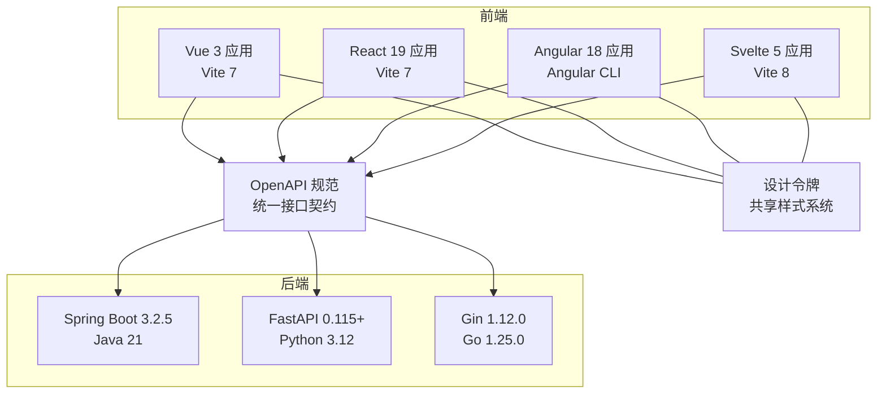
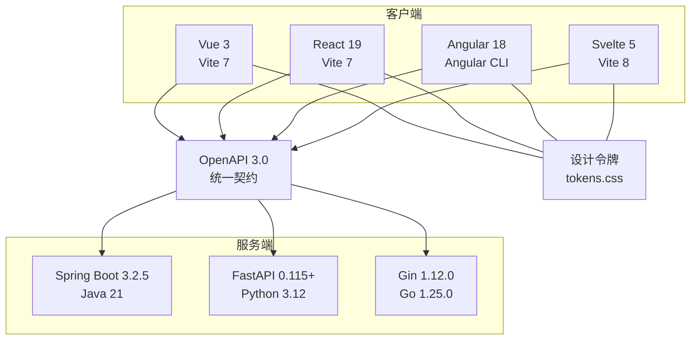
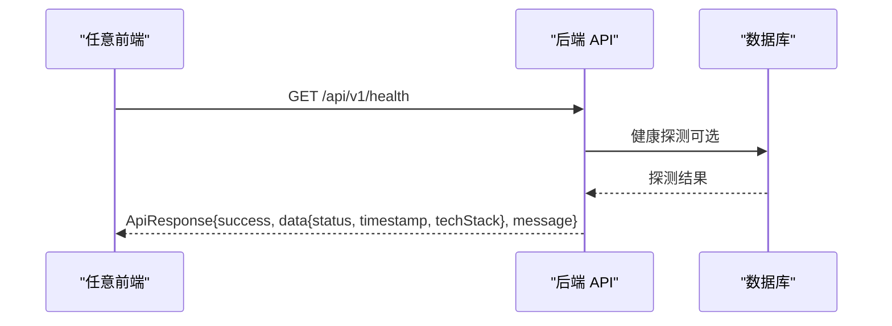
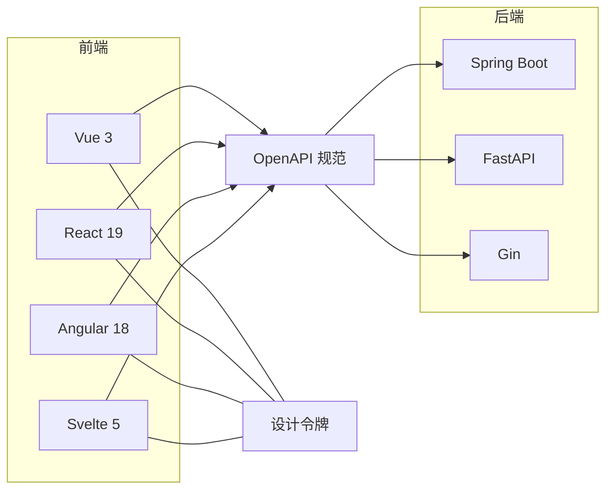

# 技术栈概览

<cite>
**本文引用的文件**
- [frontends/vue3-ts/package.json](file://frontends/vue3-ts/package.json)
- [frontends/react-ts/package.json](file://frontends/react-ts/package.json)
- [frontends/angular-ts/package.json](file://frontends/angular-ts/package.json)
- [frontends/svelte-ts/package.json](file://frontends/svelte-ts/package.json)
- [backends/fastapi/requirements.txt](file://backends/fastapi/requirements.txt)
- [backends/gin/go.mod](file://backends/gin/go.mod)
- [backends/spring-boot/pom.xml](file://backends/spring-boot/pom.xml)
- [docs/frontend-comparison.md](file://docs/frontend-comparison.md)
- [docs/backend-comparison.md](file://docs/backend-comparison.md)
- [spec/api/openapi.yaml](file://spec/api/openapi.yaml)
- [docs/design-tokens.md](file://docs/design-tokens.md)
- [frontends/vue3-ts/src/types/index.ts](file://frontends/vue3-ts/src/types/index.ts)
- [frontends/react-ts/src/types/index.ts](file://frontends/react-ts/src/types/index.ts)
- [frontends/angular-ts/src/app/types/index.ts](file://frontends/angular-ts/src/app/types/index.ts)
- [frontends/svelte-ts/src/lib/types/index.ts](file://frontends/svelte-ts/src/lib/types/index.ts)
</cite>

## 目录
1. [引言](#引言)
2. [项目结构](#项目结构)
3. [核心组件](#核心组件)
4. [架构总览](#架构总览)
5. [详细组件分析](#详细组件分析)
6. [依赖分析](#依赖分析)
7. [性能考虑](#性能考虑)
8. [故障排查指南](#故障排查指南)
9. [结论](#结论)
10. [附录](#附录)

## 引言
本文件为 HelloTime 项目提供全面的技术栈概览，围绕前端四大框架（Vue 3、React 19、Angular 18、Svelte 5）与后端三大框架（Spring Boot、FastAPI、Gin）展开，说明版本要求、构建工具、开发端口等基本信息；并通过统一 API 规范与设计系统，解释如何在多技术栈之间确保兼容性与一致性，帮助开发者理解项目的技术决策背景。

## 项目结构
HelloTime 采用多前端与多后端并行的架构组织方式，便于横向对比与并行演进：
- 前端四套实现均使用 Vite（或 Angular CLI）作为构建工具，分别对应 Vue 3、React 19、Angular 18、Svelte 5。
- 后端三套实现分别基于 Spring Boot、FastAPI、Gin，统一遵循 OpenAPI 规范与统一响应模型。
- 设计系统通过共享 CSS 变量与样式文件，保证跨前端实现的视觉一致性。

图表来源
- [docs/frontend-comparison.md:1-64](file://docs/frontend-comparison.md#L1-L64)
- [docs/backend-comparison.md:1-72](file://docs/backend-comparison.md#L1-L72)
- [spec/api/openapi.yaml:1-349](file://spec/api/openapi.yaml#L1-L349)
- [docs/design-tokens.md:1-91](file://docs/design-tokens.md#L1-L91)

章节来源
- [docs/frontend-comparison.md:1-64](file://docs/frontend-comparison.md#L1-L64)
- [docs/backend-comparison.md:1-72](file://docs/backend-comparison.md#L1-L72)
- [spec/api/openapi.yaml:1-349](file://spec/api/openapi.yaml#L1-L349)
- [docs/design-tokens.md:1-91](file://docs/design-tokens.md#L1-L91)

## 核心组件
- 统一 API 规范：以 OpenAPI 3.0 定义健康检查、胶囊 CRUD、管理员登录与分页查询等接口，确保前后端契约一致。
- 统一响应模型：所有接口返回统一的 success/data/message/errorCode 结构，便于前端一致化处理。
- 设计系统：通过 CSS 自定义属性（tokens.css）定义颜色、排版、间距、圆角与暗色模式主题，前端实现共享同一套视觉令牌。
- 类型契约：前端各框架均定义与后端响应一致的 TypeScript 接口，保证类型安全与开发体验。

章节来源
- [spec/api/openapi.yaml:10-170](file://spec/api/openapi.yaml#L10-L170)
- [docs/design-tokens.md:1-91](file://docs/design-tokens.md#L1-L91)
- [frontends/vue3-ts/src/types/index.ts:1-80](file://frontends/vue3-ts/src/types/index.ts#L1-L80)
- [frontends/react-ts/src/types/index.ts:1-80](file://frontends/react-ts/src/types/index.ts#L1-L80)
- [frontends/angular-ts/src/app/types/index.ts:1-53](file://frontends/angular-ts/src/app/types/index.ts#L1-L53)
- [frontends/svelte-ts/src/lib/types/index.ts:1-80](file://frontends/svelte-ts/src/lib/types/index.ts#L1-L80)

## 架构总览
下图展示了多前端与多后端如何通过统一 API 与设计系统协同工作：

图表来源
- [docs/frontend-comparison.md:1-64](file://docs/frontend-comparison.md#L1-L64)
- [docs/backend-comparison.md:1-72](file://docs/backend-comparison.md#L1-L72)
- [spec/api/openapi.yaml:1-349](file://spec/api/openapi.yaml#L1-L349)
- [docs/design-tokens.md:1-91](file://docs/design-tokens.md#L1-L91)

## 详细组件分析

### 前端技术栈概览
- Vue 3（vue3-ts）
  - 核心版本：^3.5.25
  - 构建工具：Vite ^7.3.1
  - 路由：vue-router ^4.6.4
  - 开发脚本：dev 使用 Vite，build 使用 vue-tsc + Vite
  - 开发端口：默认由 Vite 提供本地服务（具体端口以实际运行为准）
- React 19（react-ts）
  - 核心版本：react ^19.1.0、react-dom ^19.1.0
  - 构建工具：Vite ^7.3.1
  - 路由：react-router-dom ^7.6.1
  - 开发脚本：dev 使用 Vite，build 使用 tsc -b + Vite
  - 开发端口：默认由 Vite 提供本地服务
- Angular 18（angular-ts）
  - 核心版本：@angular/* ^18.2.0
  - 构建工具：Angular CLI + Webpack
  - 开发脚本：dev 使用 ng serve，默认端口 5175（通过 proxy.conf.json 配置代理）
  - 开发端口：5175（可通过脚本参数调整）
- Svelte 5（svelte-ts）
  - 核心版本：svelte ^5.53.7
  - 构建工具：Vite ^8.0.0
  - 开发脚本：dev 使用 Vite
  - 开发端口：默认由 Vite 提供本地服务

章节来源
- [frontends/vue3-ts/package.json:1-30](file://frontends/vue3-ts/package.json#L1-L30)
- [frontends/react-ts/package.json:1-31](file://frontends/react-ts/package.json#L1-L31)
- [frontends/angular-ts/package.json:1-38](file://frontends/angular-ts/package.json#L1-L38)
- [frontends/svelte-ts/package.json:1-21](file://frontends/svelte-ts/package.json#L1-L21)

### 后端技术栈概览
- Spring Boot（spring-boot）
  - 核心版本：Spring Boot 3.2.5
  - 编程语言：Java 21
  - ORM：Spring Data JPA + Hibernate
  - 安全：jjwt 0.12.5（JWT）
  - 数据库：SQLite（sqlite-jdbc 3.45.3.0 + hibernate-community-dialects）
  - 依赖管理：Maven（pom.xml）
- FastAPI（fastapi）
  - 核心版本：FastAPI >= 0.115
  - 运行时：Uvicorn [standard] >= 0.34
  - ORM：SQLAlchemy >= 2.0
  - 安全：PyJWT >= 2.9
  - 依赖管理：pip（requirements.txt）
- Gin（gin）
  - 核心版本：Gin v1.12.0
  - 编程语言：Go 1.25.0
  - ORM：GORM v1.31.1 + sqlite 驱动
  - 安全：golang-jwt/jwt/v5 v5.3.1
  - 依赖管理：Go Modules（go.mod）

章节来源
- [backends/spring-boot/pom.xml:1-91](file://backends/spring-boot/pom.xml#L1-L91)
- [backends/fastapi/requirements.txt:1-7](file://backends/fastapi/requirements.txt#L1-L7)
- [backends/gin/go.mod:1-46](file://backends/gin/go.mod#L1-L46)

### 统一 API 规范与设计系统
- 统一 API 规范
  - OpenAPI 3.0 定义健康检查、胶囊创建/查询、管理员登录与分页查询等路径与数据模型。
  - 统一响应结构包含 success、data、message、errorCode，便于前端一致化处理。
  - 安全方案采用 Bearer JWT，管理员接口均需携带有效 Token。
- 设计系统
  - 通过 tokens.css 定义颜色、排版、间距、圆角等设计令牌，支持亮/暗两套主题。
  - 前端实现共享 base.css、components.css、layout.css，确保视觉一致性与可维护性。

章节来源
- [spec/api/openapi.yaml:1-349](file://spec/api/openapi.yaml#L1-L349)
- [docs/design-tokens.md:1-91](file://docs/design-tokens.md#L1-L91)

### 前端类型契约与后端响应一致性
- 四个前端实现均定义了与后端响应一致的 TypeScript 接口，包括 Capsule、CreateCapsuleForm、ApiResponse<T>、PageData<T>、AdminToken、TechStack、HealthInfo 等。
- 该做法确保：
  - 前端在编译期即可发现类型不匹配问题；
  - 与 OpenAPI 规范的数据模型保持一致；
  - 降低跨技术栈协作的沟通成本。

章节来源
- [frontends/vue3-ts/src/types/index.ts:1-80](file://frontends/vue3-ts/src/types/index.ts#L1-L80)
- [frontends/react-ts/src/types/index.ts:1-80](file://frontends/react-ts/src/types/index.ts#L1-L80)
- [frontends/angular-ts/src/app/types/index.ts:1-53](file://frontends/angular-ts/src/app/types/index.ts#L1-L53)
- [frontends/svelte-ts/src/lib/types/index.ts:1-80](file://frontends/svelte-ts/src/lib/types/index.ts#L1-L80)

### 前后端交互时序（以健康检查为例）

图表来源
- [spec/api/openapi.yaml:10-22](file://spec/api/openapi.yaml#L10-L22)
- [docs/backend-comparison.md:38-41](file://docs/backend-comparison.md#L38-L41)

## 依赖分析
- 前端依赖关系
  - Vue 3：依赖 vue 与 vue-router，构建工具为 Vite。
  - React 19：依赖 react/react-dom 与 react-router-dom，构建工具为 Vite。
  - Angular 18：依赖 @angular/* 生态，构建工具为 Angular CLI。
  - Svelte 5：依赖 svelte 与 @sveltejs/vite-plugin-svelte，构建工具为 Vite。
- 后端依赖关系
  - Spring Boot：Web、JPA、Validation、SQLite、JWT 等依赖集中于 Maven。
  - FastAPI：依赖 FastAPI、Uvicorn、SQLAlchemy、PyJWT、HTTPX、pytest 等。
  - Gin：依赖 Gin、GORM、JWT、SQLite 驱动等。

图表来源
- [docs/frontend-comparison.md:1-64](file://docs/frontend-comparison.md#L1-L64)
- [docs/backend-comparison.md:1-72](file://docs/backend-comparison.md#L1-L72)
- [spec/api/openapi.yaml:1-349](file://spec/api/openapi.yaml#L1-L349)
- [docs/design-tokens.md:1-91](file://docs/design-tokens.md#L1-L91)

章节来源
- [frontends/vue3-ts/package.json:1-30](file://frontends/vue3-ts/package.json#L1-L30)
- [frontends/react-ts/package.json:1-31](file://frontends/react-ts/package.json#L1-L31)
- [frontends/angular-ts/package.json:1-38](file://frontends/angular-ts/package.json#L1-L38)
- [frontends/svelte-ts/package.json:1-21](file://frontends/svelte-ts/package.json#L1-L21)
- [backends/spring-boot/pom.xml:1-91](file://backends/spring-boot/pom.xml#L1-L91)
- [backends/fastapi/requirements.txt:1-7](file://backends/fastapi/requirements.txt#L1-L7)
- [backends/gin/go.mod:1-46](file://backends/gin/go.mod#L1-L46)

## 性能考虑
- 前端侧
  - Svelte 5 通过编译时信号追踪，避免虚拟 DOM 开销，适合对性能敏感的场景。
  - Vue 3 的 Composition API 与 SFC 提升开发体验与可维护性。
  - React 19 与 Angular 18 在生态与企业级特性上各有优势。
- 后端侧
  - Gin 在高并发与轻量化部署方面具备优势。
  - Spring Boot（Java 21）借助虚拟线程提升 I/O 密集型场景并发能力。
  - FastAPI 依托异步与自动文档能力，兼顾开发效率与性能。

章节来源
- [docs/frontend-comparison.md:56-72](file://docs/frontend-comparison.md#L56-L72)
- [docs/backend-comparison.md:62-72](file://docs/backend-comparison.md#L62-L72)

## 故障排查指南
- 健康检查失败
  - 确认后端服务已启动并监听指定端口。
  - 检查 OpenAPI 中 servers.url 与实际后端地址一致。
- 统一响应解析异常
  - 确保前端类型契约与后端响应模型一致（参考各前端 types/index.ts）。
- 设计系统主题不生效
  - 确认 HTML 上设置了 data-theme 并持久化到 localStorage。
  - 检查 tokens.css 是否被正确引入与覆盖。
- 跨域与代理
  - Angular 默认使用 proxy.conf.json 代理到后端，确认代理规则与后端端口一致。

章节来源
- [spec/api/openapi.yaml:7-8](file://spec/api/openapi.yaml#L7-L8)
- [docs/design-tokens.md:76-82](file://docs/design-tokens.md#L76-L82)
- [frontends/angular-ts/package.json:5-10](file://frontends/angular-ts/package.json#L5-L10)

## 结论
HelloTime 通过统一 API 规范与设计系统，实现了多前端与多后端的高效协同。前端四套实现基于现代构建工具与类型系统，后端三套实现分别针对不同性能与生态诉求，共同满足从原型验证到生产落地的多样化需求。统一的契约与视觉令牌显著降低了跨技术栈协作成本，为后续扩展与维护提供了坚实基础。

## 附录
- 开发端口参考
  - Vue 3 / React 19 / Svelte 5：默认由 Vite 提供本地服务（端口以实际运行日志为准）。
  - Angular 18：默认端口 5175（可通过脚本参数调整）。
- 版本与工具速览
  - 前端：TypeScript ~5.9.x、Vite 7/8、Angular CLI。
  - 后端：Java 21、Go 1.25.0、Python 3.12、Maven、pip、Go Modules。