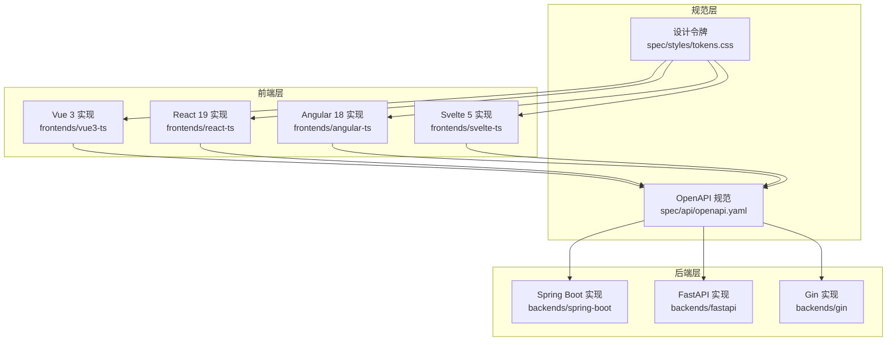
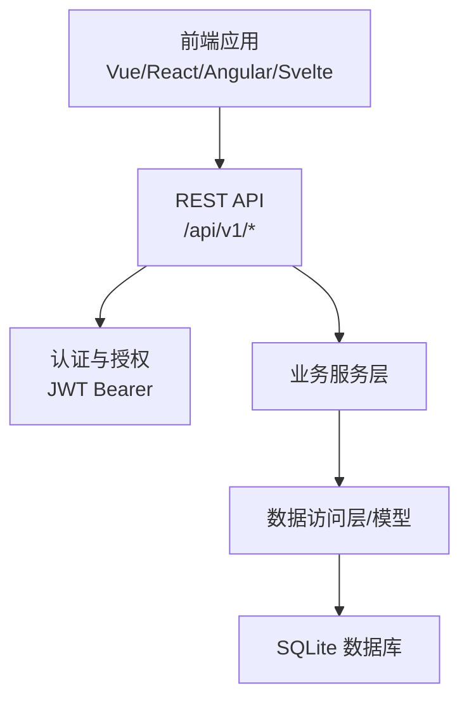
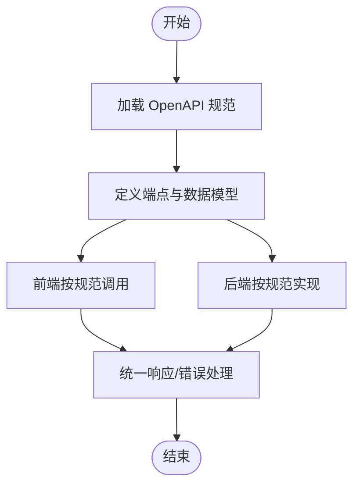
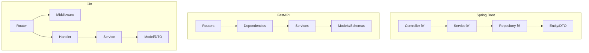
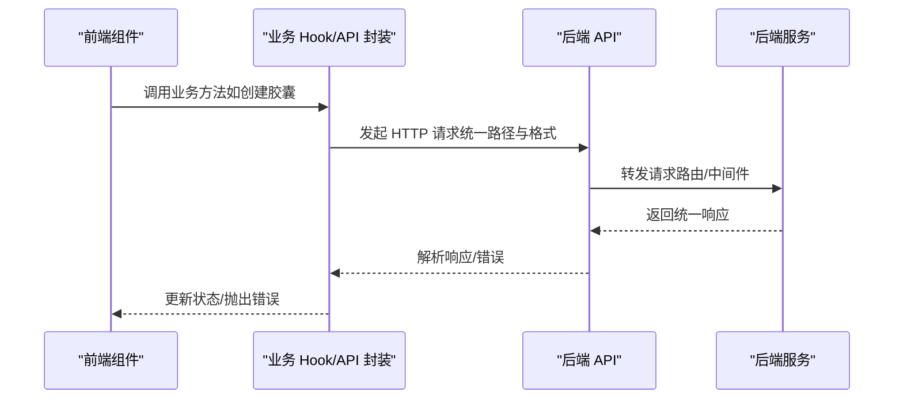
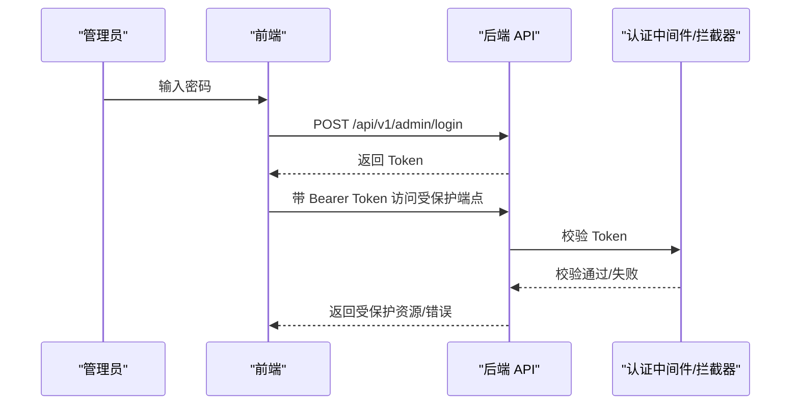
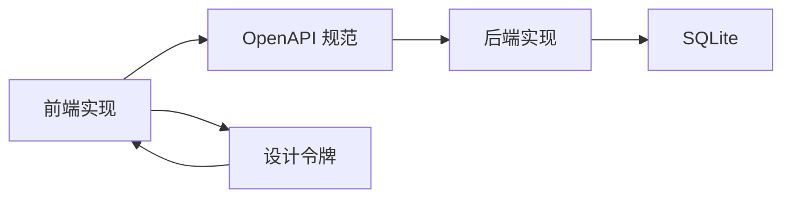

# 架构理念

<cite>
**本文引用的文件**
- [README.md](file://README.md)
- [docs/api-spec.md](file://docs/api-spec.md)
- [docs/design-tokens.md](file://docs/design-tokens.md)
- [spec/api/openapi.yaml](file://spec/api/openapi.yaml)
- [spec/styles/tokens.css](file://spec/styles/tokens.css)
- [backends/fastapi/README.md](file://backends/fastapi/README.md)
- [backends/gin/README.md](file://backends/gin/README.md)
- [backends/spring-boot/README.md](file://backends/spring-boot/README.md)
- [backends/fastapi/app/main.py](file://backends/fastapi/app/main.py)
- [backends/gin/main.go](file://backends/gin/main.go)
- [backends/spring-boot/src/main/java/com/hellotime/HelloTimeApplication.java](file://backends/spring-boot/src/main/java/com/hellotime/HelloTimeApplication.java)
- [frontends/react-ts/src/hooks/useCapsule.ts](file://frontends/react-ts/src/hooks/useCapsule.ts)
- [frontends/svelte-ts/src/lib/api/index.ts](file://frontends/svelte-ts/src/lib/api/index.ts)
</cite>

## 目录
1. [引言](#引言)
2. [项目结构](#项目结构)
3. [核心组件](#核心组件)
4. [架构总览](#架构总览)
5. [详细组件分析](#详细组件分析)
6. [依赖关系分析](#依赖关系分析)
7. [性能考量](#性能考量)
8. [故障排查指南](#故障排查指南)
9. [结论](#结论)
10. [附录](#附录)

## 引言
HelloTime 项目以“前后端完全解耦”为核心理念，通过统一的 API 规范与设计系统，实现任意前端与任意后端的自由组合。项目采用 OpenAPI 3.0 规范约束接口契约，以 CSS Design Tokens 统一样式体系，并在多个后端技术栈（Spring Boot、FastAPI、Gin）与多个前端框架（Vue 3、React 19、Angular 18、Svelte 5）中保持功能一致性与体验一致性。该架构在保证功能完备的同时，兼顾性能、可维护性与扩展性，为开发者提供清晰的分层设计与一致的实现范式。

## 项目结构
项目采用“共享规范 + 多实现”的组织方式：
- 规范层：spec/api/openapi.yaml 与 spec/styles/ 下的设计令牌，定义统一的接口契约与视觉规范。
- 后端层：backends/ 下的 Spring Boot、FastAPI、Gin 实现，各自独立运行，遵循统一 API 与响应格式。
- 前端层：frontends/ 下的 Vue 3、React 19、Angular 18、Svelte 5 实现，各自独立运行，通过统一 API 与设计系统对接后端。
- 文档与脚本：docs/ 提供架构与部署说明，scripts/ 提供一键启动与测试脚本。

图表来源
- [spec/api/openapi.yaml](file://spec/api/openapi.yaml)
- [spec/styles/tokens.css](file://spec/styles/tokens.css)
- [backends/spring-boot/README.md](file://backends/spring-boot/README.md)
- [backends/fastapi/README.md](file://backends/fastapi/README.md)
- [backends/gin/README.md](file://backends/gin/README.md)

章节来源
- [README.md:37-63](file://README.md#L37-L63)
- [docs/design-tokens.md:1-91](file://docs/design-tokens.md#L1-L91)

## 核心组件
- 统一 API 规范：以 OpenAPI 3.0 定义接口契约，涵盖健康检查、胶囊 CRUD、管理员登录与分页列表、删除等端点，确保前后端一致的请求/响应模型与错误码。
- 统一响应格式：所有后端实现返回统一的 success/data/message/errorCode 结构，便于前端一致化处理。
- 统一设计系统：CSS 自定义属性作为设计令牌，定义颜色、排版、间距、圆角等，配合暗色模式切换，保障跨前端实现的视觉一致性。
- 多后端实现：Spring Boot（Java）、FastAPI（Python）、Gin（Go），均遵循同一规范，支持独立开发、测试与部署。
- 多前端实现：Vue 3、React 19、Angular 18、Svelte 5，均通过统一 API 与设计系统对接后端。

章节来源
- [docs/api-spec.md:1-195](file://docs/api-spec.md#L1-L195)
- [docs/design-tokens.md:1-91](file://docs/design-tokens.md#L1-L91)
- [README.md:5-36](file://README.md#L5-L36)

## 架构总览
整体架构遵循“前后端完全解耦”的原则：
- 前端仅依赖后端提供的 REST API 与共享样式，不关心后端技术栈。
- 后端仅负责实现统一 API，不关心前端框架。
- 规范层作为契约与视觉基线，贯穿两端实现。

图表来源
- [spec/api/openapi.yaml](file://spec/api/openapi.yaml)
- [backends/fastapi/app/main.py](file://backends/fastapi/app/main.py)
- [backends/gin/main.go](file://backends/gin/main.go)
- [backends/spring-boot/src/main/java/com/hellotime/HelloTimeApplication.java](file://backends/spring-boot/src/main/java/com/hellotime/HelloTimeApplication.java)

## 详细组件分析

### 统一 API 规范与设计系统
- OpenAPI 3.0：定义了健康检查、胶囊创建/查询、管理员登录/分页/删除等端点，明确请求体、响应体与错误码，确保多后端实现行为一致。
- 设计令牌：通过 CSS 自定义属性定义颜色、排版、间距、圆角等，支持亮/暗两套主题，前端通过 data-theme 属性切换。

图表来源
- [spec/api/openapi.yaml](file://spec/api/openapi.yaml)
- [docs/api-spec.md:1-195](file://docs/api-spec.md#L1-L195)

章节来源
- [docs/api-spec.md:16-183](file://docs/api-spec.md#L16-L183)
- [docs/design-tokens.md:76-91](file://docs/design-tokens.md#L76-L91)

### 后端实现的分层与依赖注入
- Spring Boot（Java）：采用经典的三层架构（controller/service/repository），通过注解与自动装配实现依赖注入，统一异常处理与响应格式。
- FastAPI（Python）：通过依赖注入模块集中管理数据库会话与服务实例，路由层只做参数绑定与调用服务层，异常统一捕获并转换为统一响应。
- Gin（Go）：通过构造函数注入数据库连接与服务实例，路由注册集中在 router 包，中间件统一处理 CORS 与认证。

图表来源
- [backends/spring-boot/README.md:77-87](file://backends/spring-boot/README.md#L77-L87)
- [backends/fastapi/README.md:99-116](file://backends/fastapi/README.md#L99-L116)
- [backends/gin/README.md:84-111](file://backends/gin/README.md#L84-L111)

章节来源
- [backends/spring-boot/README.md:13-20](file://backends/spring-boot/README.md#L13-L20)
- [backends/fastapi/README.md:13-20](file://backends/fastapi/README.md#L13-L20)
- [backends/gin/README.md:12-19](file://backends/gin/README.md#L12-L19)

### 前端与后端的解耦实现
- 前端通过统一 API 模块封装请求与错误处理，业务逻辑通过 Hooks/Composables 封装，避免直接耦合具体后端实现。
- 前端样式统一使用设计令牌，通过 CSS 变量与暗色模式切换，确保跨框架一致性。

图表来源
- [frontends/react-ts/src/hooks/useCapsule.ts:14-44](file://frontends/react-ts/src/hooks/useCapsule.ts#L14-L44)
- [frontends/svelte-ts/src/lib/api/index.ts:19-37](file://frontends/svelte-ts/src/lib/api/index.ts#L19-L37)
- [spec/api/openapi.yaml](file://spec/api/openapi.yaml)

章节来源
- [frontends/react-ts/src/hooks/useCapsule.ts:1-48](file://frontends/react-ts/src/hooks/useCapsule.ts#L1-L48)
- [frontends/svelte-ts/src/lib/api/index.ts:1-120](file://frontends/svelte-ts/src/lib/api/index.ts#L1-L120)

### 认证与授权
- JWT Bearer Token：管理员登录获取 Token，后续请求在请求头携带 Authorization: Bearer {token}。
- 后端统一异常处理：将认证失败、参数校验失败、业务异常映射为统一错误响应，前端统一处理。

图表来源
- [README.md:234-264](file://README.md#L234-L264)
- [docs/api-spec.md:113-133](file://docs/api-spec.md#L113-L133)

章节来源
- [README.md:234-264](file://README.md#L234-L264)
- [docs/api-spec.md:113-133](file://docs/api-spec.md#L113-L133)

## 依赖关系分析
- 前端对后端的依赖：仅通过统一 API 与设计系统，不依赖具体后端实现；后端对前端无任何依赖。
- 后端内部依赖：控制器/路由依赖服务层，服务层依赖数据访问层，数据访问层依赖模型与数据库。
- 规范层对两端的依赖：OpenAPI 与设计令牌作为契约，约束两端实现。

图表来源
- [spec/api/openapi.yaml](file://spec/api/openapi.yaml)
- [spec/styles/tokens.css](file://spec/styles/tokens.css)

章节来源
- [spec/api/openapi.yaml](file://spec/api/openapi.yaml)
- [spec/styles/tokens.css](file://spec/styles/tokens.css)

## 性能考量
- 前端性能：统一 API 与设计系统减少重复实现，降低维护成本；组件级样式复用提升渲染效率。
- 后端性能：多后端实现均可独立优化（连接池、缓存、索引），统一规范便于横向对比与选型。
- 网络与安全：CORS 配置允许本地开发跨域，JWT 用于管理员认证，统一异常处理减少无效请求与错误传播。

## 故障排查指南
- 统一错误响应：所有后端返回统一的 success/data/message/errorCode 结构，前端可据此进行一致化错误处理与提示。
- 常见错误码：参数校验失败、未授权、资源不存在、服务器内部错误等，便于快速定位问题。
- 健康检查：通过 /api/v1/health 获取后端技术栈信息，辅助诊断后端可用性与版本信息。

章节来源
- [docs/api-spec.md:186-195](file://docs/api-spec.md#L186-L195)
- [README.md:248-264](file://README.md#L248-L264)

## 结论
HelloTime 的架构以“统一规范 + 设计系统 + 分层实现”为核心，实现了前后端完全解耦与多技术栈自由组合。通过 OpenAPI 与设计令牌，项目在功能与视觉上保持一致性；通过分层架构与依赖注入，确保后端实现的可维护性与可扩展性；通过统一响应与错误处理，简化前端集成与调试。该架构在性能、可维护性与扩展性之间取得平衡，为开发者提供了清晰的设计思路与实践范式。

## 附录
- 快速开始与多组合示例参见项目根目录 README。
- 后端实现对比与部署说明参见 docs/ 下相关文档。