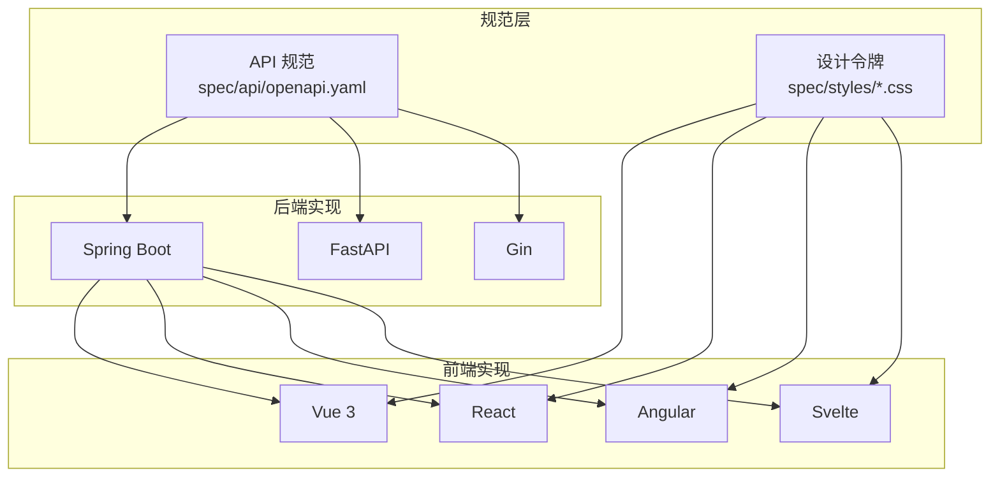
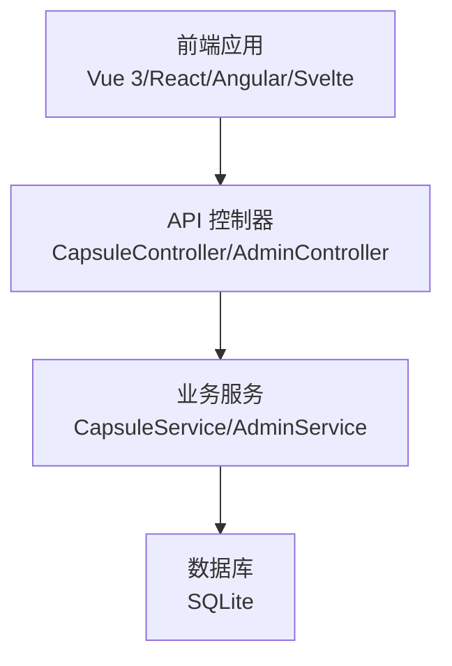
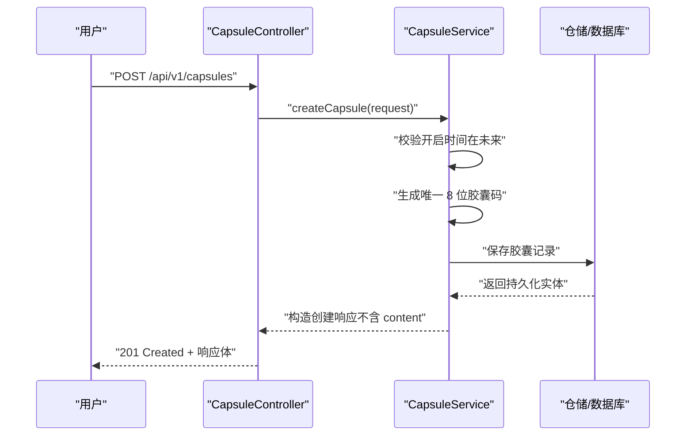
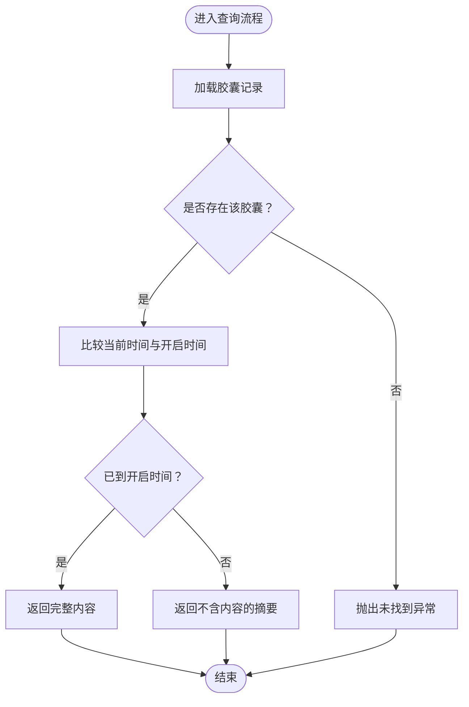
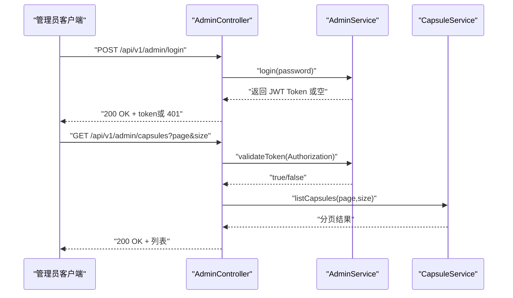
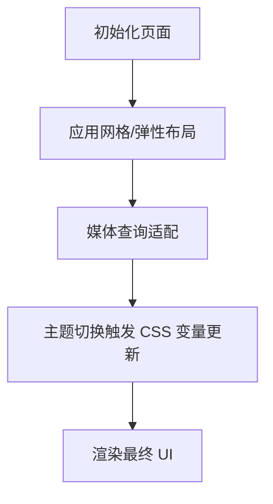
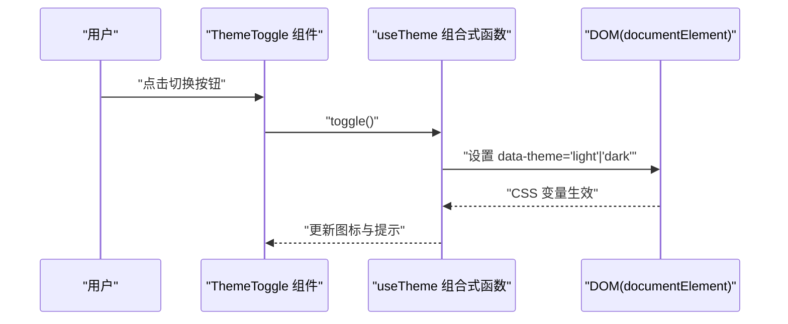
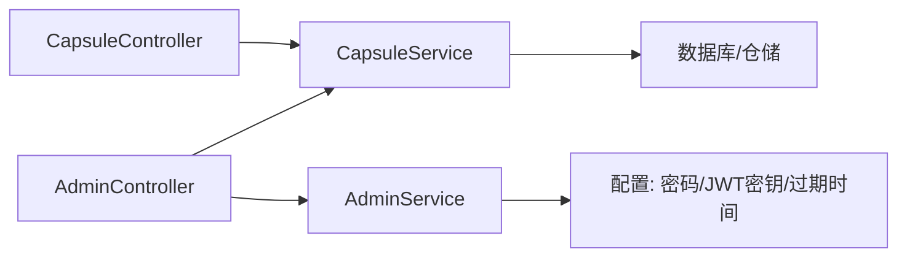

# 核心特性

<cite>
**本文引用的文件**
- [README.md](file://README.md)
- [api-spec.md](file://docs/api-spec.md)
- [database-schema.md](file://docs/database-schema.md)
- [CapsuleController.java](file://backends/spring-boot/src/main/java/com/hellotime/controller/CapsuleController.java)
- [CapsuleService.java](file://backends/spring-boot/src/main/java/com/hellotime/service/CapsuleService.java)
- [AdminController.java](file://backends/spring-boot/src/main/java/com/hellotime/controller/AdminController.java)
- [AdminService.java](file://backends/spring-boot/src/main/java/com/hellotime/service/AdminService.java)
- [HomeView.vue](file://frontends/vue3-ts/src/views/HomeView.vue)
- [CreateView.vue](file://frontends/vue3-ts/src/views/CreateView.vue)
- [OpenView.vue](file://frontends/vue3-ts/src/views/OpenView.vue)
- [ThemeToggle.vue](file://frontends/vue3-ts/src/components/ThemeToggle.vue)
- [useTheme.ts](file://frontends/vue3-ts/src/composables/useTheme.ts)
</cite>

## 目录
1. [简介](#简介)
2. [项目结构](#项目结构)
3. [核心组件](#核心组件)
4. [架构总览](#架构总览)
5. [详细组件分析](#详细组件分析)
6. [依赖关系分析](#依赖关系分析)
7. [性能考虑](#性能考虑)
8. [故障排查指南](#故障排查指南)
9. [结论](#结论)
10. [附录](#附录)

## 简介
HelloTime 是一个“时间胶囊”应用，用户可以创建胶囊，设定开启时间，之后在特定时刻开启查看内容。项目强调前后端完全解耦、统一 API 规范与设计系统，并提供多前端框架与多后端框架的对照实现。核心特性包括：
- 时间胶囊创建与管理：创建、查询、删除、分页列表
- 胶囊查询系统：基于 8 位唯一码查询；未到开启时间自动隐藏内容
- 管理员功能：JWT 认证、分页查看、删除胶囊
- 响应式设计：适配 PC、平板、移动端
- 主题切换：明亮/深色主题一键切换

这些特性共同构成项目的核心价值：以统一规范实现跨框架一致性，同时提供安全、易用、可扩展的体验。

## 项目结构
项目采用“共享规范 + 多实现”的组织方式：
- 规范层：API 规范与设计令牌位于 spec/ 目录
- 后端层：Spring Boot、FastAPI、Gin 三种实现，均遵循统一 API
- 前端层：Vue 3、React、Angular、Svelte 四种实现，共享样式与交互
- 文档层：API 文档、数据库设计、部署指南、对比分析等

章节来源
- [README.md: 37-63:37-63](file://README.md#L37-L63)
- [README.md: 195-232:195-232](file://README.md#L195-L232)

## 核心组件
- 控制器层：负责接收 HTTP 请求并调用服务层，返回统一响应格式
- 服务层：封装核心业务逻辑，如胶囊创建、查询、分页、删除、唯一码生成、开启时间判定
- 管理员服务：负责管理员登录、JWT 签发与校验
- 前端视图与组合式函数：提供创建、查询、主题切换等交互体验

章节来源
- [CapsuleController.java: 17-56:17-56](file://backends/spring-boot/src/main/java/com/hellotime/controller/CapsuleController.java#L17-L56)
- [CapsuleService.java: 26-196:26-196](file://backends/spring-boot/src/main/java/com/hellotime/service/CapsuleService.java#L26-L196)
- [AdminController.java: 18-79:18-79](file://backends/spring-boot/src/main/java/com/hellotime/controller/AdminController.java#L18-L79)
- [AdminService.java: 18-89:18-89](file://backends/spring-boot/src/main/java/com/hellotime/service/AdminService.java#L18-L89)

## 架构总览
后端采用控制器-服务-仓储分层，前端通过统一 API 与后端交互。管理员功能通过 JWT Bearer Token 认证保护。

图表来源
- [CapsuleController.java: 17-56:17-56](file://backends/spring-boot/src/main/java/com/hellotime/controller/CapsuleController.java#L17-L56)
- [AdminController.java: 18-79:18-79](file://backends/spring-boot/src/main/java/com/hellotime/controller/AdminController.java#L18-L79)
- [CapsuleService.java: 26-196:26-196](file://backends/spring-boot/src/main/java/com/hellotime/service/CapsuleService.java#L26-L196)
- [AdminService.java: 18-89:18-89](file://backends/spring-boot/src/main/java/com/hellotime/service/AdminService.java#L18-L89)

## 详细组件分析

### 时间胶囊创建与管理
- 业务价值
  - 用户可创建胶囊并设定开启时间，实现“延迟披露”的情感体验
  - 管理员可分页查看与删除胶囊，便于内容治理
- 技术要点
  - 唯一码生成：使用安全随机源生成 8 位 Base62 字符串，冲突重试上限保证唯一性
  - 开启时间校验：拒绝过去时间，确保业务语义正确
  - 创建响应：返回胶囊基本信息，不包含内容字段
  - 删除操作：事务保证原子性
- 使用场景
  - 个人纪念：写一封给未来的信，设定一年后开启
  - 社交分享：将专属胶囊码分享给朋友，制造惊喜
  - 内容运营：管理员批量清理过期或违规内容

图表来源
- [CapsuleController.java: 37-42:37-42](file://backends/spring-boot/src/main/java/com/hellotime/controller/CapsuleController.java#L37-L42)
- [CapsuleService.java: 52-73:52-73](file://backends/spring-boot/src/main/java/com/hellotime/service/CapsuleService.java#L52-L73)

章节来源
- [CapsuleController.java: 30-42:30-42](file://backends/spring-boot/src/main/java/com/hellotime/controller/CapsuleController.java#L30-L42)
- [CapsuleService.java: 44-73:44-73](file://backends/spring-boot/src/main/java/com/hellotime/service/CapsuleService.java#L44-L73)
- [database-schema.md: 25-31:25-31](file://docs/database-schema.md#L25-L31)

### 胶囊查询系统（含时序控制）
- 业务价值
  - 通过 8 位唯一码查询胶囊，未到开启时间自动隐藏内容，满足“延迟披露”
- 技术要点
  - 详情页响应：根据当前时间与开启时间比较决定是否返回内容字段
  - 管理员视图：始终返回完整内容，便于审核与运营
  - 异常处理：胶囊不存在时抛出业务异常
- 使用场景
  - 用户在开启时间到达后查看胶囊内容
  - 管理员在后台查看并核验内容

图表来源
- [CapsuleService.java: 83-87:83-87](file://backends/spring-boot/src/main/java/com/hellotime/service/CapsuleService.java#L83-L87)
- [CapsuleService.java: 167-178:167-178](file://backends/spring-boot/src/main/java/com/hellotime/service/CapsuleService.java#L167-L178)
- [CapsuleService.java: 184-195:184-195](file://backends/spring-boot/src/main/java/com/hellotime/service/CapsuleService.java#L184-L195)

章节来源
- [CapsuleController.java: 44-55:44-55](file://backends/spring-boot/src/main/java/com/hellotime/controller/CapsuleController.java#L44-L55)
- [CapsuleService.java: 75-87:75-87](file://backends/spring-boot/src/main/java/com/hellotime/service/CapsuleService.java#L75-L87)

### 管理员功能（JWT 认证与权限）
- 业务价值
  - 保护敏感操作（分页列表、删除胶囊），防止未授权访问
- 技术要点
  - 登录：校验管理员密码，签发 JWT（HS256，2 小时有效期）
  - 校验：解析并验证签名与过期时间
  - 接口：分页查询所有胶囊、按码删除胶囊
- 使用场景
  - 运营人员登录后查看全部胶囊并进行删除
  - 系统维护期间临时登录进行内容治理

图表来源
- [AdminController.java: 41-48:41-48](file://backends/spring-boot/src/main/java/com/hellotime/controller/AdminController.java#L41-L48)
- [AdminController.java: 59-64:59-64](file://backends/spring-boot/src/main/java/com/hellotime/controller/AdminController.java#L59-L64)
- [AdminController.java: 74-78:74-78](file://backends/spring-boot/src/main/java/com/hellotime/controller/AdminController.java#L74-L78)
- [AdminService.java: 53-66:53-66](file://backends/spring-boot/src/main/java/com/hellotime/service/AdminService.java#L53-L66)
- [AdminService.java: 75-87:75-87](file://backends/spring-boot/src/main/java/com/hellotime/service/AdminService.java#L75-L87)

章节来源
- [README.md: 234-247:234-247](file://README.md#L234-L247)
- [api-spec.md: 113-133:113-133](file://docs/api-spec.md#L113-L133)
- [api-spec.md: 137-165:137-165](file://docs/api-spec.md#L137-L165)
- [api-spec.md: 169-182:169-182](file://docs/api-spec.md#L169-L182)

### 响应式设计
- 业务价值
  - 在 PC、平板、移动端提供一致且舒适的浏览体验
- 技术要点
  - 使用 CSS Grid 与 Flex 布局，配合媒体查询实现自适应
  - 通过设计令牌（tokens.css）统一颜色、间距、字体等视觉变量
  - 主题切换通过 HTML 上的 data-theme 属性驱动 CSS 变量切换
- 使用场景
  - 移动端用户在地铁上打开“开启胶囊”页面
  - 桌面端用户在办公电脑上创建胶囊并复制胶囊码

图表来源
- [HomeView.vue: 143-153:143-153](file://frontends/vue3-ts/src/views/HomeView.vue#L143-L153)
- [HomeView.vue: 156-172:156-172](file://frontends/vue3-ts/src/views/HomeView.vue#L156-L172)

章节来源
- [HomeView.vue: 82-153:82-153](file://frontends/vue3-ts/src/views/HomeView.vue#L82-L153)
- [README.md: 11-12:11-12](file://README.md#L11-L12)

### 主题切换（明亮/深色）
- 业务价值
  - 提升夜间使用体验，减少眼部疲劳
- 技术要点
  - 组合式函数 useTheme 管理主题状态与本地存储
  - 在 documentElement 上设置 data-theme 属性，驱动 CSS 变量
  - 按钮组件 ThemeToggle 提供图标与交互
- 使用场景
  - 夜深人静时切换至深色主题阅读胶囊内容
  - 白天强光环境下切换至浅色主题提升对比度

图表来源
- [ThemeToggle.vue: 1-34:1-34](file://frontends/vue3-ts/src/components/ThemeToggle.vue#L1-L34)
- [useTheme.ts: 20-38:20-38](file://frontends/vue3-ts/src/composables/useTheme.ts#L20-L38)
- [useTheme.ts: 51-53:51-53](file://frontends/vue3-ts/src/composables/useTheme.ts#L51-L53)

章节来源
- [ThemeToggle.vue: 1-34:1-34](file://frontends/vue3-ts/src/components/ThemeToggle.vue#L1-L34)
- [useTheme.ts: 1-57:1-57](file://frontends/vue3-ts/src/composables/useTheme.ts#L1-L57)

### 前端交互与用户体验
- 首页（HomeView）
  - 提供“创建胶囊”“开启胶囊”两大入口，配合图标与文案增强可发现性
  - 响应式布局在窄屏设备上垂直堆叠按钮
- 创建页（CreateView）
  - 表单提交前二次确认，避免误操作
  - 成功后展示胶囊码并提供复制与跳转查看
- 开启页（OpenView）
  - 支持直接输入胶囊码或从路由参数读取
  - 结合倒计时组件（CountdownClock）展示剩余时间

章节来源
- [HomeView.vue: 1-173:1-173](file://frontends/vue3-ts/src/views/HomeView.vue#L1-L173)
- [CreateView.vue: 1-110:1-110](file://frontends/vue3-ts/src/views/CreateView.vue#L1-L110)
- [OpenView.vue: 1-51:1-51](file://frontends/vue3-ts/src/views/OpenView.vue#L1-L51)

## 依赖关系分析
- 控制器依赖服务，服务依赖仓储/数据库
- 管理员服务依赖配置（密码、JWT 密钥、过期时间）
- 前端通过统一 API 与后端交互，主题与布局依赖共享样式

图表来源
- [CapsuleController.java: 26-28:26-28](file://backends/spring-boot/src/main/java/com/hellotime/controller/CapsuleController.java#L26-L28)
- [CapsuleService.java: 40-42:40-42](file://backends/spring-boot/src/main/java/com/hellotime/service/CapsuleService.java#L40-L42)
- [AdminController.java: 29-31:29-31](file://backends/spring-boot/src/main/java/com/hellotime/controller/AdminController.java#L29-L31)
- [AdminService.java: 35-44:35-44](file://backends/spring-boot/src/main/java/com/hellotime/service/AdminService.java#L35-L44)

章节来源
- [CapsuleController.java: 17-56:17-56](file://backends/spring-boot/src/main/java/com/hellotime/controller/CapsuleController.java#L17-L56)
- [CapsuleService.java: 26-196:26-196](file://backends/spring-boot/src/main/java/com/hellotime/service/CapsuleService.java#L26-L196)
- [AdminController.java: 18-79:18-79](file://backends/spring-boot/src/main/java/com/hellotime/controller/AdminController.java#L18-L79)
- [AdminService.java: 18-89:18-89](file://backends/spring-boot/src/main/java/com/hellotime/service/AdminService.java#L18-L89)

## 性能考虑
- 数据库层面
  - 使用 SQLite，单表结构简单，索引仅需 code 唯一约束，查询效率高
  - 唯一码生成采用安全随机与重试策略，冲突概率低
- 业务层面
  - 查询详情时仅在开启时间到达后返回内容，避免不必要的大字段传输
  - 管理员分页查询使用 PageRequest，限制每页大小，降低内存压力
- 前端层面
  - 主题切换通过 CSS 变量即时生效，无重排重绘开销
  - 组件按需渲染，路由切换时仅加载当前视图

## 故障排查指南
- 常见错误码
  - 参数校验失败：检查请求体字段类型与必填项
  - 胶囊不存在：确认 8 位胶囊码是否正确
  - 未授权：确认 Authorization 头是否携带有效 Bearer Token
  - 业务错误：如开启时间早于当前时间，需调整为未来时间
- 建议排查步骤
  - 后端：查看控制器返回的统一响应结构，定位具体错误码
  - 前端：确认 API 基础路径与请求头设置，检查网络面板
  - 数据库：确认 capsules 表结构与索引，核查唯一码生成是否成功

章节来源
- [api-spec.md: 186-195:186-195](file://docs/api-spec.md#L186-L195)
- [README.md: 257-264:257-264](file://README.md#L257-L264)

## 结论
HelloTime 通过统一的 API 规范与设计系统，实现了多前端与多后端的无缝对接。其核心特性围绕“延迟披露”展开：胶囊创建与管理确保内容安全可控，查询系统通过时序控制实现内容的按期释放，管理员功能以 JWT 保障操作安全，响应式设计与主题切换优化了跨设备体验。整体架构清晰、职责明确，既适合教学对比，也便于实际项目扩展与维护。

## 附录
- API 规范与数据库设计详见文档目录中的 openapi.yaml 与 database-schema.md
- 快速开始与环境变量配置可参考项目根目录 README