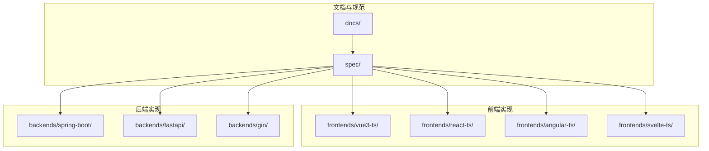
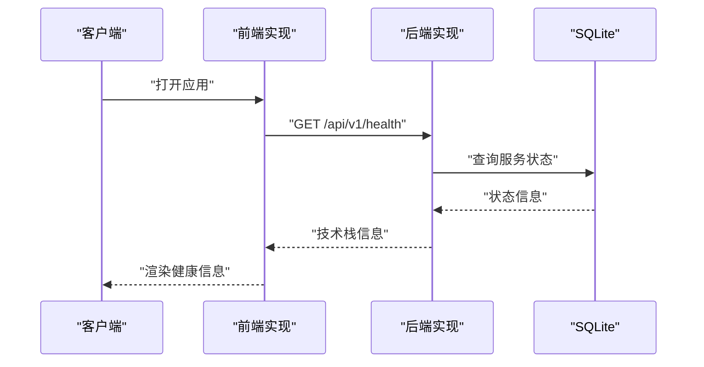
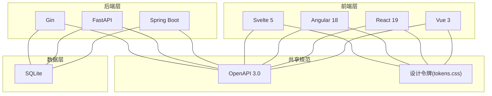
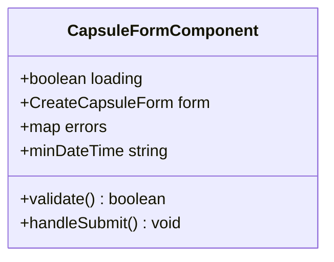
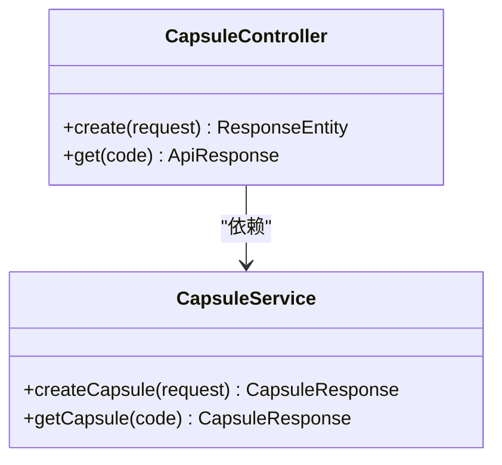
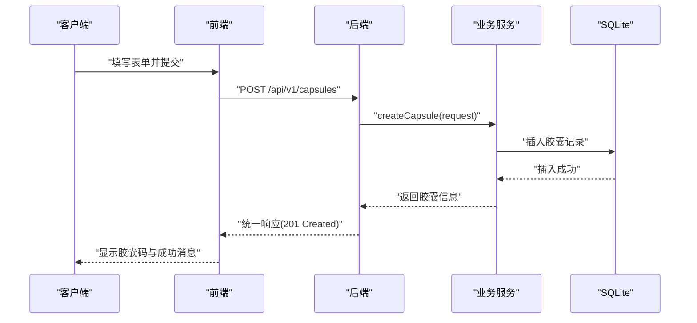
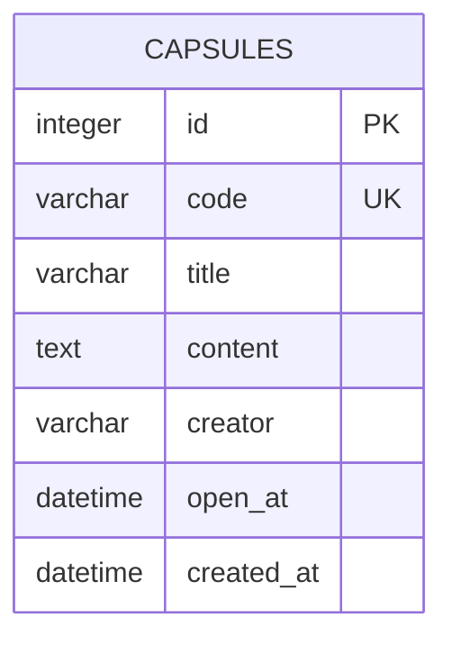
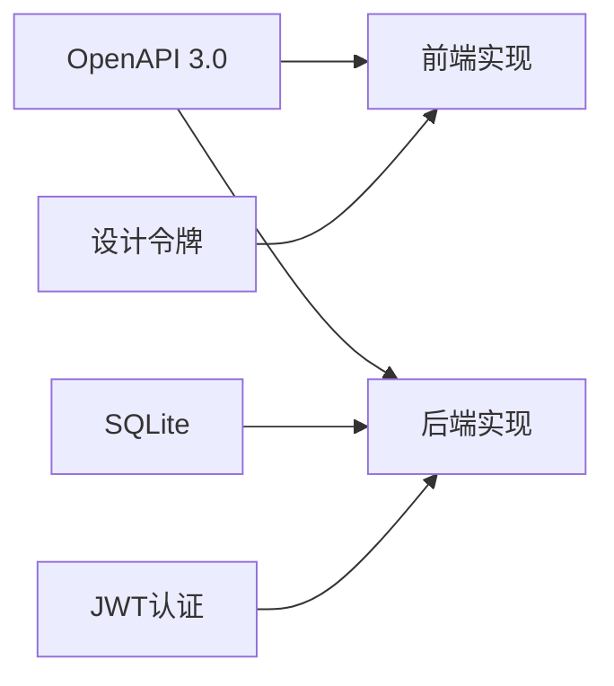

# 项目介绍

<cite>
**本文引用的文件**
- [README.md](file://README.md)
- [CLAUDE.md](file://CLAUDE.md)
- [docs/api-spec.md](file://docs/api-spec.md)
- [docs/backend-comparison.md](file://docs/backend-comparison.md)
- [docs/frontend-comparison.md](file://docs/frontend-comparison.md)
- [docs/database-schema.md](file://docs/database-schema.md)
- [docs/design-tokens.md](file://docs/design-tokens.md)
- [spec/api/openapi.yaml](file://spec/api/openapi.yaml)
- [spec/styles/tokens.css](file://spec/styles/tokens.css)
- [frontends/angular-ts/src/app/components/capsule-form/capsule-form.component.ts](file://frontends/angular-ts/src/app/components/capsule-form/capsule-form.component.ts)
- [backends/spring-boot/src/main/java/com/hellotime/controller/CapsuleController.java](file://backends/spring-boot/src/main/java/com/hellotime/controller/CapsuleController.java)
</cite>

## 目录
1. [简介](#简介)
2. [项目结构](#项目结构)
3. [核心理念与设计哲学](#核心理念与设计哲学)
4. [时间胶囊的独特价值](#时间胶囊的独特价值)
5. [作为RealWorld技术展示项目的特殊意义](#作为realworld技术展示项目的特殊意义)
6. [统一API规范与设计系统的自由组合能力](#统一api规范与设计系统的自由组合能力)
7. [目标用户与使用场景](#目标用户与使用场景)
8. [创新点与独特价值](#创新点与独特价值)
9. [架构总览](#架构总览)
10. [详细组件分析](#详细组件分析)
11. [依赖关系分析](#依赖关系分析)
12. [性能考量](#性能考量)
13. [故障排查指南](#故障排查指南)
14. [结论](#结论)

## 简介
HelloTime（时间胶囊）是一个以“封存此刻心意，在未来某个时刻开启”为核心理念的应用。它通过统一的API规范与可复用的设计系统，展示了多种前后端技术栈的自由组合能力，是RealWorld风格的技术展示项目。项目强调“前后端完全解耦、统一规范、响应式设计、主题切换、完整测试、详尽文档”，并提供四种前端框架（Vue 3、React 19、Angular 18、Svelte 5）与三种后端实现（Spring Boot、FastAPI、Gin）的对照学习与实践。

**章节来源**
- [README.md:1-323](file://README.md#L1-L323)

## 项目结构
项目采用Monorepo组织方式，核心目录包括：
- docs/：项目文档（API规范、数据库设计、部署指南、设计令牌说明）
- spec/：共享规范（OpenAPI 3.0、设计令牌与样式）
- frontends/：四种前端实现（Vue 3、React 19、Angular 18、Svelte 5）
- backends/：三种后端实现（Spring Boot、FastAPI、Gin）
- scripts/：开发/构建/测试脚本

**图表来源**
- [README.md:37-63](file://README.md#L37-L63)

**章节来源**
- [README.md:37-63](file://README.md#L37-L63)

## 核心理念与设计哲学
- 解耦优先：前后端通过统一API契约通信，可独立开发、测试与演进。
- 规范先行：以OpenAPI 3.0定义接口契约，以CSS Design Tokens统一视觉语言，确保一致性与可维护性。
- 用户体验至上：响应式布局、主题切换、内容隐藏策略（未到开启时间不显示内容）提升可用性与情感价值。
- 可组合性：任意前端与任意后端自由搭配，便于团队按技术栈选择与扩展。
- 可测试性：全栈单元测试与集成测试覆盖核心业务逻辑，保障质量与稳定性。

**章节来源**
- [README.md:7-15](file://README.md#L7-L15)
- [docs/api-spec.md:1-195](file://docs/api-spec.md#L1-L195)
- [docs/design-tokens.md:1-91](file://docs/design-tokens.md#L1-L91)

## 时间胶囊的独特价值
- 情感与技术的结合：通过“未来开启”的交互设计，赋予技术应用以情感价值与记忆意义。
- 内容安全与时机控制：未到开启时间的内容自动隐藏，体现对隐私与时机的尊重。
- 跨时代沟通：用户可向未来的自己或他人传递信息，形成跨越时间的对话。
- 教育与演示：作为RealWorld项目，直观展示多技术栈组合与工程化实践。

**章节来源**
- [docs/api-spec.md:70-110](file://docs/api-spec.md#L70-L110)

## 作为RealWorld技术展示项目的特殊意义
- 多栈对照：在同一业务场景下，对比Spring Boot、FastAPI、Gin三种后端实现的架构、性能与开发体验。
- 前后端对比：对比React、Vue 3、Svelte 5、Angular四种前端实现的组件模式、路由与响应式原理。
- 统一契约：所有实现严格遵循同一份OpenAPI规范与设计令牌，确保功能与视觉一致。
- 可扩展性：提供添加新前端/后端实现的指导，鼓励社区参与与持续演进。

**章节来源**
- [docs/backend-comparison.md:1-72](file://docs/backend-comparison.md#L1-L72)
- [docs/frontend-comparison.md:1-64](file://docs/frontend-comparison.md#L1-L64)
- [CLAUDE.md:64-116](file://CLAUDE.md#L64-L116)

## 统一API规范与设计系统的自由组合能力
- API规范：以OpenAPI 3.0定义健康检查、创建胶囊、查询胶囊、管理员登录与管理等端点，统一响应格式与错误码。
- 设计系统：以CSS自定义属性（Design Tokens）定义颜色、排版、间距、圆角与暗色模式，确保跨前端实现视觉一致。
- 自由组合：前端仅依赖API契约与共享样式，后端仅实现契约端点，二者可独立演进与替换。

**图表来源**
- [spec/api/openapi.yaml:10-23](file://spec/api/openapi.yaml#L10-L23)
- [docs/api-spec.md:18-31](file://docs/api-spec.md#L18-L31)

**章节来源**
- [spec/api/openapi.yaml:1-349](file://spec/api/openapi.yaml#L1-L349)
- [docs/api-spec.md:1-195](file://docs/api-spec.md#L1-L195)
- [docs/design-tokens.md:76-82](file://docs/design-tokens.md#L76-L82)

## 目标用户与使用场景
- 目标用户
  - 开发者：学习多技术栈组合、工程化实践与测试驱动开发。
  - 教育者：用于教学与技术分享，展示前后端解耦与统一规范的价值。
  - 产品团队：探索跨团队协作与技术选型的灵活性。
- 主要使用场景
  - 快速原型验证：通过统一契约快速搭建前后端原型。
  - 技术选型对比：对比不同框架/语言在相同业务下的实现与性能。
  - 团队协作：前端与后端团队并行开发，降低耦合风险。
- 解决的核心问题
  - 前后端协作成本高：通过统一API契约与设计系统降低沟通成本。
  - 技术栈多样性带来的维护复杂性：通过规范与对比报告提升可维护性。
  - 学习曲线陡峭：提供多实现对照，加速技术迁移与学习。

**章节来源**
- [README.md:195-204](file://README.md#L195-L204)
- [docs/frontend-comparison.md:51-57](file://docs/frontend-comparison.md#L51-L57)

## 创新点与独特价值
- 技术组合的可视化对比：在同一业务场景下，直观呈现不同技术栈的差异与优势。
- 设计令牌驱动的跨前端一致性：通过CSS自定义属性与暗色模式支持，保证视觉一致性。
- 内容时机控制：未到开启时间自动隐藏内容，增强用户体验与情感价值。
- 完整的工程化实践：从API契约、数据库设计到前端组件与测试，形成闭环。
- 社区可扩展：提供新增实现的步骤与规范，鼓励持续贡献。

**章节来源**
- [docs/design-tokens.md:76-103](file://docs/design-tokens.md#L76-L103)
- [docs/database-schema.md:25-31](file://docs/database-schema.md#L25-L31)
- [README.md:333-349](file://README.md#L333-L349)

## 架构总览
整体架构围绕“统一契约 + 可复用设计系统”展开，前后端通过REST API通信，数据库采用SQLite，前端通过共享样式实现一致的UI体验。

**图表来源**
- [README.md:16-35](file://README.md#L16-L35)
- [docs/design-tokens.md:83-91](file://docs/design-tokens.md#L83-L91)
- [docs/database-schema.md:3-5](file://docs/database-schema.md#L3-L5)

**章节来源**
- [README.md:16-35](file://README.md#L16-L35)
- [docs/design-tokens.md:83-91](file://docs/design-tokens.md#L83-L91)
- [docs/database-schema.md:3-5](file://docs/database-schema.md#L3-L5)

## 详细组件分析

### 前端组件：胶囊表单（Angular示例）
该组件展示了表单输入、本地校验与事件发射的典型模式，体现统一设计系统与一致的交互体验。

**图表来源**
- [frontends/angular-ts/src/app/components/capsule-form/capsule-form.component.ts:12-67](file://frontends/angular-ts/src/app/components/capsule-form/capsule-form.component.ts#L12-L67)

**章节来源**
- [frontends/angular-ts/src/app/components/capsule-form/capsule-form.component.ts:1-68](file://frontends/angular-ts/src/app/components/capsule-form/capsule-form.component.ts#L1-L68)

### 后端控制器：胶囊控制器（Spring Boot示例）
该控制器展示了REST端点的定义、参数校验与统一响应封装，体现契约驱动与一致性的实现。

**图表来源**
- [backends/spring-boot/src/main/java/com/hellotime/controller/CapsuleController.java:17-56](file://backends/spring-boot/src/main/java/com/hellotime/controller/CapsuleController.java#L17-L56)

**章节来源**
- [backends/spring-boot/src/main/java/com/hellotime/controller/CapsuleController.java:1-57](file://backends/spring-boot/src/main/java/com/hellotime/controller/CapsuleController.java#L1-L57)

### API工作流：创建胶囊
该流程展示了从客户端发起请求到后端处理并返回统一响应的完整过程。

**图表来源**
- [spec/api/openapi.yaml:24-47](file://spec/api/openapi.yaml#L24-L47)
- [docs/api-spec.md:35-69](file://docs/api-spec.md#L35-L69)

**章节来源**
- [spec/api/openapi.yaml:24-47](file://spec/api/openapi.yaml#L24-L47)
- [docs/api-spec.md:35-69](file://docs/api-spec.md#L35-L69)

### 数据库设计要点
- 单表结构：capsules，包含唯一8位胶囊码、标题、内容、创建者、开启时间与创建时间。
- 时间策略：统一使用UTC存储，响应时格式化为ISO 8601字符串。
- 唯一性：code字段唯一索引，碰撞处理通过重试机制保证唯一性。

**图表来源**
- [docs/database-schema.md:9-19](file://docs/database-schema.md#L9-L19)

**章节来源**
- [docs/database-schema.md:9-19](file://docs/database-schema.md#L9-L19)

## 依赖关系分析
- 前端依赖后端API契约与共享样式，彼此独立演进。
- 后端依赖统一的数据库结构与认证机制（JWT）。
- 共享规范（OpenAPI、设计令牌）贯穿前后端，确保一致性与可组合性。

**图表来源**
- [spec/api/openapi.yaml:165-171](file://spec/api/openapi.yaml#L165-L171)
- [docs/design-tokens.md:83-91](file://docs/design-tokens.md#L83-L91)
- [docs/database-schema.md:3-5](file://docs/database-schema.md#L3-L5)

**章节来源**
- [spec/api/openapi.yaml:165-171](file://spec/api/openapi.yaml#L165-L171)
- [docs/design-tokens.md:83-91](file://docs/design-tokens.md#L83-L91)
- [docs/database-schema.md:3-5](file://docs/database-schema.md#L3-L5)

## 性能考量
- 后端对比：FastAPI在异步处理与自动文档方面优势明显；Gin在高并发与轻量化部署上表现突出；Spring Boot在复杂业务与企业级特性上具备生态优势。
- 前端对比：Svelte 5在响应式与编译时优化上具备优势，代码量最少；Vue 3在开发体验与文档支持上表现均衡；React生态成熟度高；Angular在大型团队协作与强约束上更稳健。
- 数据库：SQLite适合小规模部署与技术展示，零配置、易迁移。

**章节来源**
- [docs/backend-comparison.md:56-71](file://docs/backend-comparison.md#L56-L71)
- [docs/frontend-comparison.md:49-57](file://docs/frontend-comparison.md#L49-L57)
- [docs/database-schema.md:3-5](file://docs/database-schema.md#L3-L5)

## 故障排查指南
- API响应格式：统一采用统一响应格式，若出现错误，检查errorCode与message字段，定位具体问题。
- 认证问题：管理员端点需携带Bearer Token，确认Authorization头格式与Token有效期。
- CORS问题：开发环境下已配置允许localhost跨域，若遇到跨域，请检查代理与端口配置。
- 时间与时区：所有时间戳使用UTC，注意前端展示与本地时区转换。
- 数据库文件：默认在项目根目录生成，若找不到数据库文件，请检查环境变量与工作目录。

**章节来源**
- [docs/api-spec.md:5-14](file://docs/api-spec.md#L5-L14)
- [README.md:234-264](file://README.md#L234-L264)
- [README.md:304-311](file://README.md#L304-L311)

## 结论
HelloTime时间胶囊项目以“统一契约 + 可复用设计系统”为核心，展示了多技术栈自由组合的能力与工程化实践。通过前后端解耦、统一API与设计令牌、完整的测试与文档，项目为开发者提供了清晰的定位与理解背景，既可用于学习与教学，也可作为技术选型与团队协作的参考范本。其独特的“未来开启”交互设计，进一步提升了应用的情感价值与用户体验。