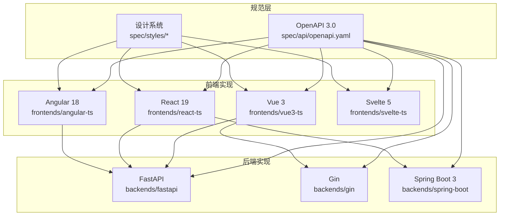
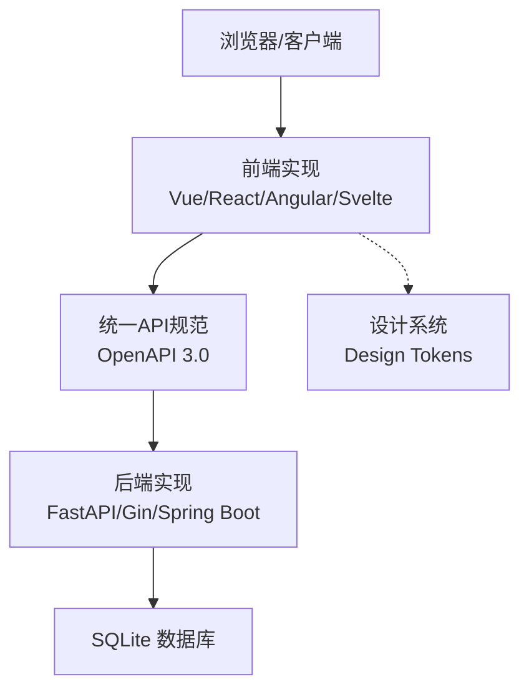

# 项目概述

<cite>
**本文引用的文件**
- [README.md](file://README.md)
- [api-spec.md](file://docs/api-spec.md)
- [backend-comparison.md](file://docs/backend-comparison.md)
- [frontend-comparison.md](file://docs/frontend-comparison.md)
- [design-tokens.md](file://docs/design-tokens.md)
- [openapi.yaml](file://spec/api/openapi.yaml)
- [tokens.css](file://spec/styles/tokens.css)
- [base.css](file://spec/styles/base.css)
- [components.css](file://spec/styles/components.css)
- [layout.css](file://spec/styles/layout.css)
- [main.py](file://backends/fastapi/app/main.py)
- [main.go](file://backends/gin/main.go)
- [HelloTimeApplication.java](file://backends/spring-boot/src/main/java/com/hellotime/HelloTimeApplication.java)
- [requirements.txt](file://backends/fastapi/requirements.txt)
- [pom.xml](file://backends/spring-boot/pom.xml)
- [package.json (Vue 3)](file://frontends/vue3-ts/package.json)
- [package.json (Angular)](file://frontends/angular-ts/package.json)
- [App.tsx (React)](file://frontends/react-ts/src/App.tsx)
- [App.vue (Vue 3)](file://frontends/vue3-ts/src/App.vue)
- [app.component.ts (Angular)](file://frontends/angular-ts/src/app/app.component.ts)
</cite>

## 目录
1. [引言](#引言)
2. [项目结构](#项目结构)
3. [核心理念与设计理念](#核心理念与设计理念)
4. [技术特色与统一规范](#技术特色与统一规范)
5. [整体架构思路](#整体架构思路)
6. [多技术栈对比与学习价值](#多技术栈对比与学习价值)
7. [主要特性亮点](#主要特性亮点)
8. [技术栈概览](#技术栈概览)
9. [使用场景示例](#使用场景示例)
10. [结论](#结论)

## 引言
HelloTime时间胶囊是一个以“RealWorld技术展示项目”为目标的多实现应用，通过统一的API规范与设计系统，演示前后端完全解耦的架构思想。项目提供多前端框架（Vue 3、React 19、Angular 18、Svelte 5）与多后端技术栈（Spring Boot 3、FastAPI、Gin）的自由组合，帮助开发者在同一业务场景下对比不同技术栈的实现方式、开发体验与性能特征，从而做出更明智的技术选型。

## 项目结构
项目采用“共享规范 + 多实现”的组织方式：
- docs：项目文档（API规范、架构设计、部署指南、对比分析）
- spec：共享规范（OpenAPI 3.0 + 设计令牌与样式）
- frontends：四个前端实现（独立可运行，共享设计系统）
- backends：三个后端实现（独立可运行，共享API规范）
- scripts：开发/构建/测试脚本（一键启动与测试）

图表来源
- [openapi.yaml:1-349](file://spec/api/openapi.yaml#L1-L349)
- [tokens.css](file://spec/styles/tokens.css)
- [main.py:1-89](file://backends/fastapi/app/main.py#L1-L89)
- [main.go:1-32](file://backends/gin/main.go#L1-L32)
- [HelloTimeApplication.java:1-12](file://backends/spring-boot/src/main/java/com/hellotime/HelloTimeApplication.java#L1-L12)

章节来源
- [README.md:37-63](file://README.md#L37-L63)

## 核心理念与设计理念
- 前后端完全解耦：前端通过统一的REST API与后端交互，任意前端可与任意后端自由组合，仅需正确配置后端地址。
- 统一API规范与设计系统：所有实现遵循同一份OpenAPI规范与设计令牌，确保功能一致、UI一致。
- RealWorld展示价值：以真实业务场景（时间胶囊）承载多技术栈对比，便于开发者横向评估不同技术栈的适用性。
- 可复用与可扩展：共享规范降低重复工作，新增前端或后端实现只需遵循规范即可快速接入。

章节来源
- [README.md:5-35](file://README.md#L5-L35)
- [api-spec.md:1-15](file://docs/api-spec.md#L1-L15)

## 技术特色与统一规范
- 统一API规范（OpenAPI 3.0）：定义健康检查、胶囊创建/查询、管理员登录/分页列表/删除等端点，确保所有后端实现行为一致。
- 统一响应格式：所有接口返回统一的success/data/message/errorCode结构，便于前端统一处理。
- 统一设计系统（CSS Design Tokens）：通过tokens.css定义颜色、排版、间距、圆角等设计令牌，配合base.css、layout.css、components.css形成一致的视觉与交互体验。
- JWT认证：管理员登录获取Bearer Token，后续管理端点需携带该Token进行鉴权。
- 响应式设计：适配PC与移动端，主题切换（明亮/深色）无缝支持。

章节来源
- [api-spec.md:16-183](file://docs/api-spec.md#L16-L183)
- [design-tokens.md:1-91](file://docs/design-tokens.md#L1-L91)
- [README.md:234-264](file://README.md#L234-L264)

## 整体架构思路
- 规范先行：以OpenAPI与设计令牌为“契约”，指导前后端开发。
- 前端层：各框架独立实现视图与交互，调用统一API；共享路由约定与组件样式。
- 后端层：各后端实现相同业务逻辑（创建胶囊、查询胶囊、管理员管理），统一错误处理与响应格式。
- 数据层：SQLite数据库，统一表结构，确保数据一致性。
- 部署与运行：每个实现均可独立运行，支持一键启动脚本与测试脚本。

图表来源
- [openapi.yaml:1-349](file://spec/api/openapi.yaml#L1-L349)
- [tokens.css](file://spec/styles/tokens.css)
- [main.py:1-89](file://backends/fastapi/app/main.py#L1-L89)
- [main.go:1-32](file://backends/gin/main.go#L1-L32)
- [HelloTimeApplication.java:1-12](file://backends/spring-boot/src/main/java/com/hellotime/HelloTimeApplication.java#L1-L12)

## 多技术栈对比与学习价值
- 后端对比维度：核心框架、编程语言、并发模型、ORM、数据校验、依赖管理、代码量、性能与开发体验。
- 前端对比维度：框架版本、构建工具、路由方案、组件范式、响应式原理、代码简洁度与开发复杂度。
- 学习价值：通过同一套规范驱动的多实现，开发者可以直观比较不同技术栈在开发效率、性能表现、生态成熟度、长期维护性等方面的差异，辅助技术选型。

章节来源
- [backend-comparison.md:1-72](file://docs/backend-comparison.md#L1-L72)
- [frontend-comparison.md:1-64](file://docs/frontend-comparison.md#L1-L64)

## 主要特性亮点
- 前后端完全解耦：任意前端 + 任意后端自由组合，仅需配置后端地址。
- 统一规范：OpenAPI 3.0 + CSS Design Tokens，确保功能与UI一致。
- 响应式设计：完美支持PC与移动端。
- 主题切换：明亮/深色主题一键切换。
- 完整测试：前后端单元测试与集成测试覆盖核心业务。
- 详尽文档：API文档、架构设计、部署指南与对比分析。

章节来源
- [README.md:7-14](file://README.md#L7-L14)
- [README.md:335](file://README.md#L335)

## 技术栈概览
- 前端框架
  - Vue 3 + TypeScript + Vite 7（端口5173）
  - React 19 + TypeScript + Vite 7（端口5174）
  - Angular 18 + TypeScript + Angular CLI（端口5175）
  - Svelte 5 + TypeScript + Vite 7（端口5176）
- 后端框架
  - Spring Boot 3 + Java 21 + SQLite（端口8080）
  - FastAPI + Python 3.12+ + SQLite（端口8080）
  - Gin + Go 1.24+ + SQLite（端口8080）
- 共享规范
  - OpenAPI 3.0（spec/api/openapi.yaml）
  - 设计令牌与样式（spec/styles/）

章节来源
- [README.md:16-33](file://README.md#L16-L33)
- [openapi.yaml:1-349](file://spec/api/openapi.yaml#L1-L349)
- [tokens.css](file://spec/styles/tokens.css)

## 使用场景示例
- 快速开始（Spring Boot + Vue 3）
  - 启动后端：进入 backends/spring-boot，使用Maven运行Spring Boot应用。
  - 启动前端：进入 frontends/vue3-ts，安装依赖并启动Vite开发服务器。
  - 访问地址：后端服务 http://localhost:8080，前端开发服务器 http://localhost:5173。
- 快速开始（FastAPI + React）
  - 启动后端：进入 backends/fastapi，安装依赖并使用Uvicorn启动服务。
  - 启动前端：进入 frontends/react-ts，安装依赖并启动Vite开发服务器。
  - 访问地址：后端服务 http://localhost:8080，前端开发服务器 http://localhost:5174。
- 一键启动所有服务
  - 使用根目录脚本同时启动后端与全部前端（Vue 5173、React 5174、Angular 5175、Svelte 5176）。

章节来源
- [README.md:65-148](file://README.md#L65-L148)

## 结论
HelloTime时间胶囊通过“统一规范 + 多实现”的方式，将复杂的多技术栈对比转化为可操作的学习路径。它既适合初学者快速理解前后端解耦与规范驱动的开发模式，也为有经验的开发者提供了真实业务场景下的技术选型参考。依托统一的API与设计系统，项目在保证功能一致性的同时，最大化地展示了不同技术栈的优势与边界，具有很高的实践价值与教学意义。